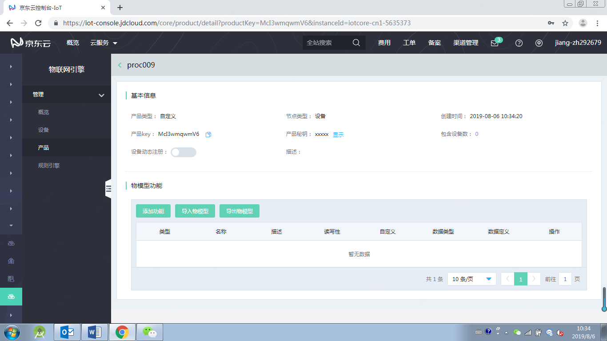
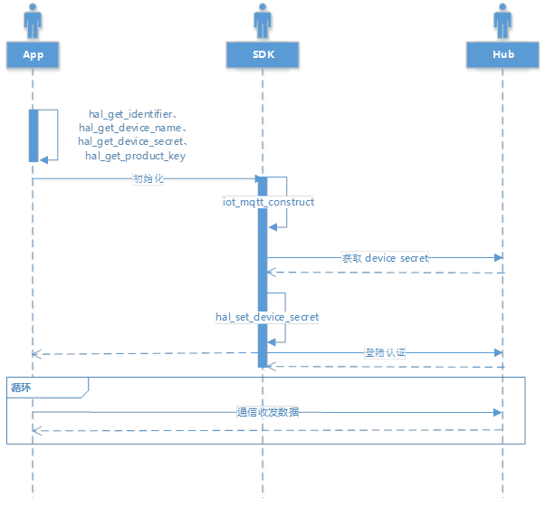

# 设备鉴权

鉴权分一机一密和一型一密，SDK中这两种模式是通过 iot_config.h 中的 `DYNAMIC_REGISTER` 宏来控制。创建产品后默认是一机一密鉴权，开启设备动态注册后，变为一型一密鉴权。

   

## 一机一密

开发者需要将服务端生成的 product key、identifier 和 device secret 烧录至设备存储系统，并实现以下 HAL APIs，从而允许 SDK 从存储系统里获取这些信息。

|函数名                                               | 函数主要功能                              |
|:-------------------------------------------------   |:-------------------------------------- |
| int hal_get_identifier(char * identifier)    | 获取设备连接标识       |
| int hal_get_device_name(char* device_name)   | 获取设备名称 |            |
| int hal_get_device_secret(char * device_secret) | 获取设备密钥       |
| int hal_get_product_key(char * product_key) | 获取设备的产品标识

SDK包含了这些 HAL APIs 的简单实现文件（hal_os_linux.c），其中 `_product_key`、`_identifier`、`_device_secret`示范了对这些信息的存储。

   

## 一型一密

云端根据 product key、product secert动态生成 identifier、device secret。

   

启用 DYNAMIC_REGISTER 宏后

 `iot_mqtt_construct(iot_mqtt_param_t *pInitParams)` 会自动去做一型一密认证，用户需要额外实现几个 HAL 层函数

| 函数名                                               | 函数主要功能                              |
| ---------------------------------------------------- | -------------------------------------- |
| int hal_get_product_secret(char * product_secret) | 获取产品密钥，产品密钥需要用户提前预置       |
| int hal_set_device_secret(char * device_secret)   | 用于 SDK 获取到设备密钥后进行存储       |
| int hal_set_identifier(char * device_id)         | 用于 SDK 获取到设备identifier后进行存储       |

具体实现可以参考 `platform/linux/hal_os_linux.c` 的实现。

## 相关参考

- [快速接入设备](../Developer-Guide-Device/DeviceEasyLink.md)
- [建立连接](../Developer-Guide-Device/EstablishConnection.md)
- [订阅发布消息](../Developer-Guide-Device/SubPub.md)
- [网络连接和心跳](../Developer-Guide-Device/HeartBeat-Reconnection.md)
- [相关API](../Developer-Guide-Device/API.md)
- [术语表](../Developer-Guide-Device/Glossary.md)
