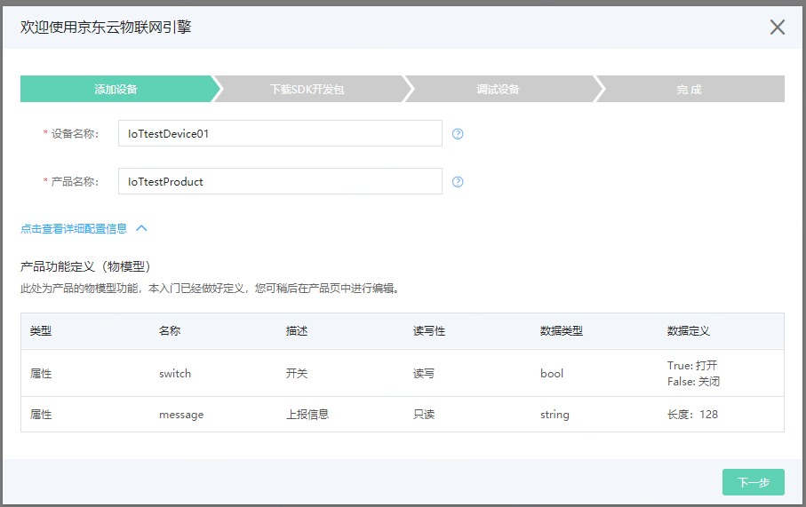
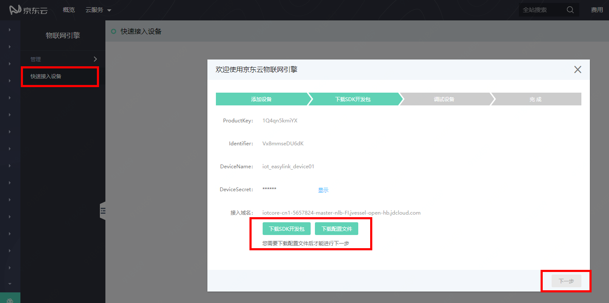
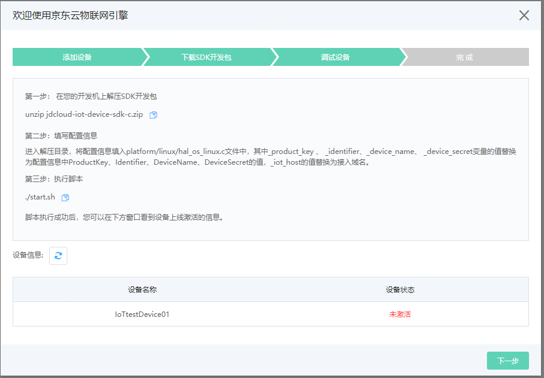
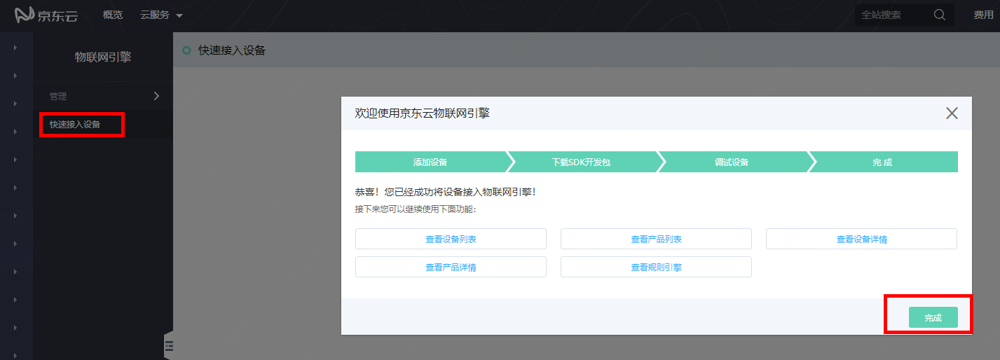

# 快速接入设备

用户首次开通服务后，即可进入快速接入设备页面。（您之后也可在左侧菜单栏点击【快速接入设备】菜单，再次进入快速接入设备页面）

1. 新建产品和设备

   填入产品名称和设备名称，默认系统会自动为产品添加switch和message这两条属性，稍后，您可以在产品详情中，修改编辑产品物模型定义。

   

2. 记录设备的配置信息及接入域名，并下载SDK开发包以及配置文件。注意：您必须下载并保存好您设备的配置文件，用于后面设备的连接鉴权。

   

3. 根据页面提示，在开发机上运行SDK开发包中的Demo程序，之后查看设备连接情况。

   

4. 完成快速接入设备，您可以直接点击下方链接，进入其他相关页面。

   

## 相关参考

- [SDK简介](../Developer-Guide-Device/Introduction.md)
- [设备鉴权](../Developer-Guide-Device/AuthenticateDevices.md)
- [建立连接](../Developer-Guide-Device/EstablishConnection.md)
- [订阅发布消息](../Developer-Guide-Device/SubPub.md)
- [网络连接和心跳](../Developer-Guide-Device/HeartBeat-Reconnection.md)
- [相关API](../Developer-Guide-Device/API.md)
- [术语表](../Developer-Guide-Device/Glossary.md)
