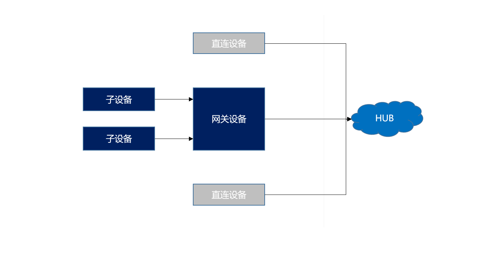
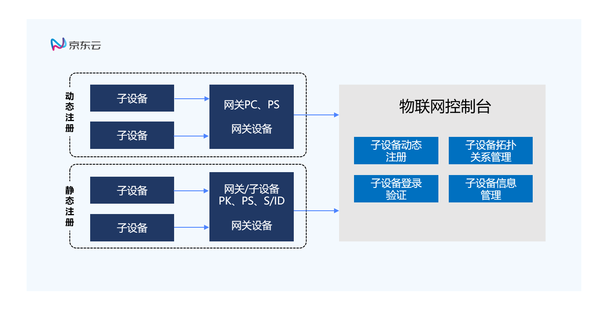
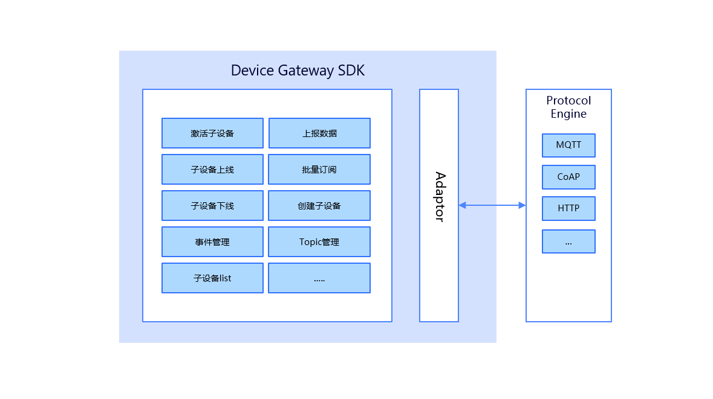

# 网关功能

- 网关负责代理子设备的认证、与云端的数据通信、管理子设备的信息和状态。网关与子设备之间的通信由厂商处理。
- 网关功能通过 iot_config.h 中的 DEVICE_GATEWAY 宏来控制。
- 编译生成的执行文件在 build/x86_64/bin/gateway_example 。

## 设备拓扑关系

- 直连设备：可直接连接云端
- 网关设备：拥有管理子设备，代理子设备连接云端的能力
- 子设备：不可直接连接云端需要通过代理连接云端的设备

## 子设备发送和接收

- 子设备的上下线由网关通知云端
- 子设备没有心跳，网关有心跳
- 网关需订阅子设备的topic，同步响应
- 网关可批量发送和接收子设备的数据

## 子设备激活

子设备需要在后台配置托普关系，子设备可多次获取DS/ID，子设备需先解除和网关的依赖关系，才可关联其他网关。解除依赖后，原网关清楚对子设备的控制能力。

网关功能架构图：

## 创建新设备

- `Int iot_gateway_construct(iot_dev_type_t dev_type, iot_dev_auth_info_t *meta_info);`
-	接口说明：创建一个新设备，包括网关和子设备类型。
-	返回值：成功返回设备ID，失败返回FAIL_RETURN
-	参数说明：

|参数名|	参数类型|	必填|	描述|
|:-:|:-:|:-:|:-:|
|dev_type|	iot_dev_type_t|	是|	需要创建的设备类型|
|meta_info|	iot_dev_auth_info_t| 	是	|设备的验证信息|

## 开启设备连接网络和主题订阅

-	`int iot_gateway_connect(int devid);`
-	接口说明：指定设备开启网络连接。
-	返回值：成功返回SUCCESS_RETURN，失败返回FAIL_RETURN
-	参数说明：

|参数名|	参数类型|	必填|	描述 |
|:-:|:-:|:-:|:-:|
|devid|	int |	是 |	需要连接网络的设备ID |

## 接收网络信息和分发事件

-	`void iot_gateway_yield(int timeout_ms);`
-	接口说明：接收云端事件，分发事件到注册的方法。
-	返回值：void
-	参数说明：

|参数名|	参数类型|	必填	|描述|
|:-:|:-:|:-:|:-:|
|timeout_ms|	int|	是|	接收网数据的超时时间|

## 关闭网络连接和回收设备资源

-	`int iot_gateway_destroy(int devid);`
-	接口说明：关闭指定设备网络连接和回收设备资源。
-	返回值：成功返回SUCCESS_RETURN，失败返回FAIL_RETURN
-	参数说明：

|参数名	|参数类型|	必填|	描述|
|:-:|:-:|:-:|:-:|
|devid|	int|	是|	指定设备id|

## 发送数据到云端

-	`int iot_gateway_report(int devid, iot_msg_type_t msg_type, unsigned char *payload, int payload_len);`
-	接口说明：发送数据到云端。
-	返回值：成功返回信息id，失败返回FAIL_RETURN
-	参数说明：

|参数名|	参数类型|	必填	|描述|
|:-:|:-:|:-:|:-:|
|devid|	int|	是|	指定设备id|
|msg_type|	iot_msg_type_t	|是	|消息类型|
|payload|	Unsigned char*|	是	|消息体|
|Payload_len|	int|	是|	消息体长度|

## 发送数据到云端

-	`uint32_t iot_gateway_generate_msgid();`
-	接口说明：生成消息id。
-	返回值：成功消息id，失败返回-1

