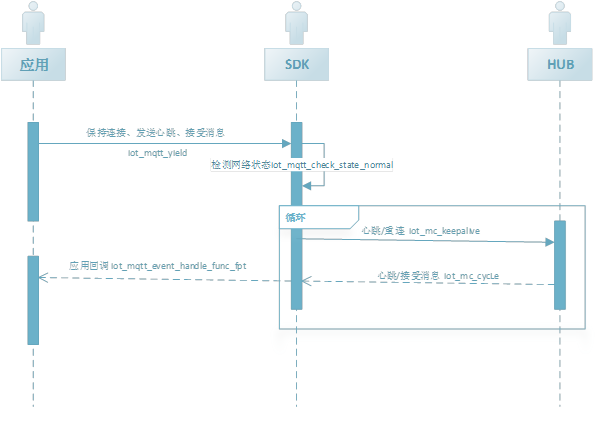

# 网络连接和心跳

设备 app 需要定期发送心跳至物联网引擎并得到回复从而确定网络的正常连接，同时需要检查并获取从物联网引擎发布给设备的消息请求

 

## 维护网络连接和心跳

接口：

​	int iot_mqtt_yield(void *handle, int timeout_ms);

接口说明：在指定的时间内检查网络状态，是否执行重连，发送心跳、接收数据

返回值：iot_error_t 中的code

参数说明：

| **参数名** | **参数类型**     | **必填** | **描述**   |
| ---------- | ---------------- | -------- | ---------- |
| handle     | iot_mc_client_pt | 是       | MQTT client |
| timeout_ms | int              | 是       | 处理网络操作的执行时长  |

 

在 MQTT client 中可通过设置 iot_mqtt_api.h 里的 `CONFIG_MQTT_KEEPALIVE_INTERAL` 宏来调整心跳间隔，心跳间隔的取值范围（单位秒）。 iot_mqtt_yield函数的调用间隔应该小于心跳的间隔时长。

 

## 检测网络状态

接口：

​	int iot_mqtt_check_state_normal(void *handle);

接口说明：检测网络连接是否正常

返回值：iot_error_t 中的code

参数说明：

| **参数名** | **参数类型**     | **必填** | **描述**     |
| ---------- | ---------------- | -------- | ------------ |
| handle     | iot_mc_client_pt | 是       | MQTT   client |

示例代码：

```
Res = iot_mqtt_check_state_normal(handle);
If(Res){                       
// MQTT client in normal state
}else{
//MQTT client in abnormal state
}
```
## 相关参考
- [快速接入设备](../Developer-Guide-Device/DeviceEasyLink.md)
- [设备鉴权](../Developer-Guide-Device/AuthenticateDevices.md)
- [建立连接](../Developer-Guide-Device/EstablishConnection.md)
- [订阅发布消息](../Developer-Guide-Device/SubPub.md)
- [相关API](../Developer-Guide-Device/API.md)
- [术语表](../Developer-Guide-Device/Glossary.md)
