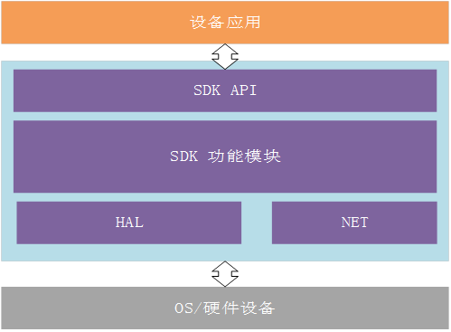

# Device SDK介绍

## 概述

京东云IoT Device SDK，是提供给设备厂商，用于集成在设备之上并通过SDK安全连接至京东云物联网引擎或物联网中心进行管理。设备必须要支持TCP/IP协议才能使用Device SDK，其他非IP设备通过非标准MQTT协议的设备，需要通过网关，边缘节点以及物联网协议适配才能接入物联网中心或物联网引擎。

京东云IoT Device SDK面向MQTT C语言开发者。本文档用于指导开发者快速接入JDCloud_IOT_DEVICE_SDK，提供了各个接口的定义与详细描述，目前SDK仅支持linux系统环境.

为了适应不同的操作系统、工具链和设备厂商的裁剪，IoT Device SDK 以开源代码的方式对外提供。

## 获取SDK开发包
目前京东云IoT Device SDK提供了C语言开发包，请点击下载：
[jdcloud-iot-device-sdk-c.zip](https://iotsdk-public.s3.cn-north-1.jdcloud-oss.com/device-sdk/linux-c/jdcloud-iot-device-sdk-c.zip)

## 架构

应用业务逻辑、SDK、HAL的关系如下图所示：

应用只需关心使用SDK API组合业务逻辑，无需关心通信细节，HAL层需要用户根据自身的OS和设备信息进行适配，SDK提供了linux的HAL层适配。

## 相关参考

- [快速接入设备](../Developer-Guide-Device/DeviceEasyLink.md)
- [设备鉴权](../Developer-Guide-Device/AuthenticateDevices.md)
- [建立连接](../Developer-Guide-Device/EstablishConnection.md)
- [订阅发布消息](../Developer-Guide-Device/SubPub.md)
- [网络连接和心跳](../Developer-Guide-Device/HeartBeat-Reconnection.md)
- [相关API](../Developer-Guide-Device/API.md)
- [术语表](../Developer-Guide-Device/Glossary.md)

