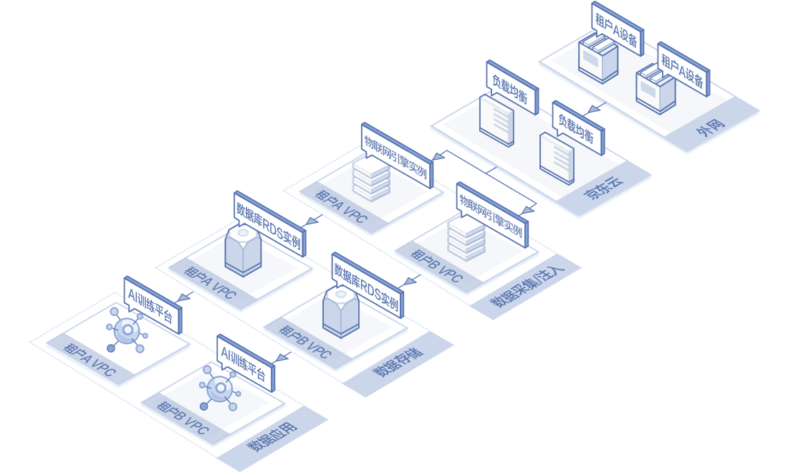

# 基础架构

物联网引擎（IoT Core）包含协议引擎、设备管理、设备影子、产品管理、产品物模型、规则引擎、安全保障等主要模块

## 业务架构
业务架构如下图：

## 相关参考

- [产品优势](../Introduction/Benefits.md)
- [产品功能](../Introduction/Features.md)
- [价格总览](../Pricing/Price-Overview.md)
- [计费规则](../Pricing/Billing-Rules.md)
