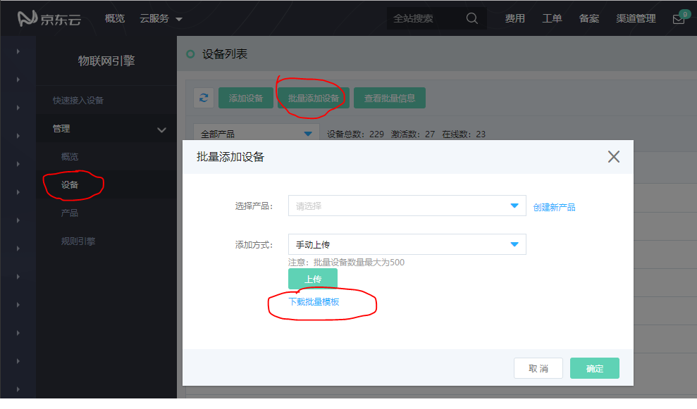
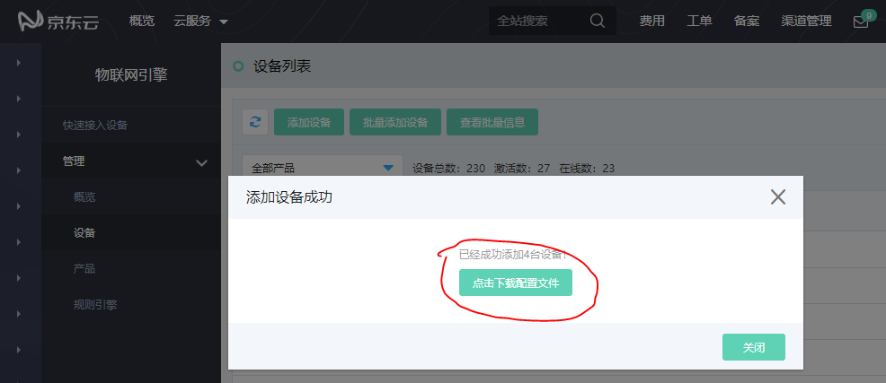

# 创建批量设备

产品完成创建后，需要进行设备创建。创建设备有单个创建和批量创建2种方式。本文为您介绍的是单个设备的创建方式。

**操作步骤**

1. 登入[物联网引擎控制台](https://iot-console.jdcloud.com/core/)
2. 选择左侧导航栏中 **管理** -> **设备**
3. 点击页面上方的 **批量添加设备**
4. 选择已创建的产品，点击 **下载批量模板**，下载表格模板
5. 在模板中填写设备名称(deviceName)，然后将填好的表格上传至物联网引擎控制台。

6. 点击 **确认** ，完成创建批量设备。
若批量上传的设备名称列表中有不合法的名称，将出现错误提示。请根据设备名称规范，修改设备名称，再重新上传文件。
7. 点击下载配置文件，下载本批次设备的设备证书。

**设备证书信息**

1. 设备创建完成，获得设备证书。
2. 点击下载配置文件。获取批量设备的配置证书密钥
