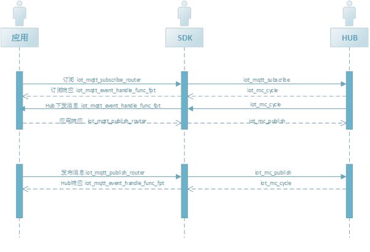

# 订阅和发布消息

设备激活后物联网引擎会生成相应的topic，设备可以订阅需要的topic。物联网引擎发布消息给订阅的设备，设备处理后进行响应。

 

## 订阅topic  

接口：

```
iot_mqtt_subscribe_router(
    void *handle,
    iot_mqtt_sub_t topic_type,
    const char * product_key,
    const char * device_id,
    iot_mqtt_event_handle_func_fpt topic_handle_func,
    void *pcontext);`
```

接口说明：订阅需要的topic，并注返回函数

返回值：成功返回packetid，否则返回iot_error_t中的错误类型

参数说明：

| **参数名**        | **参数类型**                   | **必填** | **描述**            |
| ----------------- | ------------------------------ | -------- | ------------------- |
| handle            | iot_mc_client_pt               | 是       | MQTT client          |
| topic_type        | iot_mqtt_sub_t                 | 是       | 需要订阅的topic类型 |
| product_key       | char*                          | 是       | Product key         |
| device_id         | char*                          | 是       | Device identifier     |
| topic_handle_func | iot_mqtt_event_handle_func_fpt | 是       | 返回函数            |
| pcontext          | void*                          | 是       | 通过返回函数返回    |

示例代码：

```
hal_get_product_key(SMP_PRODUCT_KEY);
hal_get_device_id(SMP_DEVICE_ID);
iot_mqtt_subscribe_router(handle,MQTT_SUB_TYPE_PROPERTY_REPLY,MP_PRODUCT_KEY, SMP_DEVICE_ID, iot_subscribe_reply, NULL);
```


## 发布消息

接口：

```
int32_t iot_mqtt_publish_router(
    void *handle,
    iot_mqtt_pub_t topic_type,
    const char * product_key,
    const char * device_id,
    cJSON *payload)
```

接口说明：发布消息

返回值：成功返回packetid，否则返回iot_error_t中的错误类型

参数说明：

| **参数名**  | **参数类型**     | **必填** | **描述**          |
| ----------- | ---------------- | -------- | ----------------- |
| handle      | iot_mc_client_pt | 是       | MQTT client        |
| topic_type  | iot_mqtt_pub_t   | 是       | 推送到指定的topic |
| product_key | char*            | 是       | Product key       |
| device_id   | char*            | 是       | Device identifier   |
| payload     | cjson            | 是       | 推送的消息        |

示例代码：

```
cJSON * data = iot_mqtt_build_device_shadow_update_json(rep_json,ts);
iot_mqtt_publish_router(handle,MQTT_PUB_TYPE_DEVICE_UPDATE_SHADOW,SMP_PRODUCT_KEY,SMP_DEVICE_ID,data;
```

目前支持的订阅topic类型 

```
typedef enum {                
    MQTT_SUB_TYPE_PROPERTY_REPLY = 0,
    MQTT_SUB_TYPE_EVENT_REPLY,
    MQTT_SUB_TYPE_SERVICE,
    MQTT_SUB_TYPE_SHADOW_UPDATE,
    MQTT_SUB_TYPE_DEVICE_UPDATE_SHADOW_REPLY,
    MQTT_SUB_TYPE_GET_SHADOW_REPLY,
    MQTT_SUB_DYNAMIC_AUTH,
} iot_mqtt_sub_t;
```

目前支持的发布topic类型 

```
typedef enum {
    MQTT_PUB_TYPE_PROPERTY = 0,
    MQTT_PUB_TYPE_EVENT,
    MQTT_PUB_TYPE_SERVICE_REPLY,
    MQTT_PUB_TYPE_SHADOW_REPLY,
    MQTT_PUB_TYPE_DEVICE_UPDATE_SHADOW,
    MQTT_PUB_TYPE_GET_SHADOW,
} iot_mqtt_pub_t;
```


## 订阅服务和响应

设备端需要使用此方法订阅hub的影子，及时响应hub的命令

1)订阅服务Topic：
```
iot_mqtt_subscribe_router(handle, MQTT_SUB_TYPE_SERVICE, SMP_PRODUCT_KEY, SMP_IDENTIFIER, iot_subscribe_reply, NULL);
```

 Handle为mqtt的客户端，iot_subscribe_reply为注册的回调方法。

2) 响应服务命令下发：

a）iot_subscribe_reply会收到hub下发的服务命令，回调方法会获取到mqtt的信息。

b) payload中的json格式如下：

```
{                                            
    "msgId ": "123",
    "version": "1.0",
    "name": "testService",         
    "data ": {                        
        "Power": "on",
        "WF":23.6
     }
}                              
```
            

c）设备根据服务名和入参处理完逻辑后，将服务的出参封装成json对象，传给iot_mqtt_build_service_reply_json 方法生成payload，再调用iot_mqtt_publish_router进行回复。

## 设备属性上报

设备如果有事件需要通知hub，可以通过此方法发送

1) 订阅属性回复Topic：
```
iot_mqtt_subscribe_router(handle,QTT_SUB_TYPE_PROPERTY_REPLY, SMP_PRODUCT_KEY, SMP_IDENTIFIER, iot_subscribe_reply, NULL)
```

2) 上报本地数据：

a) 请求数据格式：                                                             

```
{                                       
   "msgId ": "123",
   "version": "1.0",
   "data ": {
       "Power": "on",
       "WF":23.6,
   },
   "ts":1559805611390
}
```

b）上报只读属性的property，将需要上报的属性封装成json对象传入方法iot_mqtt_build_property_json中生成payload。再调用iot_mqtt_publish_router进行发送。

c）iot_subscribe_reply会收到hub收到属性上报的响应。

## 设备事件上报

设备如果有事件需要通知hub，可以通过此方法发送

1) 订阅事件上报回复Topic：         
```
iot_mqtt_subscribe_router(handle, MQTT_SUB_TYPE_EVENT_REPLY, SMP_PRODUCT_KEY, SMP_IDENTIFIER, iot_subscribe_reply, NULL)
```
2) 上报设备事件：

a) 请求数据格式：

```
{
    "msgId ": "123",
    "version": "1.0",
    "name": "testEvent",
    "data ": {
        "Power": "on", 
        "WF":23.6
    },
    "ts":1559805611390
}
```

b）事件有事件名和入参，将入参封装成josn和事件名一起出入iot_mqtt_build_event_json中生成payload。再调用iot_mqtt_publish_router进行发送。

c）iot_subscribe_reply会收到hub收到事件上报的响应。

## 请求影子 

设备需要同步hub的影子状态，可以调用此方法

1) 订阅影子回复Topic：
```
iot_mqtt_subscribe_router(handle, MQTT_SUB_TYPE_GET_SHADOW_REPLY, SMP_PRODUCT_KEY, SMP_IDENTIFIER, iot_subscribe_reply, NULL)
```
2) 请求获取影子：

a) 请求数据格式：

```
{
    "msgId ": "123",
    "version": "1.0",
    "data ": {
    }
}                                       
```

b）使用iot_mqtt_build_shadow_acquiring_json生产payload，传入iot_mqtt_publish_router发送请求影子。

c）iot_subscribe_reply会收到hub返回的影子值格式如下。

```
{                                  
    "msgId ": "123",
    "code": 200,
    "data": {
        "state":{
            "desired": {//期望值
                "Power": "on",//属性期望值,无期望值时为null
                "WF": 23.6
            },
            "reported": {//当前值
                "Power": "off",
                "WF": 11
            }
        },
        "metadata": {
            "reported": {
                "Power": {
                    "timestamp": 1451649600512 //当前值的更新时间戳，精确到毫秒
                },
                "WF": {
                    "timestamp": 1451649600512 //当前值的更新时间戳，精确到毫秒
                }
            }, 
            "desired": {
                "Power": {
                    timestamp": 1451649600512 //期望值的更新时间戳，精确到毫秒
                },
                "WF": {
                    "timestamp": 1451649600512 //期望值的更新时间戳，精确到毫秒
                }
            }
        },
        "version": 3,//影子版本号
        "timestamp": 1451649600512 //影子最后更新时间戳，精确到毫秒
    }
}
```


## 订阅影子更新和响应

设备端需要使用此方法订阅hub的影子，及时响应hub的命令

1) 订阅影子Topic：
```
iot_mqtt_subscribe_router(handle, MQTT_SUB_TYPE_SHADOW_UPDATE, SMP_PRODUCT_KEY, SMP_IDENTIFIER, iot_subscribe_reply, NULL);
```
2) 响应影子下发：

a）iot_subscribe_reply会收到hub下发的影子，回调方法会获取到mqtt的信息。

b) 影子下发数据格式：

```
{
    "msgId ": "123",
    "version": "1.0",
    "data ": {
        "desired": {//云端下发的属性期望值
            "Power": "on",
            "WF": 23.6
        },
        "version": 2,//当前版本，整数递增
        "timestamp": 1561107827//下发时间，精确到毫秒
    }
}
```

`c) 根据`desired处理相应的逻辑，将需要report的值封装到json对象中，传入

iot_mqtt_build_shadow_update_reply_json方法，再调用iot_mqtt_publish_router进行回复。

## 取消订阅

取消订阅Topic：
```
int iot_mqtt_unsubscribe(void *handle, const char *topic_filter);
```
接口说明：取消订阅的topic

返回值：成功返回packetid，否则返回iot_error_t中的错误类型

参数说明：

| **参数名**   | **参数类型**     | **必填** | **描述**        |
| ------------ | ---------------- | -------- | --------------- |
| handle       | iot_mc_client_pt | 是       | MQTT   client    |
| topic_filter | char*            | 是       | 需要取消的topic |

示例代码：

```
char *fmt = get_mqtt_sub_format(MQTT_SUB_TYPE_PROPERTY_REPLY);
hal_snprintf(topic,CONFIG_MQTT_TOPIC_MAXLEN,fmt,meta_info->product_key,meta_info->device_name);
iot_mqtt_unsubscribe(handle, topic)；
```

## 相关参考

- [快速接入设备](../Developer-Guide-Device/DeviceEasyLink.md)
- [设备鉴权](../Developer-Guide-Device/AuthenticateDevices.md)
- [建立连接](../Developer-Guide-Device/EstablishConnection.md)
- [网络连接和心跳](../Developer-Guide-Device/HeartBeat-Reconnection.md)
- [相关API](../Developer-Guide-Device/API.md)
- [术语表](../Developer-Guide-Device/Glossary.md)
