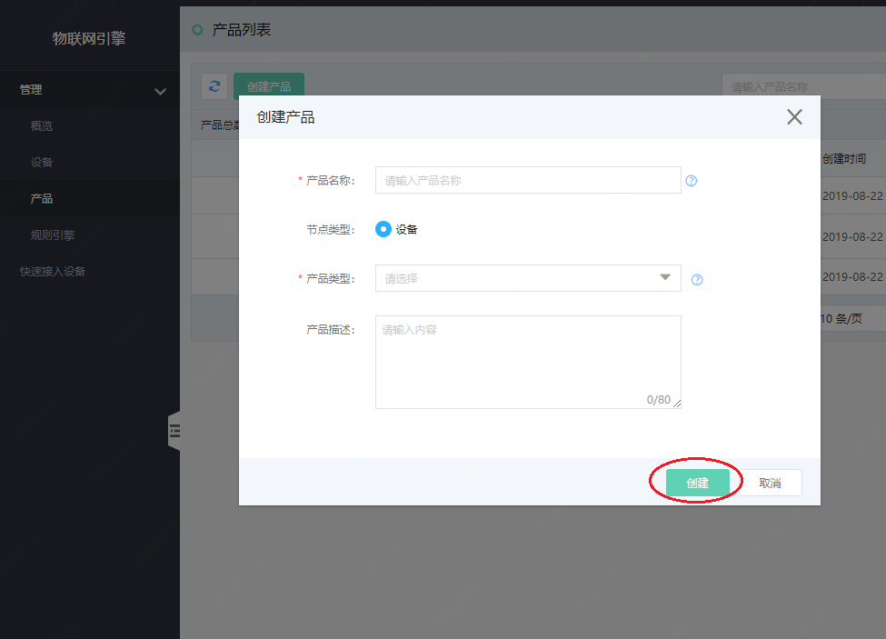
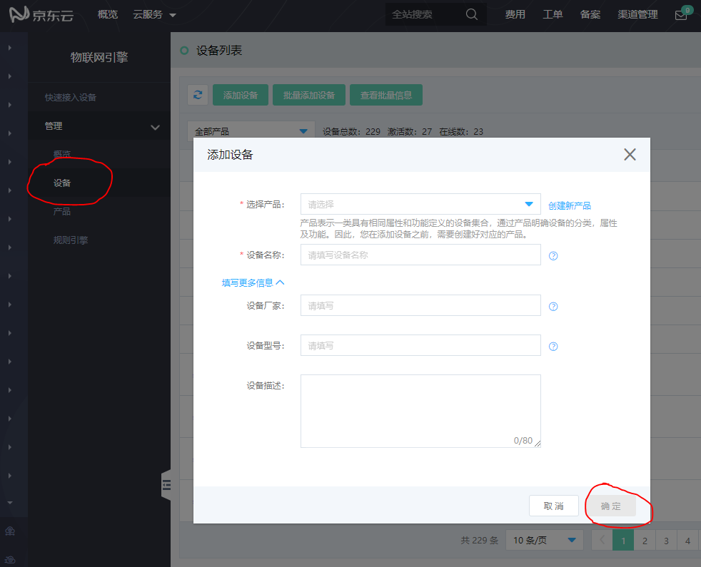

# 创建产品与设备

本文介绍如何快速的创建产品与设备，创建产品与设备是使用物联网平台的第一步，您可以根据需要定义设备的集合及产品。

1. 登录 [物联网引擎控制台](https://iot-console.jdcloud.com/core)
2. 创建产品
- 左侧导航栏选择 **管理** -> **产品** 。 在 **产品** 页面，点击上方的 **创建产品**。 参考如下，按照页面提示填写信息，然后单击 **创建**。产品将自动出现在产品列表中。
具体配置细节可参考 [**创建产品**](../Operation-Guide/Create-Product.md) 文档完成。

3. 创建设备。
- 左侧导航栏选中 **管理** > **设备** ，进入 **设备** 页面
- 单击 **添加设备** 。选中 **已创建的产品** ，输入 **设备名称** ，单击 **确定**。

