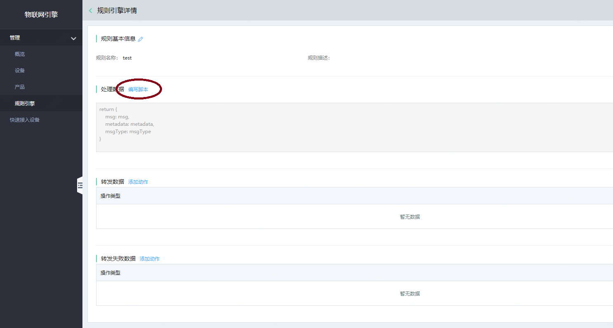
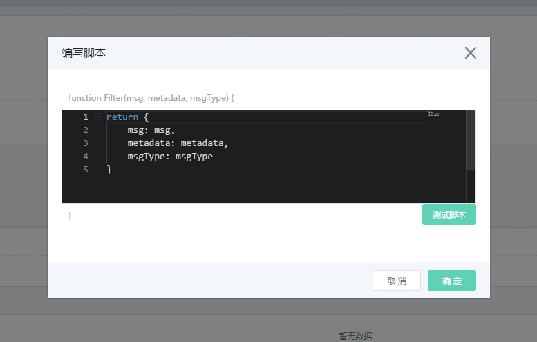
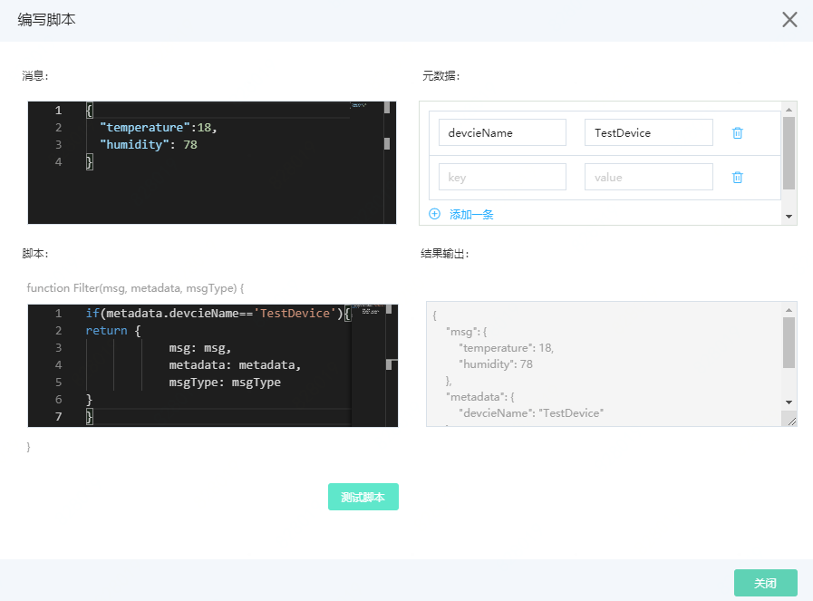
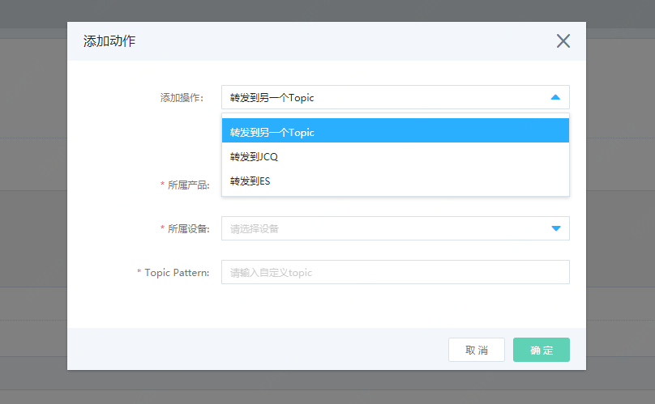
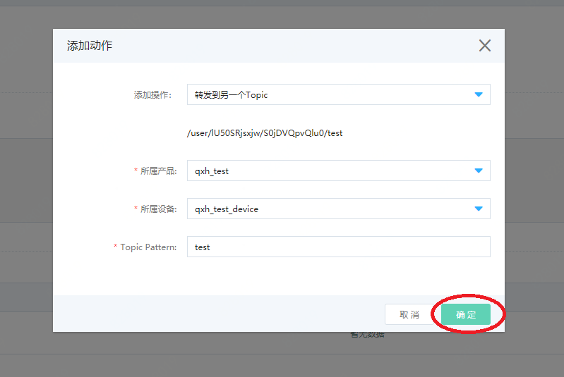
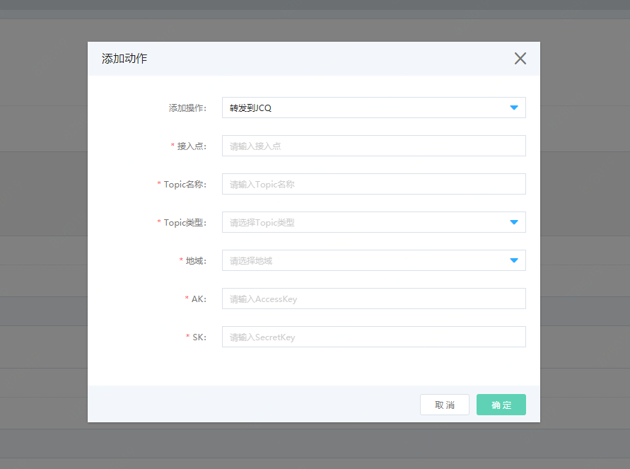

# 规则引擎

## 创建规则

1. 登录[物联网引擎控制台](https://iot-console.jdcloud.com/core)
2. 左侧到导航选择 **管理** -> **规则引擎**
3. 点击页面上方的 **创建规则引擎**

[create-rule](../../../../image/IoT/IoT-Engine/Create_Rule.png)

## 数据转发

1. 点击 **规则名称** ， 进入规则引擎详情页

### 2.1 处理数据/编写脚本

1. 点击页面上的 **编写脚本**，进行处理规则引擎转发的规则逻辑编写



- 脚本所用的为 JavaScript 语言
- 所有的数据都会经过 脚本 进行处理，然后进行数据转发



脚本样例如下：

```
function Filter(msg, metadata, msgType) {  		
	if(metadata.devcieName=='TestDevice'){
return { 							
    		msg: msg,
    		metadata: metadata,
   			msgType: msgType
}
}
}									

```

| 属性 | 描述
| ----- | ----- |
|msg| 用户产品中定义的属性，设备上报数据|
|metadata| 静态 元数据<br>metadata 元数据中包括：<br> metadata.deviceName 为设备名称 <br> metadata.identifier 为设备Key <br> metadata.ts 为消息上报的时间  <br> metadata.version 为当前版本 |
|msgType|消息类型 |

脚本编写完成后，可点击 **测试脚本** ， 进行脚本测试

测试界面如下：

- 结果输出为 当执行脚本过滤后 输出的数据
- 用户可以点击 **测试脚本**
- **结果输出** 显示经过脚本过滤的数据



## 2.2 转发数据/添加动作

- 点击 **添加动作** ，出现添加动作弹窗，添加操作有三种方式，分别是转发到另一个Topic，转发到JCQ，转发到ES



### 2.2.1 转发到另一个Topic

- 选择必选项产品、设备和输入自定义topic名称。若产品没有可选项，请先到产品页创建产品，然后去设备页为所属产品添加设备；若设备没有可选项，请到设备页为所属产品添加设备。



- 点击 **确定** ，转发列表中即可看到该MQTT操作类型。同时可以对其进行编辑和删除。

### 2.2.2 转发到JCQ

转发JCQ需填写 JCQ 接入点、Topic名称、Topic类型和地域 等信息， 可以进入 消息队列JCQ 产品中查找到相关信息 。

获取消息队列JCQ的参数信息：
1. 进入 **消息队列 JCQ** -> **Topic管理页**
2. 点击目标 Topic 名称进入该 Topic 详情页。 若Topic管理页没有创建好的Topic，则点击 **新建按钮** ，创建Topic。

AK/SK信息：
1. 


