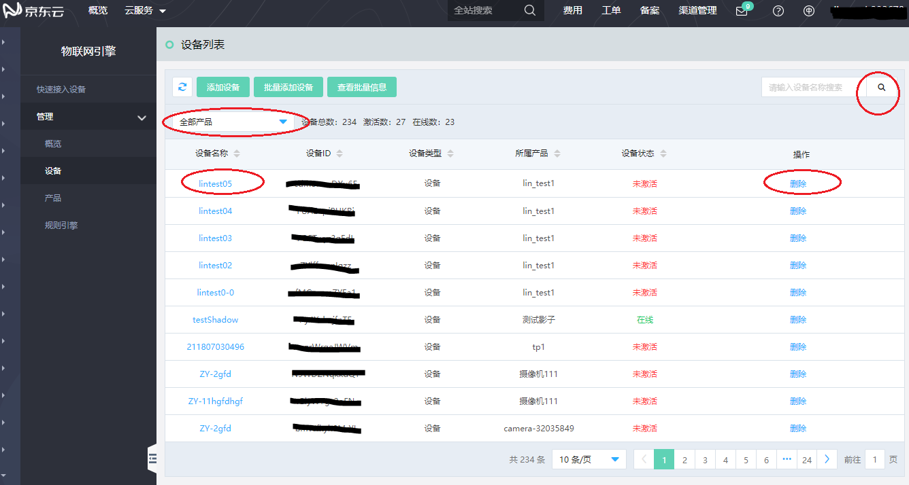

# 设备管理

在物联网引擎控制台成功创建设备后，您可以通过物联网引擎控制台管理、查看具体设备信息。

**操作步骤**

在物联网引擎控制台左侧导航栏，单击 **管理** -> **设备** ，进入设备管理页。

| 操作                  | 操作描述                 |
| :------------------- | :------------------- |
|查看具体产品下的设备信息  | 在页面上方选择某个产品，可以查询该产品下的所有设备信息|
|搜索设备  | 输入设备名称，搜索设备信息，目前指支持精确搜索 | 
|查看具体设备信息  | 点击设备名称，进入设备详情页进行设备信息查看 | 
|删除具体设备  | 点击对应要删除的设备的删除按钮，注意：设备删除后，该设备证书信息将失效，该设备在物联网引擎的数据记录也会删除| 
