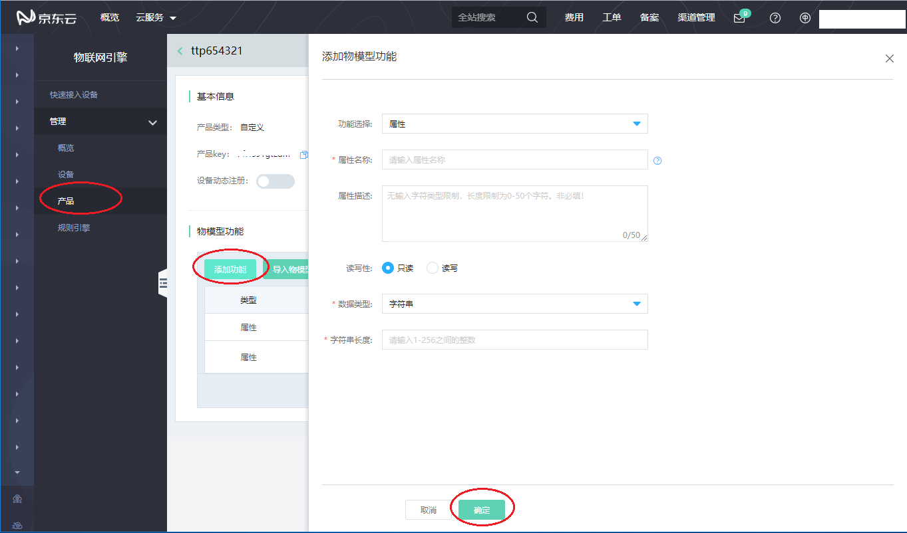

# 新增物模型

新增物模型，即定义产品功能（包括属性、事件和服务）。本文介绍如何在控制台定义物模型。

**操作步骤**

1. 登录[物联网引擎控制台](https://iot-console.jdcloud.com/core)
2. 左侧到含量选择 **管理** -> **产品**
3. 在产品列表中，点击产品名称，进入产品详情页面
4. 点击 物模型功能-> **添加功能** 按钮
5. 在弹出对话框中，定义适合该产品的功能信息。您可为产品自定义属性、服务和事件。

6. 设置参数完成后，单击 **确认**。

## 属性参数设置如下：

| 参数                  | 描述                 |
| :-------------------: | :------------------- |
|属性名称  | 定义属性的名称，支持英文字母、数字、下划线“_”及中划线“-”，必须英文字母及数字开头结尾，1-30个字符。必填！产品下唯一。不可修改。 | 
|属性描述 | 用于进行功能的说明。无输入字符类型限制，长度限制为0-50个字符。非必填！ | 
|读写性 | 定义属性值本身的读写性，可读写属性自动生成物影子。必填项。	值：只读(read_only)：支持 GET（获取）和 SET（设置）。 / 读写(read_write) ：仅支持 GET（获取）。  | 
|数据类型 | 定义该属性的数据类型，目前支持下面几种类型，必填项。   - 字符串（string）:长度（length）:允许传入字符串的最大长度（输入值为1 - 256范围内的整数），不可为空，不可为0。可更改；   - 布尔值（bool）:数值（value）：true / false, 数值名称（name）：定义对应的数值名称，用于识别及展示。不可为空，支持汉字、英文字母、数字。长度为1-10个字符。可更改;    - 枚举值（enum）:数值（value）：定义枚举的数值，取值范围：0~99。总数大于等于2个（数值支持类型：string），输入“0”时，仅支持1位。其他数字不支持以0开头。不可重复！可更改。数值名称（name）：定义对应的数值名称，用于识别及展示。不可为空，支持汉字、英文字母、数字。长度为1-10个字符。可更改。   - 浮点（float），默认标准定义范围为 （ -2128+1 , 2128 -1），小数有效位数7位。    - 整型（int32），默认标准定义范围为（-231 , 231-1），无小数。    - 双精度浮点（double），默认标准定义范围为（-21034 +1, 21023-1），小数有效位数14位。     注意：最大/最小值以及步长的范围应在该数据类型的标准范围内。   包含的其他数值型：  最大值（max）：该数值允许的最大值 可更改；	   最小值（min）：该数值允许的最小值 可更改；	   步长(step)：数值变化的最小粒度 可更改；单位（unit）：该数值对应的单位，长度限制为0-10个字符。可更改 非必填项；单位名称（unitname）：该数值对应的单位名称，长度限制为0-10个字符。可更改 非必填项。  步长使用场景如下：  1. 根据步长值判断设备上报数据精度是否正常，进而产生报警或故障的event。   2. 对于读写属性，在进行属性更新时，对用户填入的更新值做精度校验，不符合要求的不能更新。|
