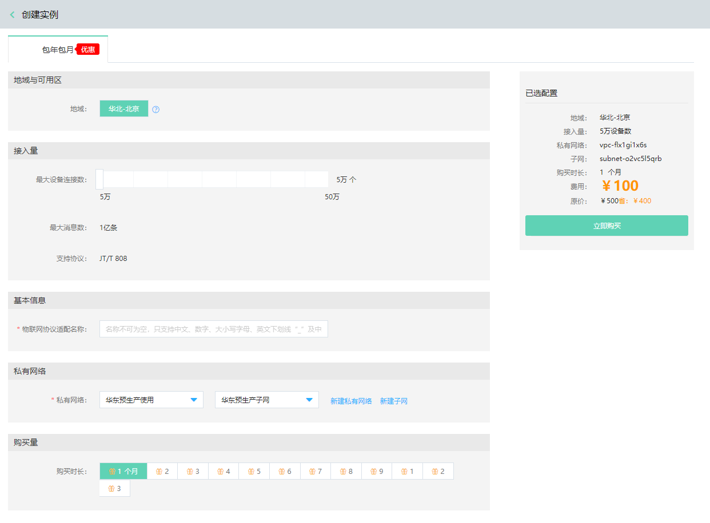

# 创建实例

您可以通过 物联网协议适配服务 控制台或 API 快速创建 物联网协议适配实例 。

本文介绍通过控制台如何创建 物联网协议适配服务实例。

## 前提条件
- 已注册京东云账号，并完成实名认证。如果还没有账号请 [注册](https://accounts.jdcloud.com/p/regPage?source=jdcloud%26ReturnUrl=%2f%2fuc.jdcloud.com%2fpassport%2fcomplete%3freturnUrl%3dhttp%3A%2F%2Fuc.jdcloud.com%2Fredirect%2FloginRouter%3FreturnUrl%3Dhttps%253A%252F%252Fwww.jdcloud.com%252Fhelp%252Fdetail%252F734%252FisCatalog%252F1)，或 [实名认证](https://uc.jdcloud.com/account/certify)。

## 操作步骤
1. 登录 [物联网协议适配服务控制台](https://iot-console.jdcloud.com/iot-protocol-adaptor)。
2. 在“实例列表”页面，点击 **创建** ，进入“创建实例”页面。

    
	
3. 选择实例配置

	- 地域
	
       京东云的机房分布在全球多个位置，这些位置称为地域。物联网协议适配 服务   目前仅支持华北-北京地域。

	   说明：
	   - 处在同一地域的云服务产品之间通过内网互通，但不同账户的资源内网完全隔离；
	   - 处在不同地域的云服务产品之间内网不能互通。
	   
	- 接入量
	
	   您可以根据您具体的设备接入量来选择购买及创建物联网协议适配实例，按照设备连接数5万递增。超过50万连接数的，请您提交工单申请。
	   
	- 基本信息
	
	    为您的物联网协议适配实例创建一个名称。不同实例的名称不能相同。	   
	   
	- 私有网络
	
	   物联网协议适配服务支持私有网络部署。如果您当前尚未完成网络规划，请先去创建私有网络与子网。
	   
4. 点击 **立即购买** ，进入“订单确认”页面。
6. 在“订单确认”页面，确认实例信息及订单金额后，请点击 **立即支付** 。
7. 支付流程流程完成后，页面会自动跳转到 物联网协议适配服务   “实例列表”页面，等待实例创建完成，您可以在“实例列表”页面查看新创建的 物联网协议适配 服务   实例。

**注意**

目前物联网协议适配服务按包年包月方式计费，暂时不提供主动删除实例功能。 如您需要删除当前实例，请在实例到期前，备份好您的数据，到期未续费15天后，实例将自动删除。
