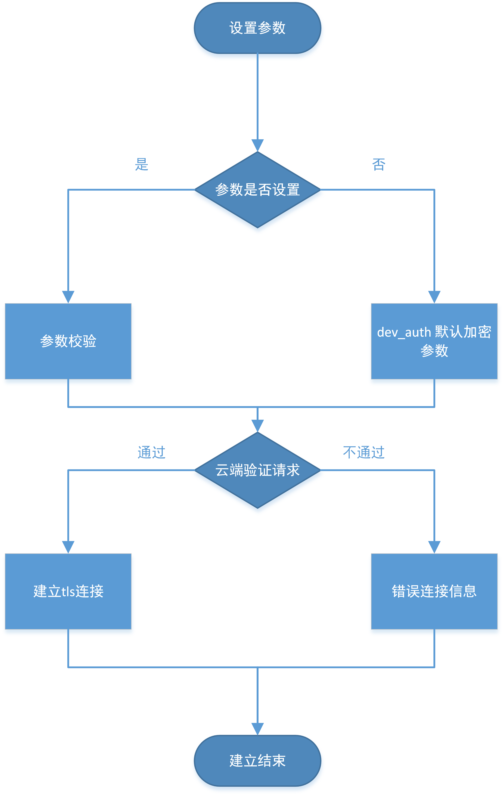

# 建立连接

## Host配置

京东云目前提供物联网引擎和物联网中心两个产品支持设备接入。

物联网引擎：在用户VPC内创建用户私有实例，所有资源为该用户独立使用。享有独立的接入入口。

物联网中心：用户无需创建实例，采用统一的接入入口，物联网中心为每个用户自动分配资源。

在SDK文件 src/utils/iot_config.h 中，通过`INDEPENDENT_MODE`来控制 SDK 是访问物联网引擎还是物联网中心，对物联网引擎开发者需要将platform/linux/hal_os_linux.c 中`_device_host`的地址替换为物联网引擎的公网域名地址。


## 初始化数据

开发者从控制台获取到设备3件套后，将信息写入存储系统或 HAL 文件后，即可从设备 app 调用`iot_mqtt_construct()`来建立连接。

 

## 创建 MQTT 连接实例

接口：void *iot_mqtt_construct(iot_mqtt_param_t *pInitParams) 

接口说明：创建 MQTT 实例，初始化数据，建立 MQTT 连接

返回值：成功返回 MQTT 实例，否则返回 NULL

参数说明：

| **iot_mqtt_param_t****参数名** | **参数类型**            | **描述**             |
| ------------------------------ | ----------------------| -------------------- |
| port                           | uint16_t              | MQTT Broker端口      |
| host                           | const char*            | MQTT Broker host     |
| client_id                      | const char*           | MQTT Client id       |
| username                       | const char*           | 进行 MQTT 连接用的用户名    |
| password                       | const char*           | 进行 MQTT 连接用的密码     |
| pub_key                        | char*                 | 认证 MQTT Broker 的 CA 证书    |
| clean_session                  | uint8_t               | 是否清除 MQTT 会话     |
| request_timeout_ms             | uint32_t              | MQTT 消息请求的超时设置      |
| keepalive_interval_ms          | uint32_t              | MQTT 心跳间隔
| write_buf_size                 | uint32_t              | size of write buffer |
| read_buf_size                  | uint32_t              | size of read buffer  |
| handle_event                  | iot_mqtt_event_handle_t | MQTT 事件处理回调函数   |

示例代码：

```
iot_mqtt_param_t mqtt_params；

pclient = iot_mqtt_construct(&mqtt_params);
```


## 销毁MQTT连接和实例

接口： Int iot_mqtt_destroy (iot_mqtt_param_t *pInitParams)

接口说明：销毁 Mqtt 实例，释放数据和连接

返回值：成功返回`SUCCESS_RETURN`，否则返回其他


 示例代码：

```
iot_mqtt_destroy (pInitParams);
```

## 相关参考

- [快速接入设备](../Developer-Guide-Device/DeviceEasyLink.md)
- [设备鉴权](../Developer-Guide-Device/AuthenticateDevices.md)
- [订阅发布消息](../Developer-Guide-Device/SubPub.md)
- [心跳及重连](../Developer-Guide-Device/HeartBeat-Reconnection.md)
- [相关API](../Developer-Guide-Device/API.md)
- [术语表](../Developer-Guide-Device/Glossary.md)
