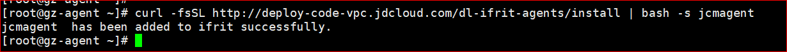

# 安装监控插件
选择需要作为探测源的云主机（仅支持Linux类主机），登录该云主机。  
1. 配置credential文件  
  - 创建 ~/.jdcloud/monitor_credentials.yml 文件  
  - 编缉并保存monitor_credentials.yml文件，文件内容为：  
```
ak: xxxxxxx(填写YourAccessKeyID)   
sk: xxxxxxx(填写YourAccessKeySecret) 
```
   注： ak\sk内容填写须符合yaml语法（键值对之间必须要有空格），否则会读取ak\sk失败。如: ak:(空格)xxxxxx

2. 复制安装命令至云主机。  
```
curl -fsSL http://deploy-code-vpc.jdcloud.com/dl-ifrit-agents/install | bash -s jcmagent
```  

3. 敲击回车键，执行安装操作。  
     

4. 等待1-3分钟，执行以下命令验证jcmagent是否安装成功。  
  - 验证命令：
```
curl http://localhost:1236/ping
```
  - 返回：pong  代表jcmagent安装成。  
  示例如下：  
     
 注：如果安装失败，1-3分钟后重新执行安装命令。多次失败，请联系客服。
