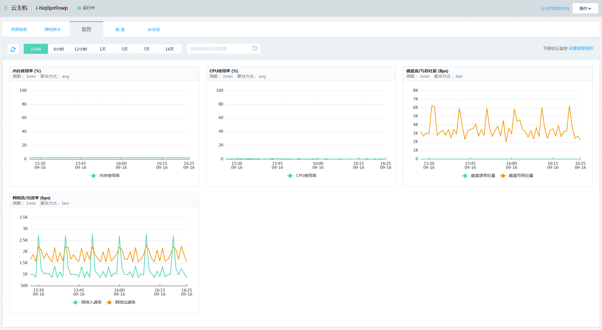

## 查看监控图表
云资源的监控图表可通过两种方式进行查看，一种是在云监控页面进行查看，一种是在云资源详情页面查看。  

**云监控页面查看**  
1. 登录京东云控制台，点击管理->云监控->资源监控，以云主机为例，四级菜单选中“云主机”，进入云主机监控列表。
  

2. 点击实例操作了下的“监控表”按钮，进入监控信息详情页面。即可查看到对应资源的监控详情。  
  

**云资源详情页面查看**
1. 登录京东云控制台，（以云主机为例）点击左侧菜单导航栏 弹性计算->云主机，进入云主机实例列表。  

2. 选中需要查看的云主机实例，点击ID/名称列下的资源明名称或ID信息，进入云主机详情页面。  
  

   
   
   

