# 报警模板
报警模板能够帮助用户快速创建和更新报警规则。报警模板分为默认报警模板和自定义报警模板。默认报警模板是京东云平台根据不同云产品的特性提供的默认模板，方便初次使用云产品的用户快速创建报警规则。自定义报警模板是用户根据自身业务需求的不同创建的报警模板。

## 默认报警模板  
### 查看模板
1.	进入京东云控制台-云监控菜单-报警管理-报警模板，点击“默认报警模板”标签，即可进入默认报警模板列表面。 可以查看到模板名称、资源类型、触发条件数量、 是否关联规则等信息。  
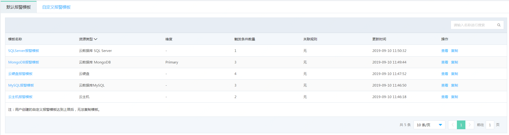  

2.	点击列表中的“查看”，可以查看默认报警模板的详情信息，即：触发条件详情，已关联的报警规则信息。  
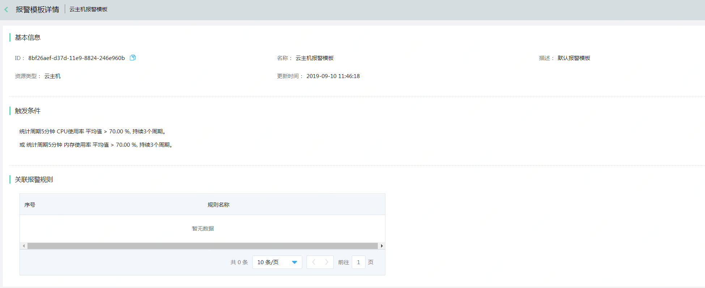
### 复制模板
1.	进入京东云控制台-云监控菜单-报警管理-报警模板，点击“默认报警模板”标签，即可进入默认报警模板列表面。  
  
2.	选中需要复制的报警模板，点击“复制”按钮，打开复制默认模板页面。  
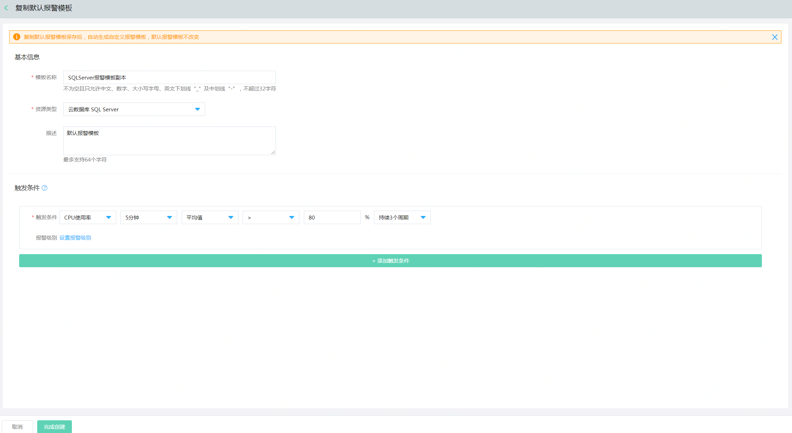  
注：若自定义模板数量已达上限后，无法复制。
3.	在复制模板页面，可更改模板名称、触发条件等信息，点击完成创建即可。

## 自定义报警模板  
### 查看模板
1.	进入京东云控制台-云监控菜单-报警管理-报警模板，点击“自定义报警模板”标签，即可进入自定义报警模板列表页面。  
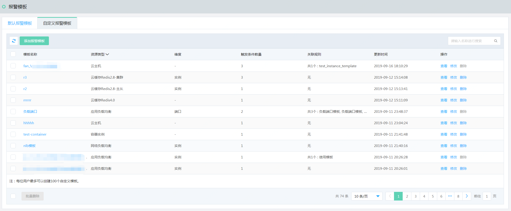  

2. 点击“查看”，即可查看自定义报警模板详情，即：触发条件详情，已关联的报警规则信息。 
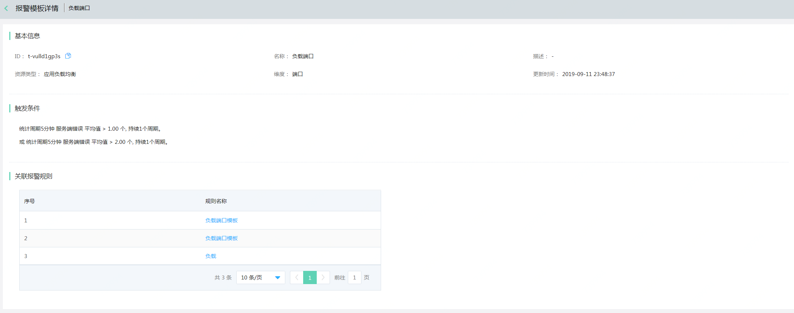

### 添加模板
1. 进入京东云控制台-云监控菜单-报警管理-报警模板，点击“自定义报警模板”标签，即可进入自定义报警模板列表页面。可以查看到模板名称、资源类型、触发条件数量、 是否关联规则等信息。 
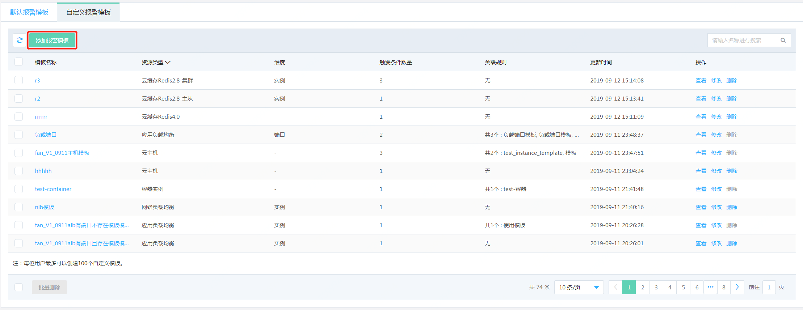  

2. 点击“添加报警模板”，填写报警模板名称、选择资源类型、填写模板描述信息及该模板的触发条件，点击“完成创建”，即可保存新模板的创建。  
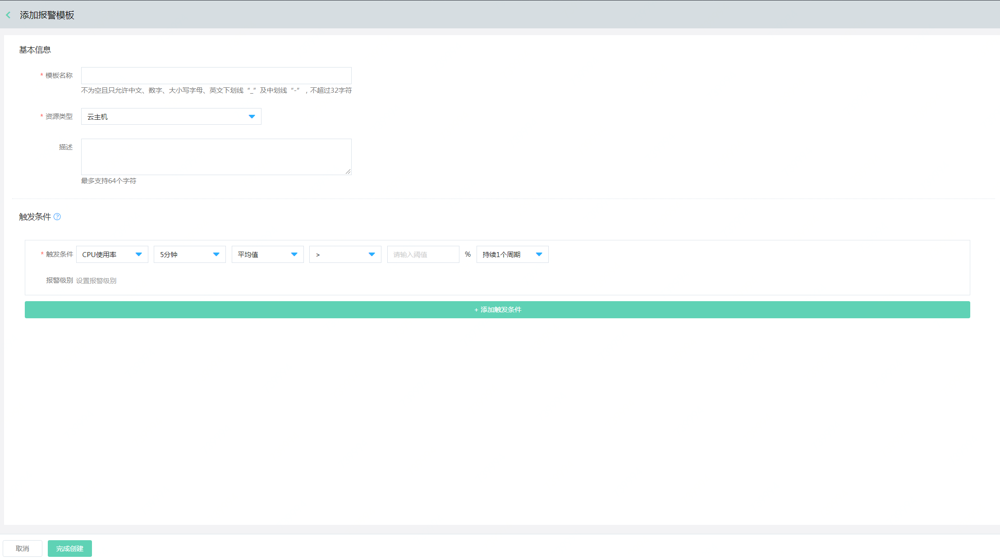  

### 删除模板
1.	进入京东云控制台-云监控菜单-报警管理-报警模板，点击“自定义报警模板”标签，即可进入自定义报警模板列表页面。  
  
2. 选中需要删除的模板，点击“删除”，或选中多个模板，点击“批量删除”按钮。  
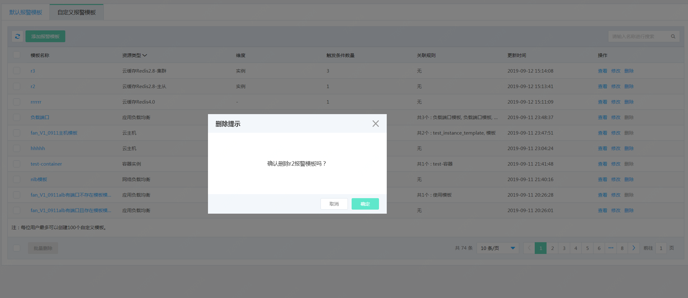  
注： 已关联报警规则的报警模板不允许删除。需要将关联的规则切换为其他模板或自定义触发条件，或者删除规则后才可删除。

## 使用报警模板  
1.	进入京东云控制台-云监控菜单-报警管理-全部报警规则，进入全部报警规则列表页面。  
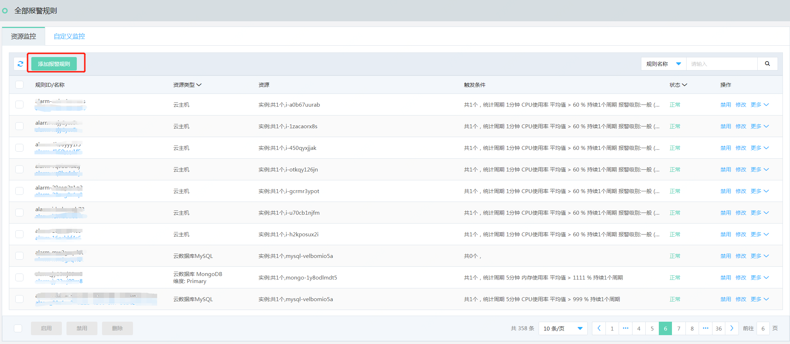
2.	点击“添加报警规则”，添加报警规则页面。  
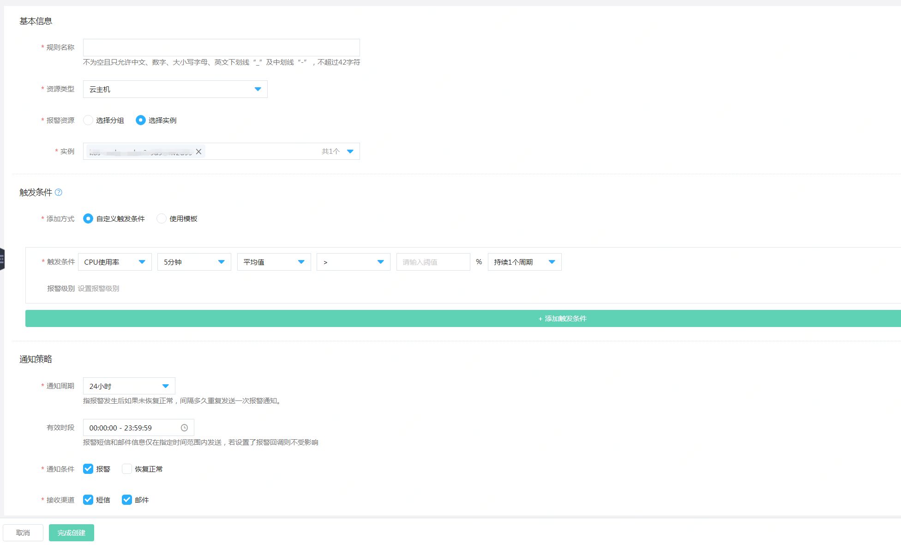
3.  按照以下步骤配置报警规则需要的信息。  
    1）基本信息：配置规则名称，选择资源类型和报警资源  
    2）触发条件：添加方式选择“使用模板”，点击选择模板下拉框，选中需要关联的报警模板。  
    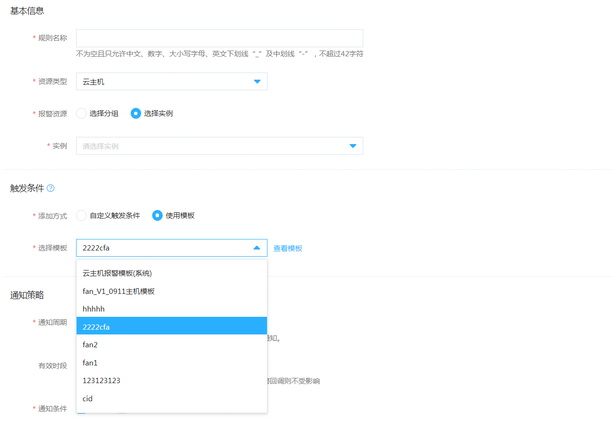  
    3）通知策略中：配置通知周期、有效时段、通知条件、接收渠道和通知对象信息。
    
4.  点击页面底部的“完成创建”，即可完成基于报警模板的规则创建。  

