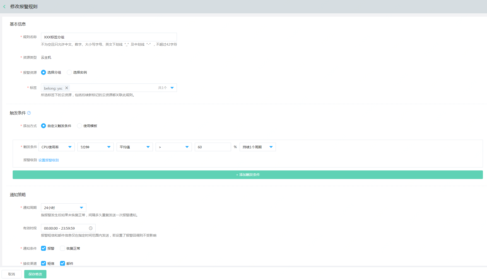
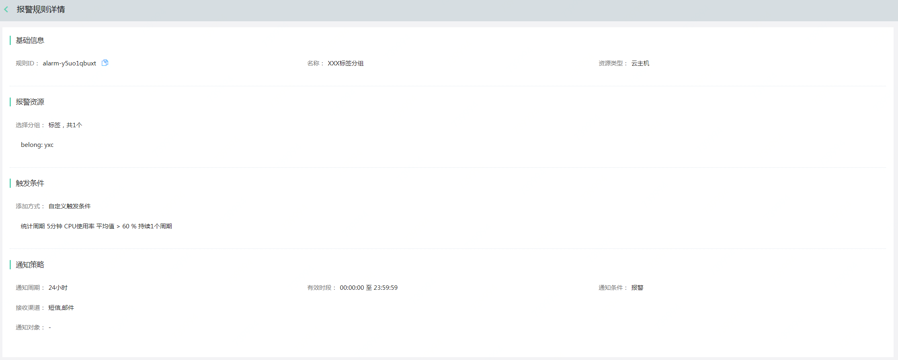
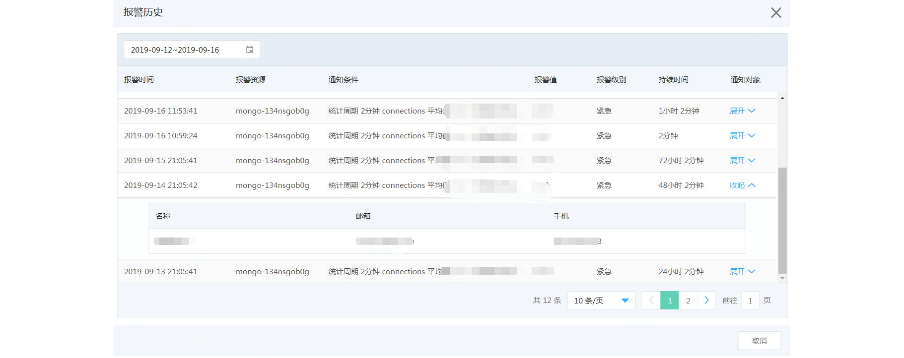

# 修改报警规则
1.	登录京东云控制台，点击管理->云监控->报警管理->全部报警规则，进入全部报警规则列表页面。  
  

2.  选中需要修改的报警规则，点击操作列下的“修改”按钮，打开修改报警规则页面。  
  

3. 仅资源类型不允许修改，其他信息都可更改。可参考添加报警规则页面。

# 查看规则详情
1.	登录京东云控制台，点击管理->云监控->报警管理->全部报警规则，进入全部报警规则列表页面。  
  

2.	点击操作列下 更多->查看详情按钮，进入报警规则详情页面。
  

3. 可查看到该规则配置的基本信息、报警资源、触发条件和通知策略信息。

# 启用/禁用报警规则  
1.	登录京东云控制台，点击管理->云监控->报警管理->全部报警规则，进入全部报警规则列表页面。  

2.	选中需要禁用的报警规则点击操作列下的“禁用”按钮，或批量选中多条，选中记录栏底部的批量“禁用”按钮，即可。  

3.	选中需要启用的报警规则点击操作列下的“启用”按钮，或批量选中多条已禁用的规则，选中记录栏底部的批量“启用”按钮，即可。

# 查看报警历史  
1.	登录京东云控制台，点击管理->云监控->报警管理->全部报警规则，进入全部报警规则列表页面。   

2.	点击操作列下 更多->报警历史按钮，进入报警历史详情页面。  
  

3.	默认展示近3天的报警历史，可以更改时间，查看对应时间段的报警历史。

# 删除报警规则
1.	登录京东云控制台，点击管理->云监控->报警管理->全部报警规则，进入全部报警规则列表页面。    
  

2. 选中需要删除的报警规则，点击操作列下的“删除”按钮；或批量选中多条需删除的规则，点击底部的批量“删除”按钮。  
  

3. 在弹出的确认提示框中，点击确定按钮，即可。

