# 添加报警规则
## 批量添加报警
1. 登录京东云控制台，点击管理->云监控->资源监控，以资源云主机为例，四级菜单选中“云主机”，进入云主机监控列表。  
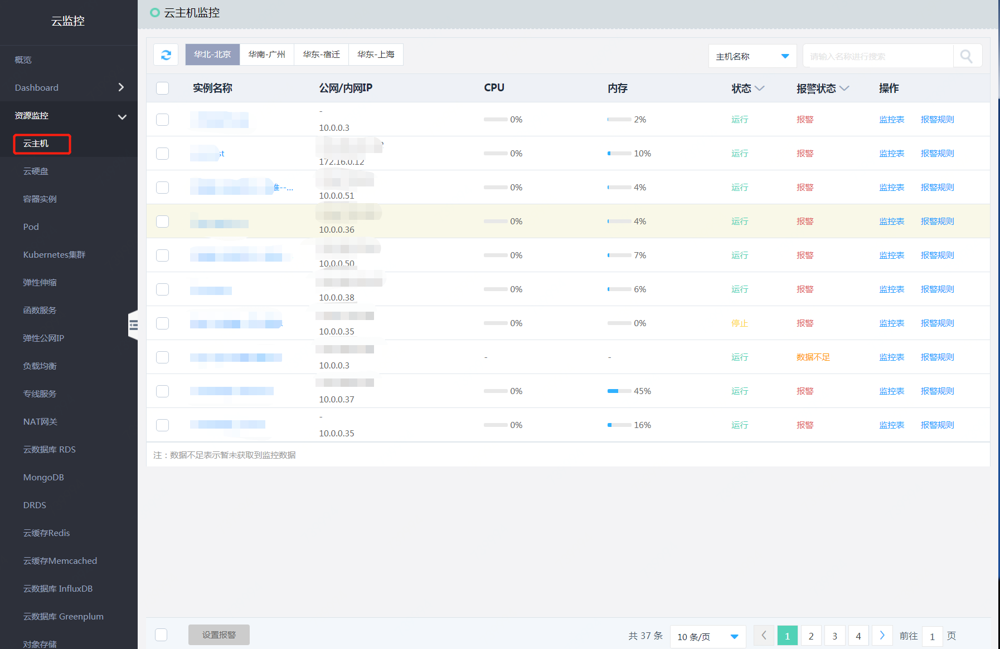
2. 选中需要批量设置报警的云主机，点击表格下方的“设置报警”按钮，进入添加报警规则页面。  
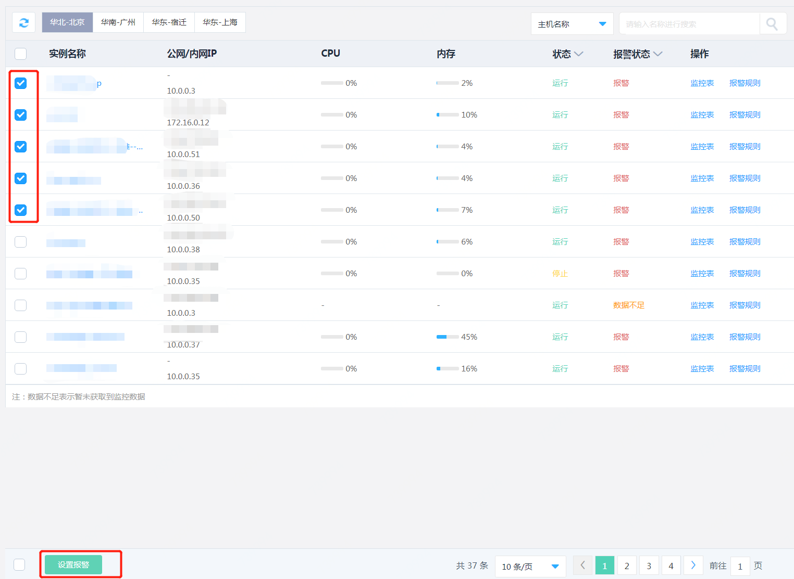  
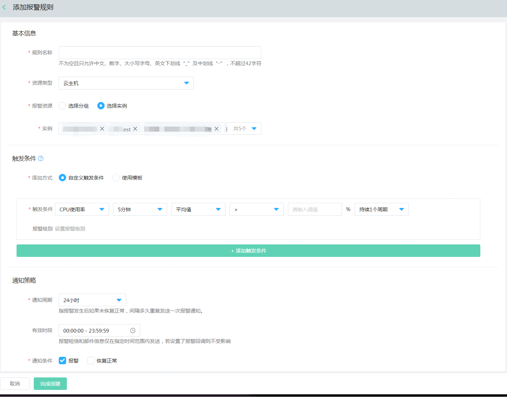  

3. 按照以下步骤配置信息  
   1）基本信息：设置规则名称，确认资源类型和已选中的实例信息。  
   2）触发条件：支持自定义添加，也支持绑定已有的模板信息。
   - 自定义添加：选择监控项、统计周期、统计方法、计算方式、阈值、持续周期，同时可根据需求配置报警级别。  若需配置多个触发条件，点击“添加触发条件”按钮即可配置。
 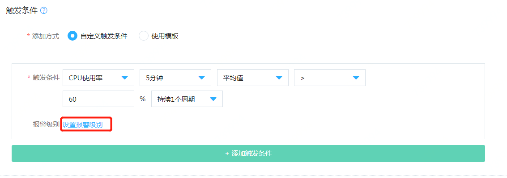    
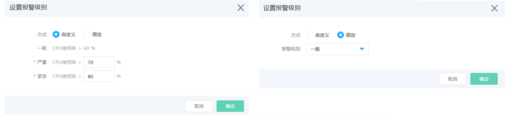 
   - 使用模板：切换至“使用模板”选项，点击下拉框，选择需要使用的模板，若需详细了解模板的详情信息，可点击“查看模板”字样，打开模板详情。  
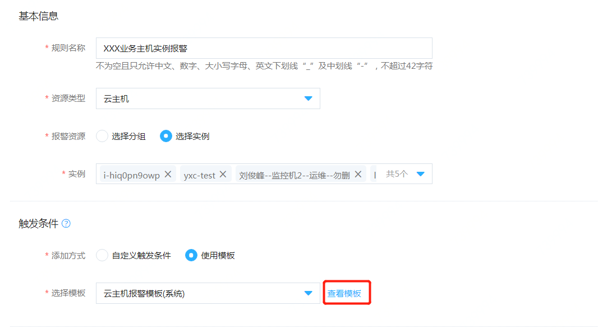  

   3）通知策略：  
   - 通知周期：表示如果资源一直处于告警状态，未恢复正常，间隔多久发送下一次通知。提供5分钟、10分钟、15分钟、30分钟、1小时、3小时、6小时、12小时和24小时几种选项。
   - 有效时段：报警短信和邮件信息仅在指定时间范围内发送，默认是全天都发送。
   - 通知条件：提供“报警”和“恢复正常”两种场景，默认仅报警状态发送，必须要指定通知条件。
   - 接收渠道：提供“短信”和“邮件”两种选型，默认都发送，可根据需要选择。  
   - 通知对象：支持选择联系人或联系组。添加联系人和联系组击选择框底部的“账户管理-联系人管理”进入用户中心进行配置。  
   - 报警回调：当资源发生告警时，京东云主动按照您配置的URL地址和POST参数进行回调。  
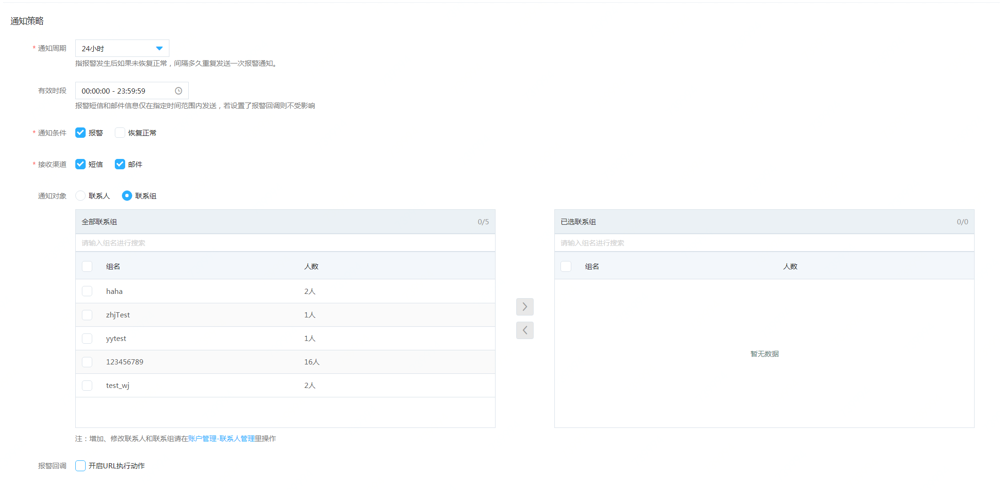  
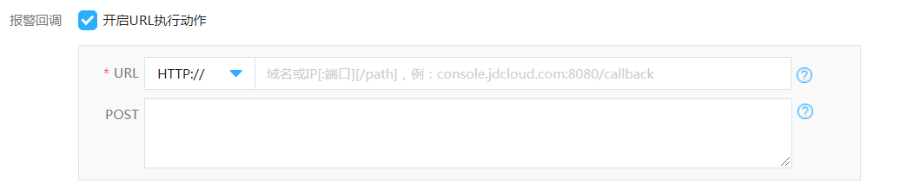
4. 点击页面底部的“完成创建”，则支持添加报警规则，点击“取消”按钮， 放弃本次操作。

## 指定资源添加报警  
1. 登录京东云控制台，点击管理->云监控->资源监控，以资源云主机为例，四级菜单选中“云主机”，进入云主机监控列表。  

2. 选中需要设置报警的云主机，点击操作列下的“报警规则”按钮，进入对应云主机实例的报警规则列表页面。  
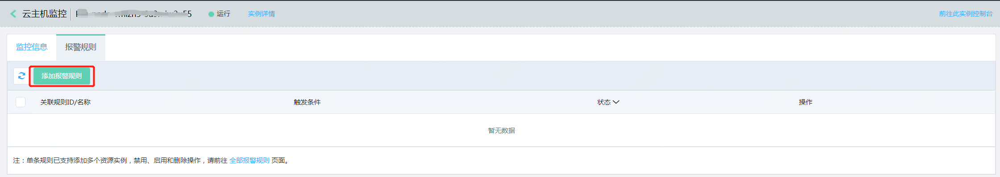
3. 点击“添加报警规则”按钮，进入添加报警规则页面
 
4. 配置规则名称、触发条件和通知策略（同批量设置报警规则） ，点击“完成创建”按钮即可。

## 基于标签添加报警  
###  添加标签（以云主机为例）  
前提：云主机实例状态需为“运行中”或“已停止”。
1. 登录京东云云控制台，点左侧导航栏的弹性计算->云主机,进入实例列表页。  
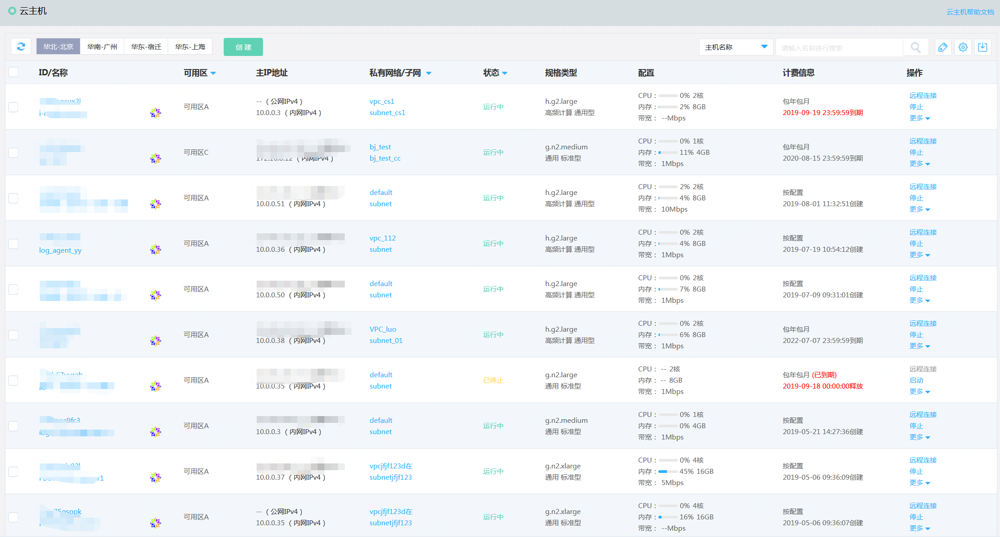
2. 选择需要配置标签的地域；在实例列表中选择编辑标签的实例，确认其状态为“运行”或“停止”状态。  
3. 单台操作：点击操作->更多->编辑标签按钮。  
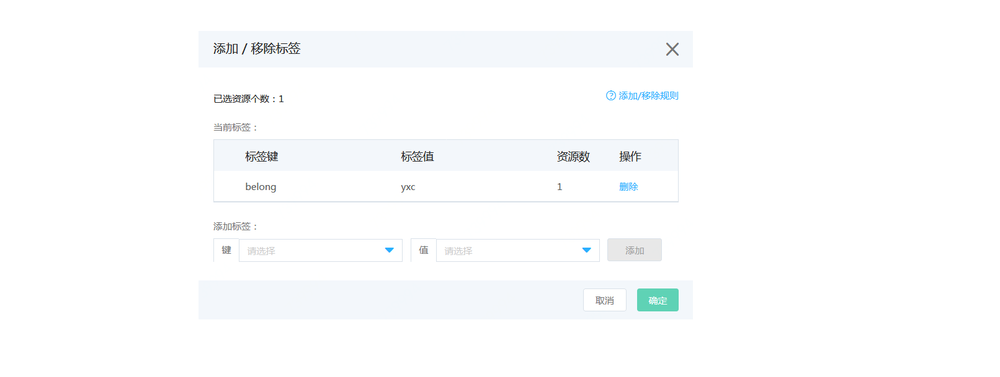
4. 在弹出的“编辑标签”弹窗里，可根据已有标签直接下拉选择或者根据输入进行模糊匹配后选择对应标签键/值（Key-Value）进行添加标签，点击"添加"则将显示在当前标签内。  
5. 单击"确定"，将按照当前标签内显示情况完成编辑标签。

### 配置报警    
1. 登录京东云控制台，点击管理->云监控->报警管理->全部报警规则，进入全部报警规则列表页面。  
 
2. 点击“添加报警规则”，进入添加报警规则页面
 
3. 基本信息：配置规则名称，资源类型选择“云主机”，报警资源选择“选择分组”，在标签下拉框中选择需要配置报警的标签分组。  
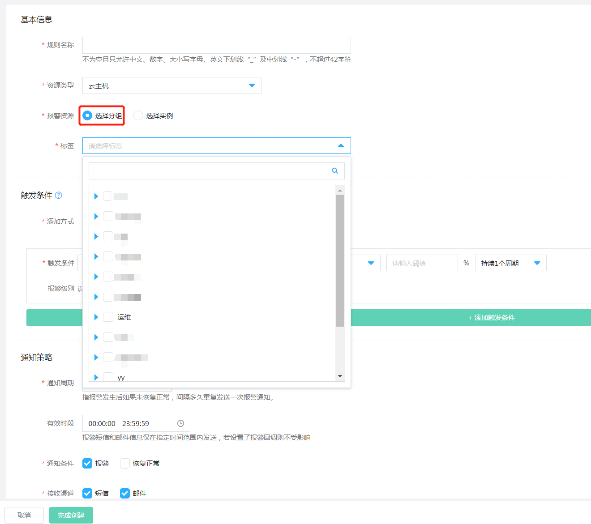
4. 触发条件、通知策略相关配置同“批量配置报警规则”。
5. 完成以上配置后，点击“完成创建”操作，创建成功后在全部告警规则列表中可看到刚添加的规则。  
**注：** 通过此方式配置的报警规则，后续新增资源仅需添加对应的标签，无需手动添加规则即可关联报警。  
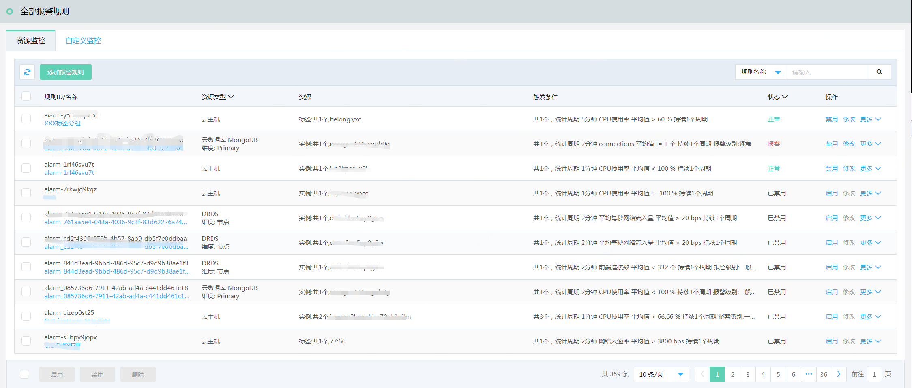  
