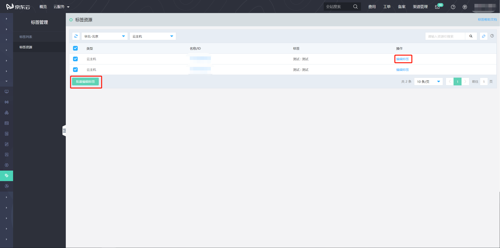
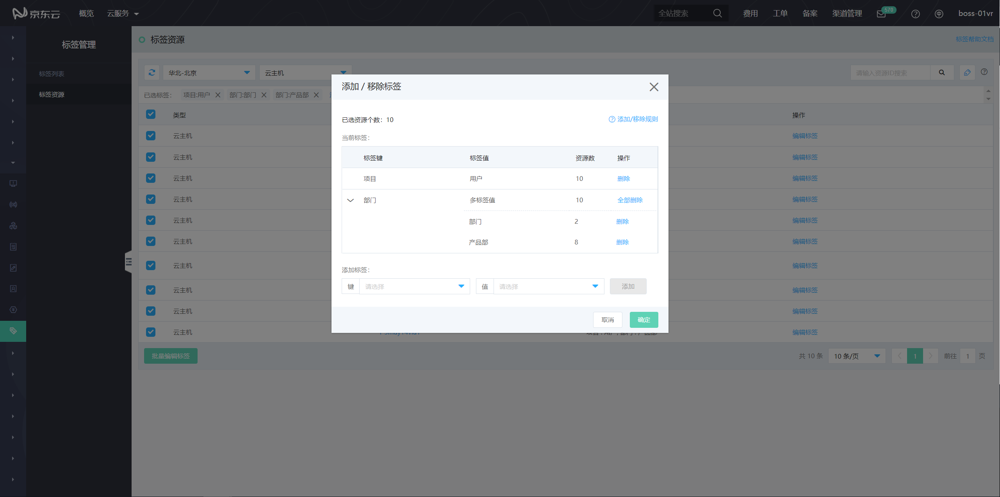
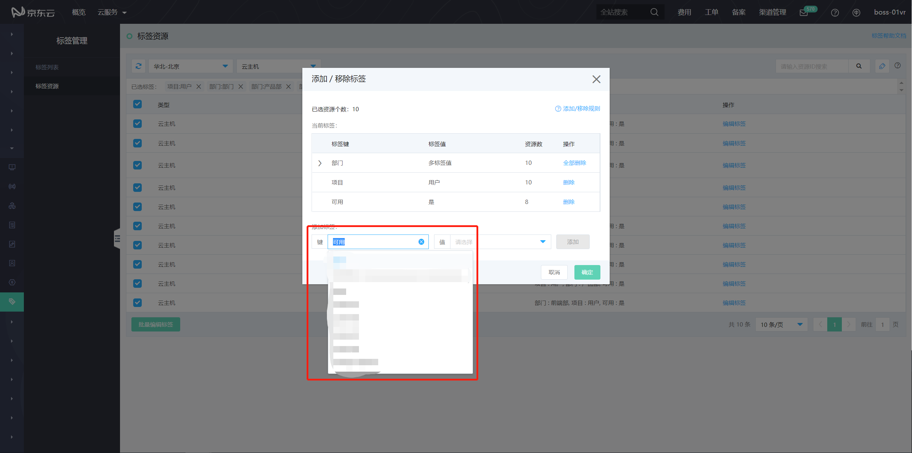
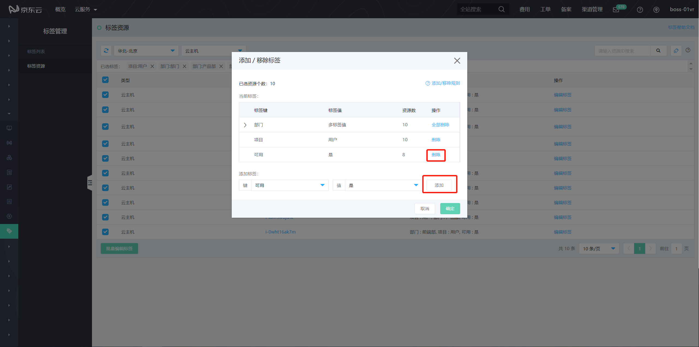
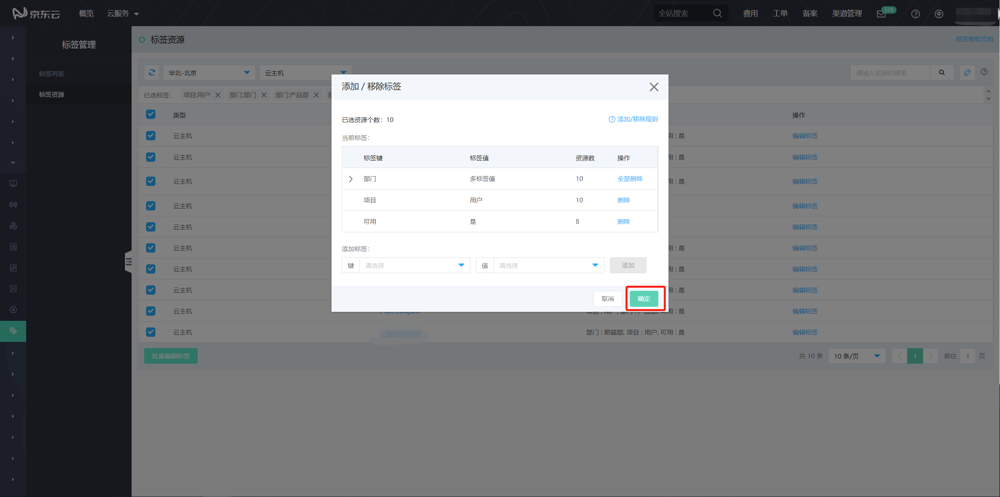
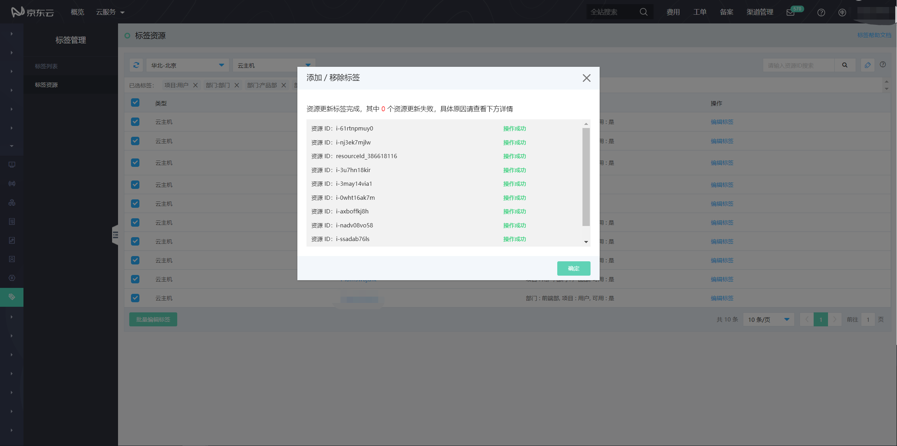

# 标签编辑

## 功能入口
你可以在支持标签的产品的列表页，资源详情页或控制台菜单中的“管理-标签管理-标签资源”（后文简称为标签控制台）页面中，对标签进行编辑操作。标签控制台仅展示绑定过标签的资源，本文主要介绍如何在标签控制台对标签进行编辑。

                                                

                                                    

                                                          
## 功能介绍
在标签控制台点击资源右侧的“编辑标签”按钮，或选择对应资源后点击页面下方的“批量编辑标签”均可在当前页面打开该资源的标签编辑框。

此页面对选定资源的标签做了集合展示，“标签键”和“标签值”表示对应的标签键和值，资源数表示绑定了改标签的资源个数。以下图为例，所选的10个资源全部绑定了标签“项目：用户”，2个资源绑定了标签“部门：前端部”，8个资源绑定了标签“部门：产品部”。

点击“键”“值”的下拉框，会展示目前你资源所绑定过的键和值。你也可以通过输入添加新的标签键或值，输入后按Enter或点击下拉框确认对标签键或值的添加。

选择对应的键值后，点击“添加”按钮添加标签，你也可以通过点击标签右侧的“删除”解绑对应标签与资源的绑定关系。

完成对应对资源标签的编辑操作后，点击“确定”提交你对标签所进行的更改。

更改的结果将以资源维度在打标结果页进行展示

标签键和值有以下限制：

- 同一个资源针对同一个标签键只能存在一个标签值（举例：资源A存在标签“部门：产品部”，此时若对此资源添加标签“部门：研发部”，相当于覆盖原有标签）；

- 每个标签仅包含一个键，和一个值，键和值均不可为空；

- 键和值首尾的空格将被自动过滤，字符中多个空格将合并为1个空格；

- 标签的键和值区分大小写，大小写不同的标签将被作为不同的标签处理；

- 标签“键”最大所支持127个字符，标签值最大支持255个字符，不建议为键或值命名过长，不利于标签的使用和理解；每个资源最多可绑定10个标签（每个不同键的标签计为一个）。

