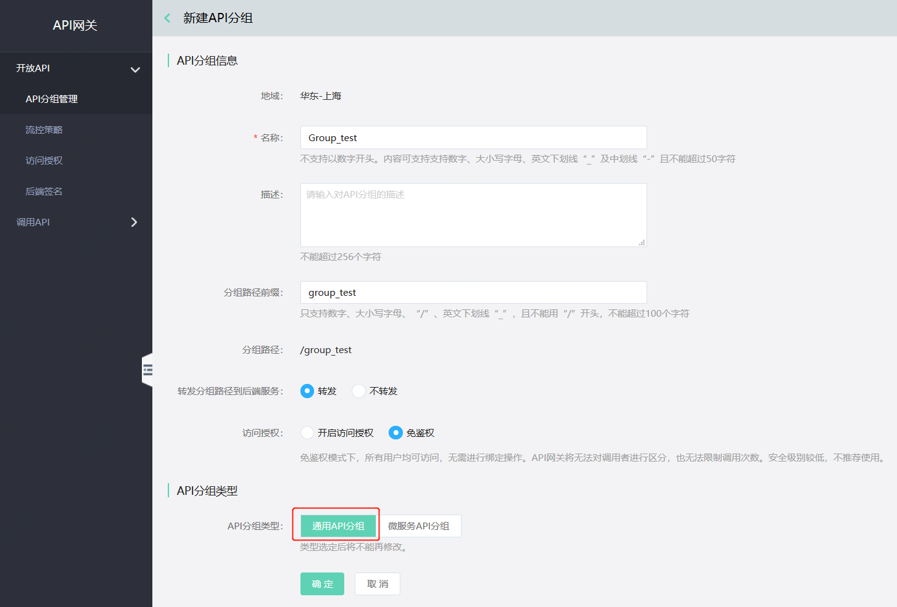
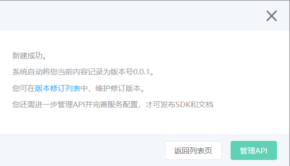
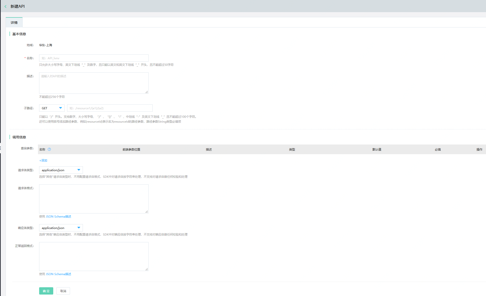
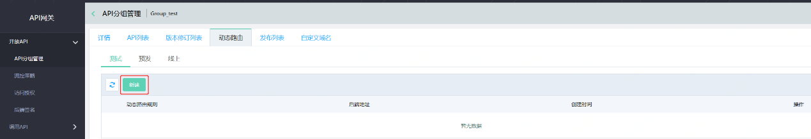
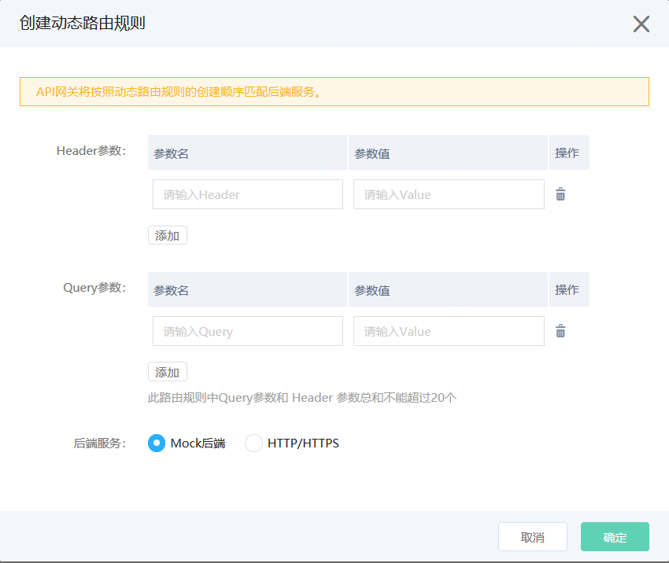
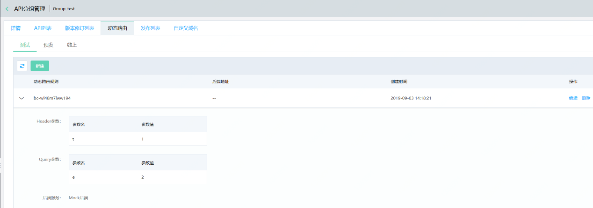
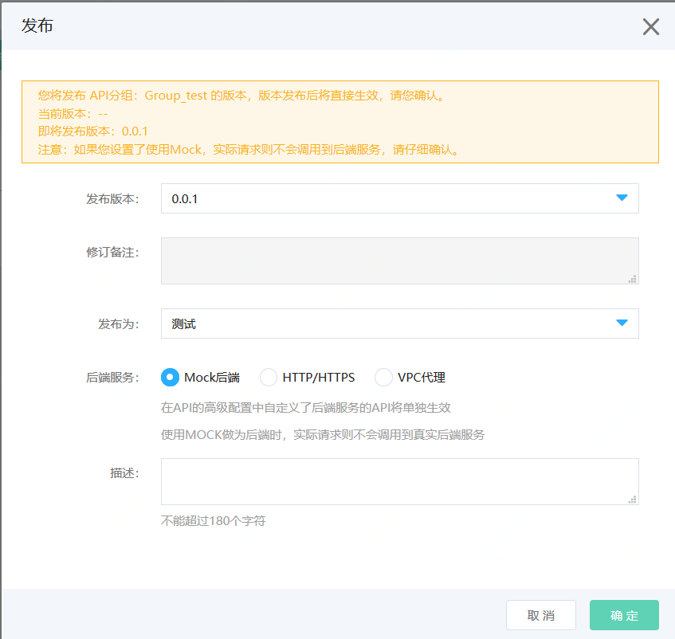
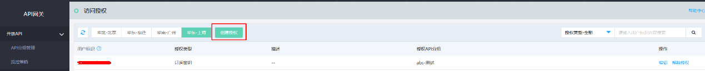
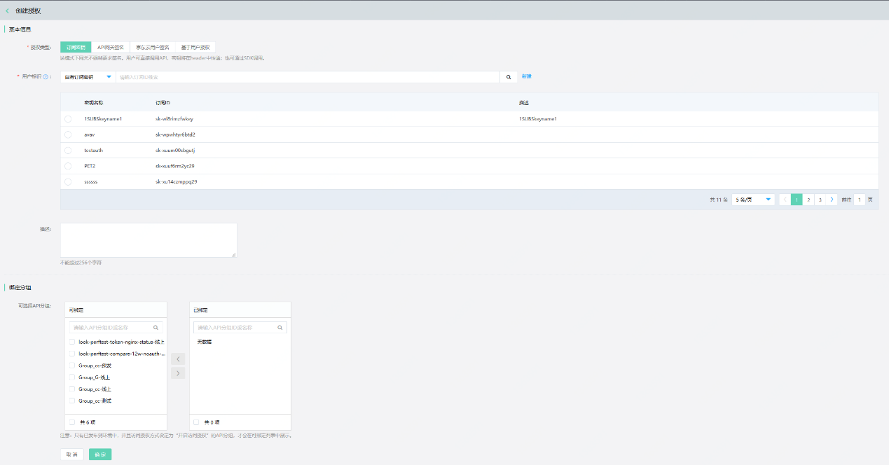

# 动态路由

API网关支持动态路由功能。使用动态路由功能时，您可以自定义多个路由规则，通过定义不同的前端参数来为同一个API分组配置不同环境下的多个后端服务，
从而适用于更多的业务场景。

#### 入口：
互联网中间件>API网关>API分组管理 >动态路由

##  操作步骤：
1. 在API分组管理中，点击“创建分组”。API分组类型请选择“通用API分组”。可选择开启访问授权或免鉴权。

 
 
 
2. 新建成功后，选择“管理API”。
 
 
 

3. 点击“新建API”，创建该分组中的API。（此步骤可跳过）

 
 

4. 选择“动态路由”模块， 从“测试、预发、线上”中选择任一环境，点击“新建”按钮，创建动态路由规则。

 
 

5. 创建动态路由规则时，每条规则中Query参数和 Header 参数总和不能超过20个。用户可选择Mock后端服务或HTTP/HTTPS后端服务中的一种作为该条规则的后端服务。

 
 

6. 创建完成后，可对已创建的动态路由规则进行查看、编辑或删除。用户可创建多条动态路由规则，而API网关将按照动态路由规则的创建顺序匹配后端服务。

 
 

7. 接着进行API分组的发布，当发布环境与动态路由规则的创建环境一致时，该环境下已创建的所有动态路由规则才会生效。

 
 

8. 如果在创建API分组时选择了免鉴权模式，则可以使用Postman进行对分组的访问。如果在创建API分组时选择了访问授权模式，则下一步进行访问授权过程。您需要先创建自己的[订阅密钥](https://apigateway-console.jdcloud.com/subscriptionKey)、[签名密钥](https://apigateway-console.jdcloud.com/accessSecretKey)或[京东云用户Access Key](https://uc.jdcloud.com/account/accesskey)，再在API网关的[访问授权](https://apigateway-console.jdcloud.com/authorizationList)模块中选择已创建的密钥，绑定对应的通用API分组。当您为其他用户进行API网关签名授权和京东云用户签名授权与此过程类似。

 
 
 
 

9. 接下来用户即可利用SDK实现对API分组的访问。

