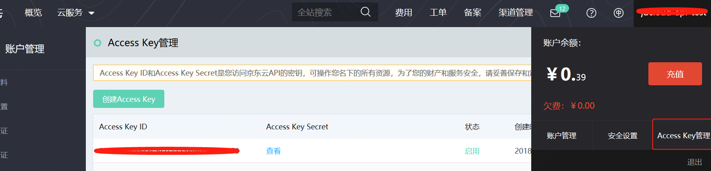
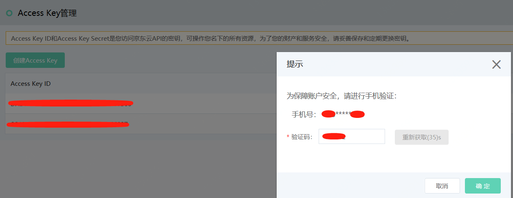
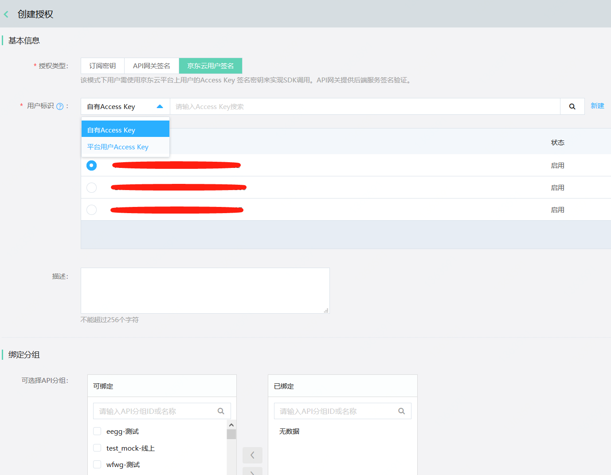

# 京东云用户签名Access Key

京东云API网关支持京东云用户签名的授权类型，该授权类型的密钥来源于用户在京东云的账户管理中所创建的Access Key， 授权完成后用户可使用SDK对API进行调用。API网关则可对其进行后端签名校验。

#### 入口：

京东云账户管理>Access Key管理

## 操作步骤：

### （1）	登录京东云，进入Access Key管理。 

  
  
- 点击“创建Access Key”按钮，需要进行短信验证。验证成功后，系统将会自动生成Access Key ID和Access Key Secret ，并展示状态和创建时间，用户也可对Access Key进行禁用及删除操作。

  

- API调用者需要将京东云用户签名Access Key ID告知API提供者，由API提供者进行访问授权。

### （2）	API提供者将API分组授权给API调用者，供其使用

- 进入“开放API”部分的“访问授权”列表页，点击“创建授权”。

  
  
- 在“基本信息”部分选择授权类型“京东云用户签名”。用户标识部分可选择“自有Access Key”或“平台用户Access Key”，用户需要从对应的密钥列表中选择当前用户所创建  的Access Key ID或输入其他用户的Access Key ID进行密钥的搜索选择。

- 京东云用户Access Key选择完成后，在“绑定分组”部分选择对应的可绑定分组进行绑定，点击“确定”。至此，京东云用户签名的Access Key与API分组之间的授权过程已经完成。

  注意：只有已发布到环境中，并且访问授权方式设定为“开启访问授权”的API分组，才会在可绑定列表中展示。

  
  
- 接下来用户即可使用SDK实现对API分组内API的访问。
