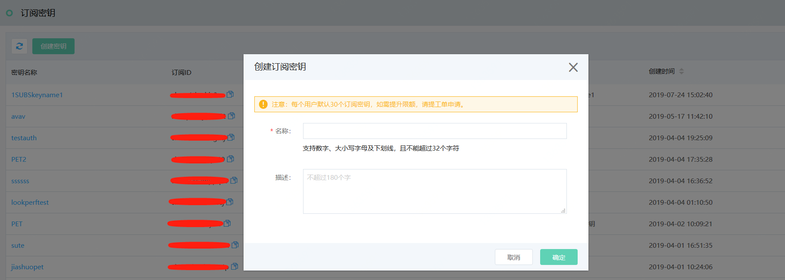
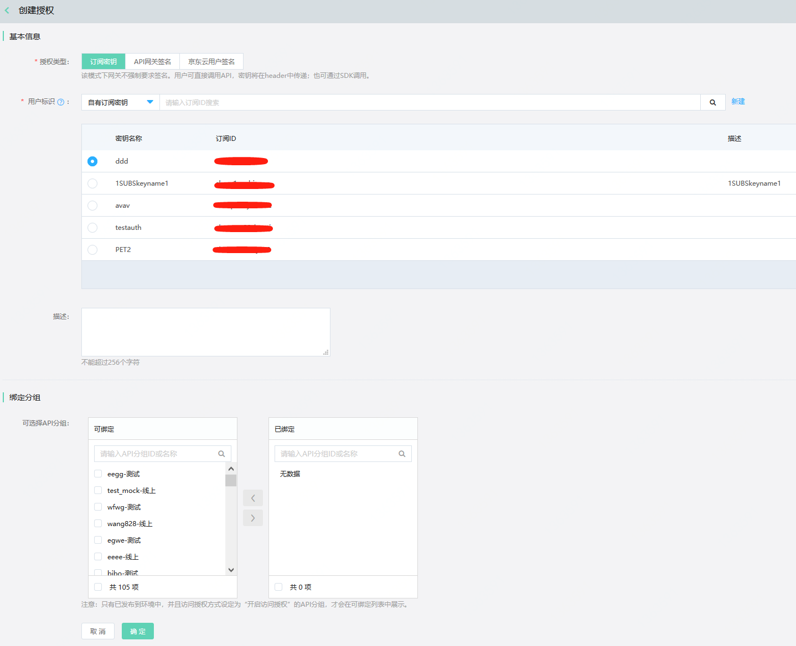

# 订阅密钥

API网关支持订阅密钥的授权类型。用户除了选择利用SDK的方式对API进行访问， 还可以通过在Header中传递订阅密钥来实现API的授权访问。
使用订阅密钥进行授权访问的成本很低且方便快捷，同时也能保障一定的安全性，因此非常适合想快速进行API调用的用户。

#### 入口：
互联网中间件>API网关>调用API >订阅密钥

## 操作步骤：
### （1）API调用者创建和提供订阅密钥 

- 点击左侧菜单，进入订阅密钥列表页。
- 在订阅密钥列表页面，点击“创建密钥”按钮，填写名称（必填）和描述（非必填）。

  
  
- 密钥创建成功后，系统会自动生成订阅ID、订阅Key。
- API调用者需要将订阅密钥ID告知API提供者，由API提供者进行访问授权。

### （2）	API提供者将API分组授权给API调用者，供其使用

- 进入“开放API”部分的“访问授权”列表页，点击“创建授权”。

  
  
- 在“基本信息”部分选择授权类型“订阅密钥”。用户可从订阅密钥列表中选择当前用户所创建的订阅密钥或输入其他用户的订阅ID进行密钥的搜索选择。
- 订阅密钥选择完成后，在“绑定分组”部分选择对应的可绑定分组进行绑定，点击“确定”。至此，订阅密钥与API分组之间的授权过程已经完成。

  注意：只有已发布到环境   中，并且访问授权方式设定为“开启访问授权”的API分组，才会在可绑定列表中展示。

  
  
- 接下来用户可以用两种方法实现对API分组内API的访问：
  1.在header中传递jdcloud-apim-subscription-key。
  2.使用SDK进行调用。
