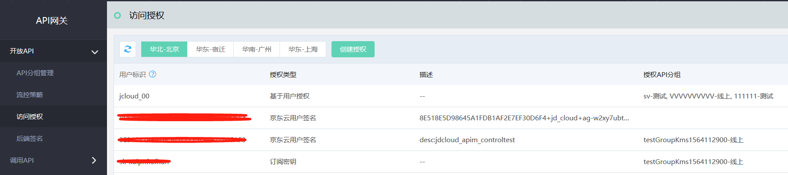
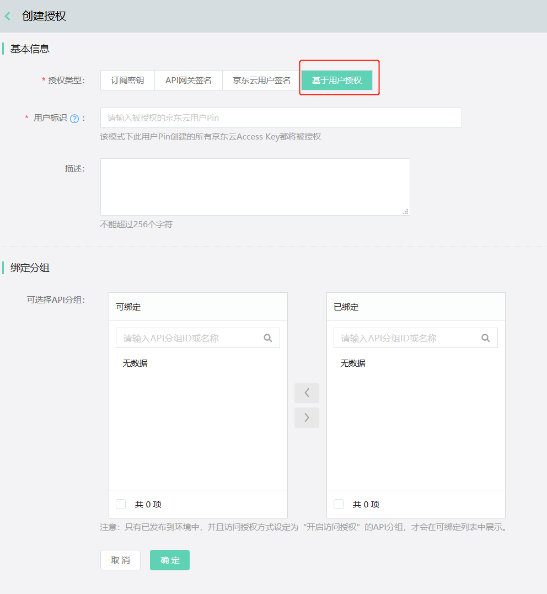

# 基于用户授权

API网关支持基于用户授权的类型。使用这种授权方式，您可以通过输入用户Pin而将该用户及子用户所创建的所有有效京东云Access Key 都进行授权，
无需进行多次对单Access Key的授权过程，操作简便。

#### 入口：
互联网中间件>API网关>访问授权>创建授权

### 操作步骤：
#### （1）您需要先自行获取待授权的京东云用户Pin。

#### （2）在访问授权模块中点击“创建授权”。

  
  

#### （3）授权类型选择“基于用户授权”，在用户标识部分输入想要被授权的京东云用户Pin，一次只可填写一个。

  

#### （4）从可选择API分组中选择分组进行绑定，完成整个授权绑定过程。
  
#### （5）接下来用户即可使用SDK实现对API分组的访问。
