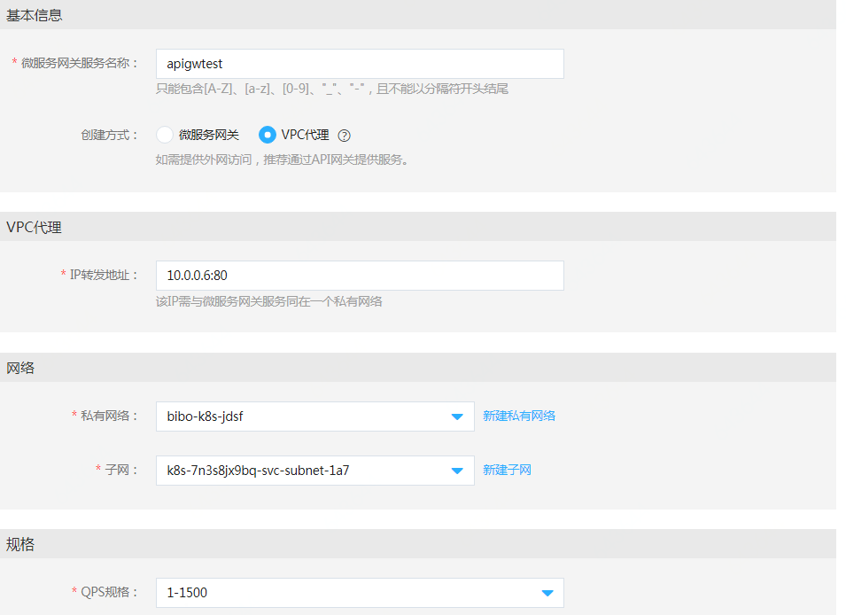
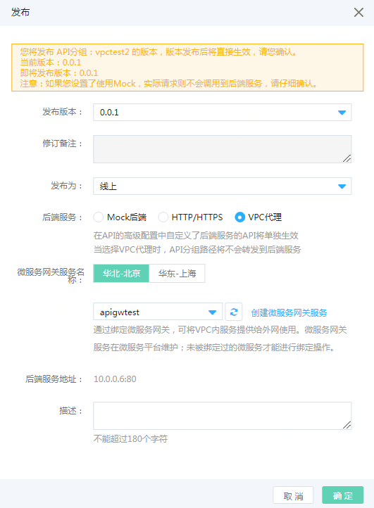
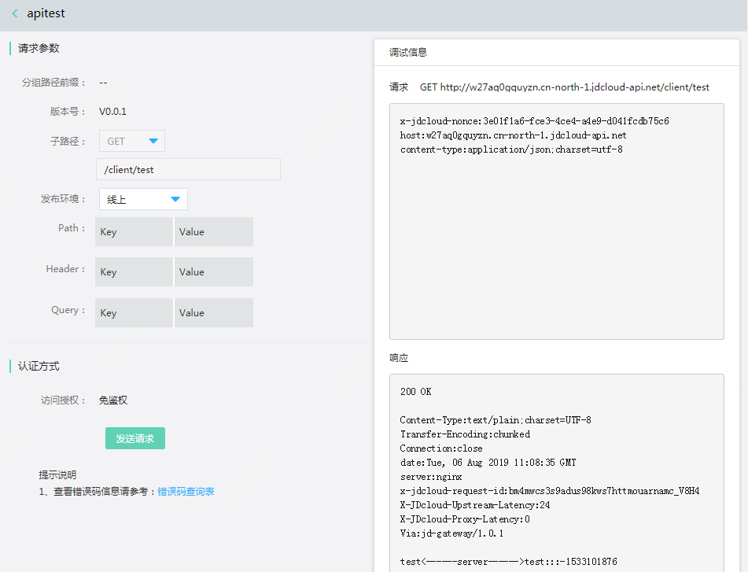

# 使用API网关开放VPC内的接口

可以将VPC内的接口直接通过API网关开放，无需申请公网IP，无需直接公网暴露。

假设服务在VPC内的地址为10.0.0.6/client/test，

    # curl 10.0.0.6/client/test
    server successed!
    
需要将此服务直接发布到API网关上，分如下两步完成：

<b>配置VPC代理 -> 配置API网关分组</b>

## 配置VPC代理
在控制台  互联网中间件-》微服务平台产品的微服务网关菜单里，创建网关服务，名称例如apigwtest，创建方式选 VPC代理，转发地址配置后端服务地址，如本例中为10.0.0.6

更多创建微服务网关的资料参考 [微服务网关](../Operation-Guide/JDSFGW/overview.md) 产品

## 配置API网关分组

在控制台  互联网中间件-》API网关里创建一个新的API分组，例如vpctest，简单起见访问授权这里选择 免鉴权。（线上实际API请务必开启访问授权。）

点管理API，新建一个API，例如叫apitest，路径为本demo中的/client/test，其他字段留空，点确定。

然后去发布。点发布，发布为选线上，后端服务选VPC代理，在微服务网关下拉框中选择上一步建的apigwtest，确定。

  

更多创建API的资料参考 [API网关](../../API-Gateway/Introduction/Product-Overview.md)   产品

点调试api，发送请求们可以在响应中看到VPC中的服务的响应。

  

## 补充说明

VPC内的地址可以是服务进程的地址，Nginx等负载均衡软件的地址，也可以是云内网负载均衡的地址。

下面是将云主机上的服务发布到内网负载均衡的示例。

假设后端为部署在VPC中的HTTP服务，部署在VPC内的地址为10.0.224.3,10.0.224.4,10.0.224.5三个云主机的31169端口。

    # curl 10.0.224.3:31169/client/test
    test<------server------>test

在控制台 网络-》负载均衡 产品中，创建应用型负载均衡，在网络区域，选择HTTP服务所部属的VPC和子网，因为不对公网开放所有安全组这里可以选择“默认安全组开放全部端口”（也可以自己创建一个开放80的安全组），点击立即购买。

等创建完成后，在监听器页“新建监听器”，监听协议和端口保持默认的Http/80，点下一步；

填写后端服务名称，端口选择31169，点下一步；

填写健康检查配置，点下一步；

添加服务器组，选暂不添加，点确定

在虚拟服务器组页“新建虚拟服务器组”，在可选实例中选择服务所在的云主机，点添加。

在后端服务，点刚才创建的后端服务，点编辑，在弹出的界面中选择服务器组选虚拟服务器组，并选择刚才创建的组，点确定。

使用资源信息页的负载均衡Vip即可访问服务，将此地址配置在VPC代理即可通过API网关访问。
    
更多创建内网负载均衡的资料参考 [应用负载均衡](../../../Networking/Application-Load-Balancer/Introduction/Overview.md) 产品
