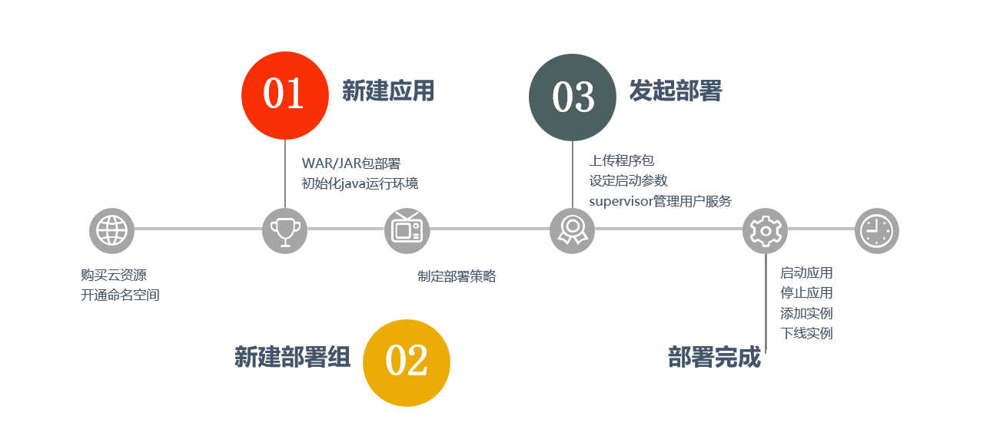
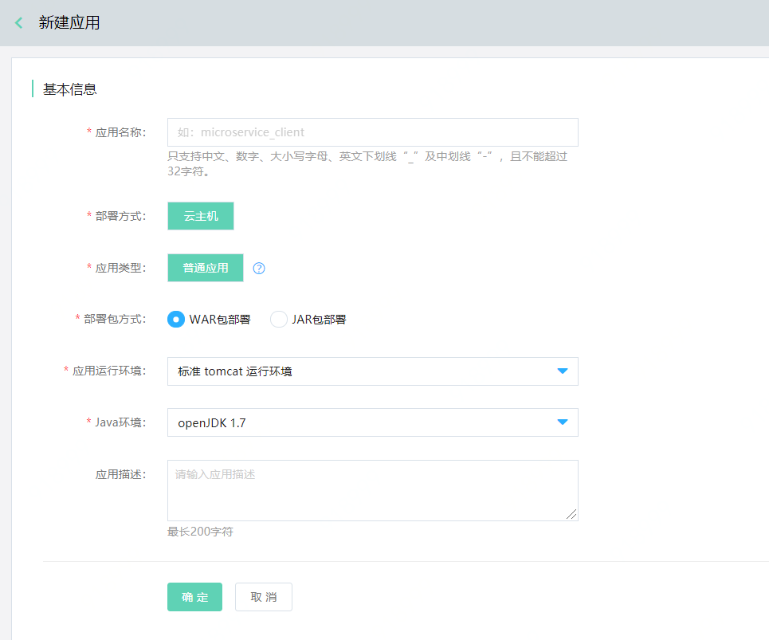
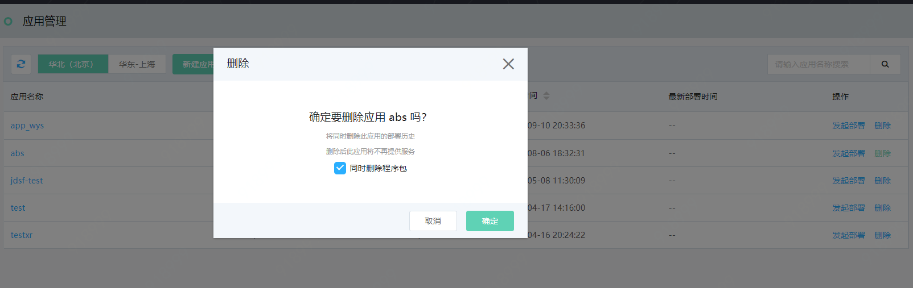
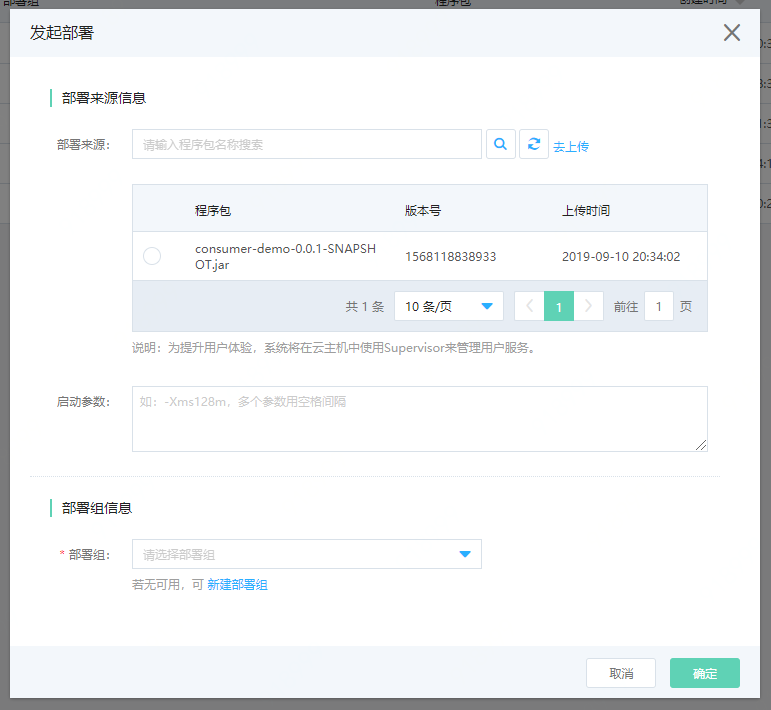
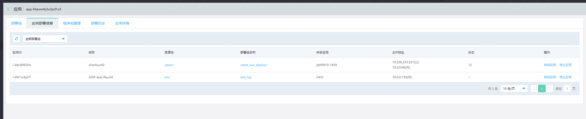
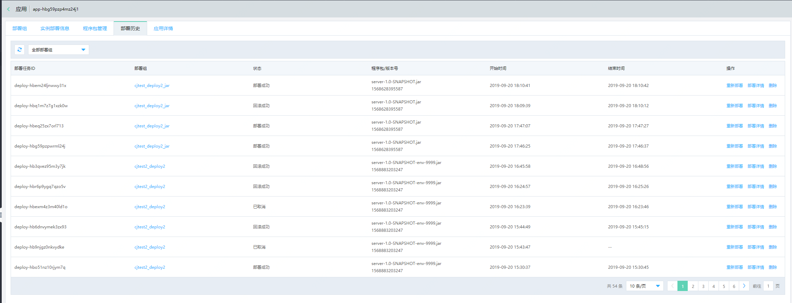

#  应用管理
应用，是一组具有特定功能组成的集合。当前平台提供虚拟机应用的部署，用户可通过虚拟机部署方式，部署应用程序包到云主机上。

- 1台云主机上只能部署1个应用；
- 支持WAR包、JAR包部署。

## 操作场景

例如，用户在命名空间（如预发环境、线上环境）中，部署程序包、创建应用、删除应用等。

## 操作步骤

应用的操作流程如下：

### 创建应用

1、	登录微服务平台控制台。在左侧导航栏点击应用管理，进入应用列表页。

2、	在列表上方，点击新建应用，进入创建页。

3、	设置基本信息，单击确定，完成创建。

**说明：**

-  Java运行环境目前支持OpenJDK1.7、OpenJDK1.8。

### 删除应用

1、登录微服务平台控制台。	在左侧导航栏点击应用管理，进入应用列表页。

2、对于需要删除的应用，点击操作列的删除。

**说明：**

- 需先删除部署组，才能删除应用；否则无法删除。

- 删除时，用户可以选择，是否同时删除程序包。默认勾选同时删除。

- 用户需在删除数据前，自行做好数据备份工作。

### 部署应用

1、 登录微服务平台控制台。	在左侧导航栏点击应用管理，进入应用列表页。

2、对于需要部署的应用，点击操作列的发起部署。

- 为提升用户体验，**系统将在云主机中使用Supervisor来管理用户服务。**

- 如果已经创建了相应的部署组，则可直接配置好部署来源、选择部署组后，即可发起部署。

- 如果还未创建部署组，可点击“新建部署组”，先新建部署组后再部署。关于部署组内容，可查看部署组章节。

3、实施部署。

**说明：**

- 部署完成后，可进行回滚、重新部署操作。

- 用户还可查看每个实例的部署信息。

- 删除时，用户可以选择，是否同时删除程序包。默认勾选同时删除。

### 实例部署信息

用户可查看当前应用，通过哪些部署组，被部署至哪些实例上；并可对每个实例上的应用，进行起停操作。

### 程序包管理

程序包管理中上传的是，当前应用在部署中所使用的程序包。在删除应用的同时，用户可选择是否同步删除应用下的所有程序包；删除前用户需自行备份。

### 部署历史

该节内容，可查看部署组章节。在删除部署组的同时，用户可选择是否同步删除部署历史；删除前用户需自行备份。

### 部署组

该节内容，可查看部署组章节。

