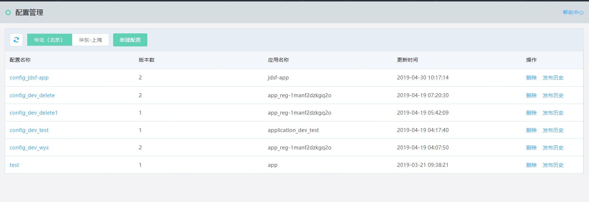
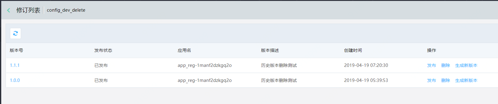
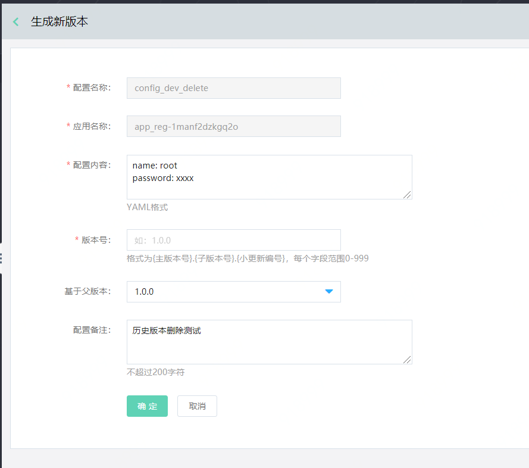

# 配置管理
配置管理，提供给用户对应用进行配置的服务。每个配置中，可以存在多个版本，并且每个版本可发布在同一应用所在的不同部署组中。
 

## 操作步骤

### 配置管理列表

 

### 创建配置
第1步：选择可用的区域region，新建配置。
-	进入配置管理列表，选择可用的区域region。
-	点击新建配置按钮，进行新建操作
 
 
第2步：在区域中，点击新建配置，进入新建页
  
  
说明：
-	应用的名称由用户自行录入，并保证名称的正确。
-	同一服务上，不能创建同名配置。
-	新建成功后，同步生成版本信息。

第3步：查看配置项的版本管理
点击配置项的名称。进入版本列表页。
   
   
   
第4步：查看版本详情。
点击版本号名称可查看版本详情。
   

### 修订列表
选择配置管理列表中某条配置，可查看该条配置的发布修订历史记录。
 

### 生成新版本
第1步： 进入配置管理列表。
点击配置项的名称，如图中“配置测试-test”，进入该配置的版本列表页。
 
 
 
第2步：选择当前版本作为父版本，进入配置详情，然后点击操作中的生成新版本，进入版本编辑页。保存后生成新版本。
 

  
  
**说明：**
- 这里默认的父版本号为您上一步中选择的版本的版本号。
- 默认展示父版本内容。
- 新版本号需要大于所有老版本号。
- 	当切换父版本时，“配置内容”里的信息会自动更换成为父版本内容，用户可自行修改编辑。

第3步： 发布新版本。
- 如果需要发布新版本，直接选择要发布的版本，点击发布按钮。
- 然后填写发布信息，进行配置发布。
  
  
  
  
**说明：**
- 发布后，新版本会替代原有版本作为线上版本。
- 在版本修订列表中，需至少保留1条版本记录。如您需要删除所有记录，请在上一级“配置管理”中删除整条配置记录。

