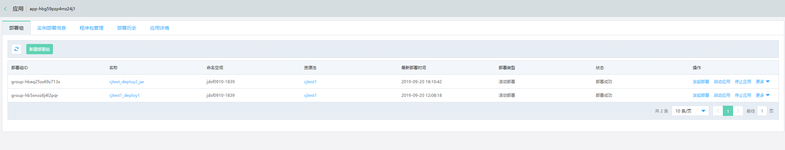
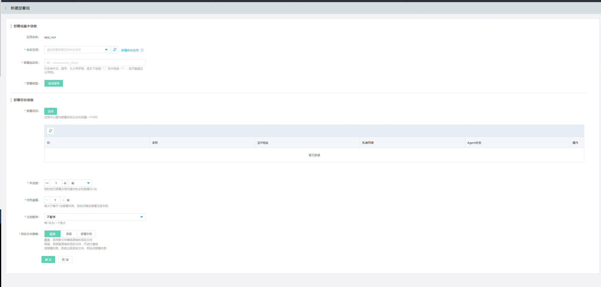
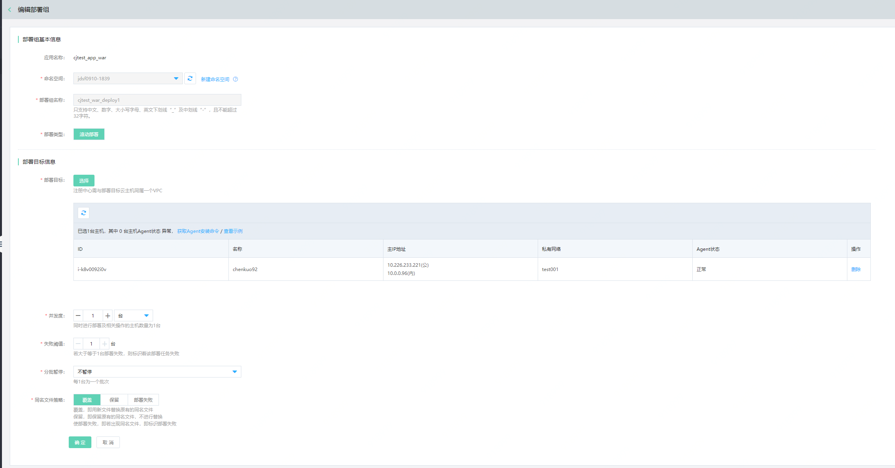

#  部署组
部署组，是批量执行部署程序包到应用实例上的单元组。目前平台支持云主机应用部署。

## 操作场景

用户部署程序包，执行部署组、删除部署组、查看部署历史。对于应用的管理，可进行启停应用等。

## 操作步骤
### 创建部署组
1、	登录微服务平台控制台。在左侧导航栏点击应用管理，进入应用列表页。

2、	点击应用名称，进入应用详情，点击部署组tab签，可查看到当前应用相关的所部署组信息

3、	在列表上方，点击新建，进入创建页。

| 信息项 | 说明  |
| :- | :- |
| 命名空间 | 需要选择当前部署组，要将应用部署至哪个命名空间。 |
| 部署组名称 | 请填写部署组名称，在同一个应用中，部署组名称唯一。 |
| 部署类型 | 目前可支持 [滚动部署](../../../../Developer-Tools/CodeDeploy/Operation-Guide/Deployment-Type.md)  。 |
| 部署目标  | 点击“选择”按钮，在弹窗中选择此地域中已有云主机;用户需先选择资源池，再选择该资源池下的部署目标云主机名。 |
| 并发度 |  若“部署类型”选择“滚动部署”，那么可支持设置部署并发度。支持按照百分比和主机台数两种设置方式。以并发度设置为2台为例，在进行滚动部署时，应用部署和流量路由的粒度为2台主机。 |
| 失败阈值 |  若大于等于n台部署失败，则标志着该部署任务失败。 |
| 同名文件策略 | 设置在部署/回滚时，同目录内的同名文件如何处理。现支持三种方式：使部署失败，即若出现同名文件，即标志部署失败；覆盖，即用新文件替换原有的同名文件；保留，即保留原有的同名文件，不进行替换。默认选项：覆盖。 |

### 编辑部署组
1、 部署组中的命名空间、部署组名称，一经创建后不可修改。其余信息均可修改。

2、当在部署目标中，移除实例后实施生效；且移除后，其它部署组才可再次使用该移除的实例。

### 删除部署组

删除的同时，会下线署组中的所有实例，并停止其中的所有应用。

