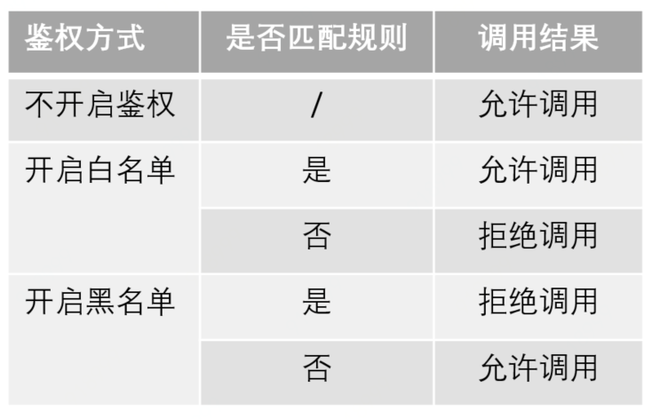
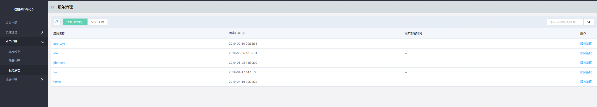
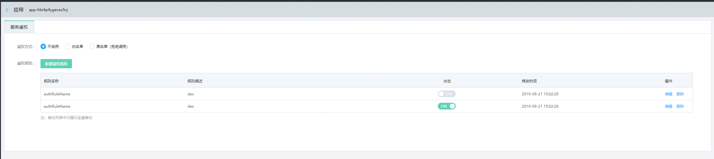
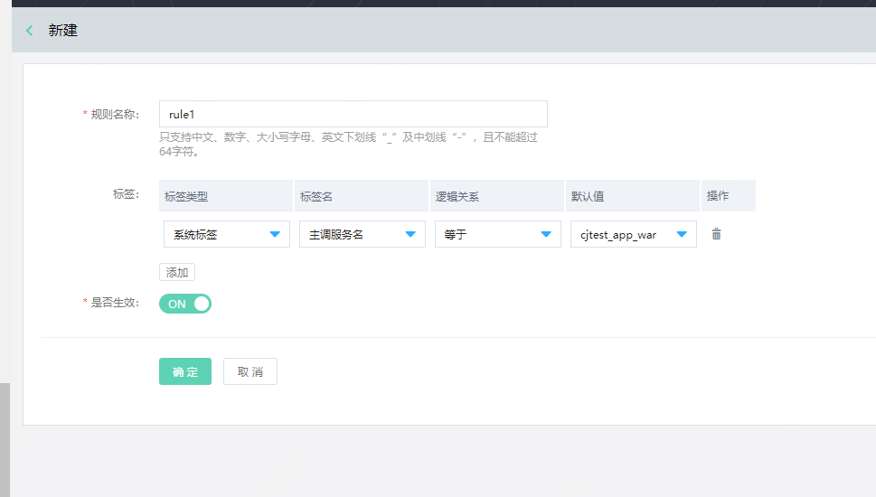

#  服务治理
服务是微服务治理的基本单元。在微服务平台中，当应用被部署完成，注册中心完成服务的注册和发现后，该服务将出现在服务治理的列表中。用户可进行的操作包括：服务鉴权和路由策略两部分。

**说明：**

-  请提前参考： [微服务平台 spring cloud 插件说明](../../Getting-Started/JDSF-Plugin.md)

## 鉴权规则

## 操作步骤

### 查看服务

1、登录微服务平台控制台。	在左侧导航栏点击应用管理，进入服务治理列表。

2、在列表中的应用，即用户可进行服务治理的应用。

### 查看服务鉴权信息

1、登录微服务平台控制台。	在左侧导航栏点击应用管理，进入服务治理列表。

2、在列表中，选择要配置鉴权的应用，点击操作栏中的服务鉴权操作。

3、在服务鉴权配置页中，为当前服务配置鉴权规则、鉴权方式。

| 信息项 |说明 |
|---|---|
| 不启用 | 当选择不启用时，即该鉴权规则不生效，任何请求均可调用服务。 |
| 白名单 | 当请求发到网关时，如果匹配任意一条鉴权规则，则允许调用；否则不能调用。 |
| 黑名单 | 当请求发到网关时，当请求匹配任意一条鉴权规则时，都拒绝调用；否则都允许调用。 |

**说明：**
-  一个服务允许配置多条鉴权规则。当多条鉴权规则同时启用时，规则间是逻辑或（OR）关系，即请求只需满足任意一条鉴权规则，即通过规则。
-  用户可直接切换鉴权方式：进行黑白名单互切。

### 创建服务鉴权规则
1、点击新建规则。

2、设置基本信息，单击确定，完成创建。

