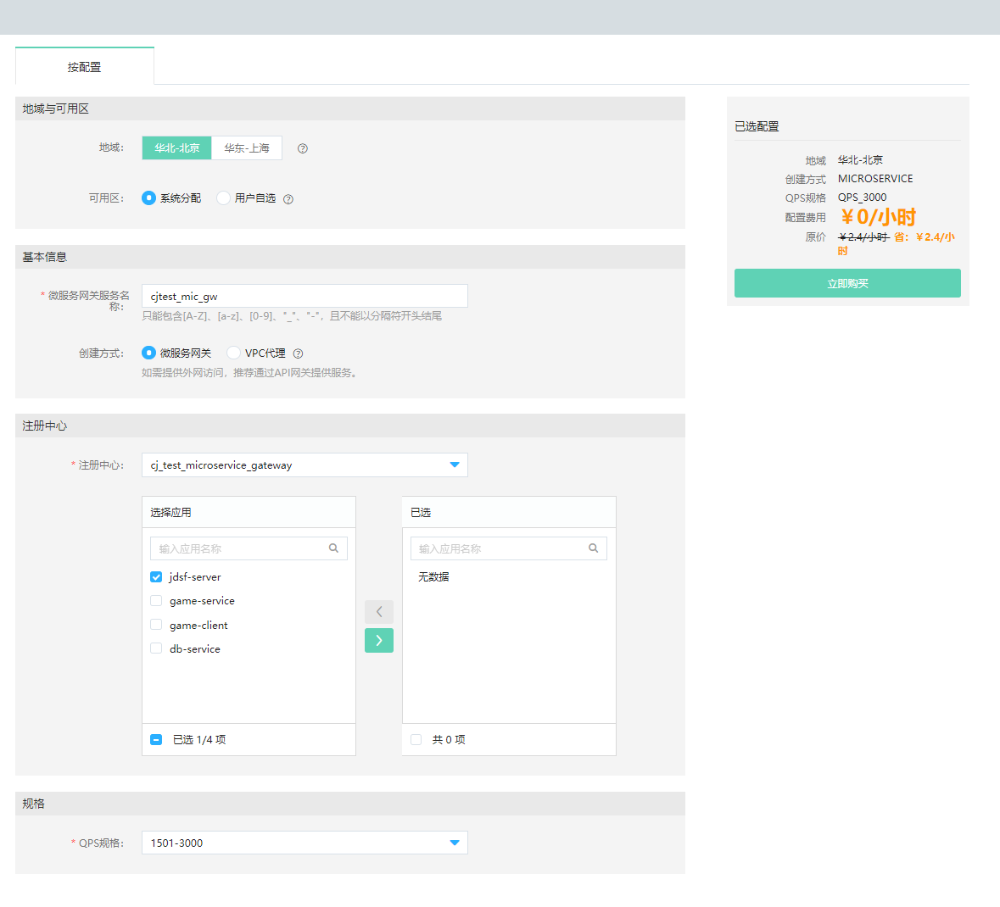
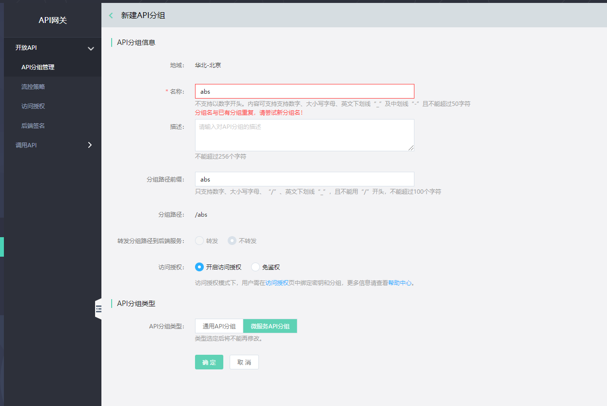
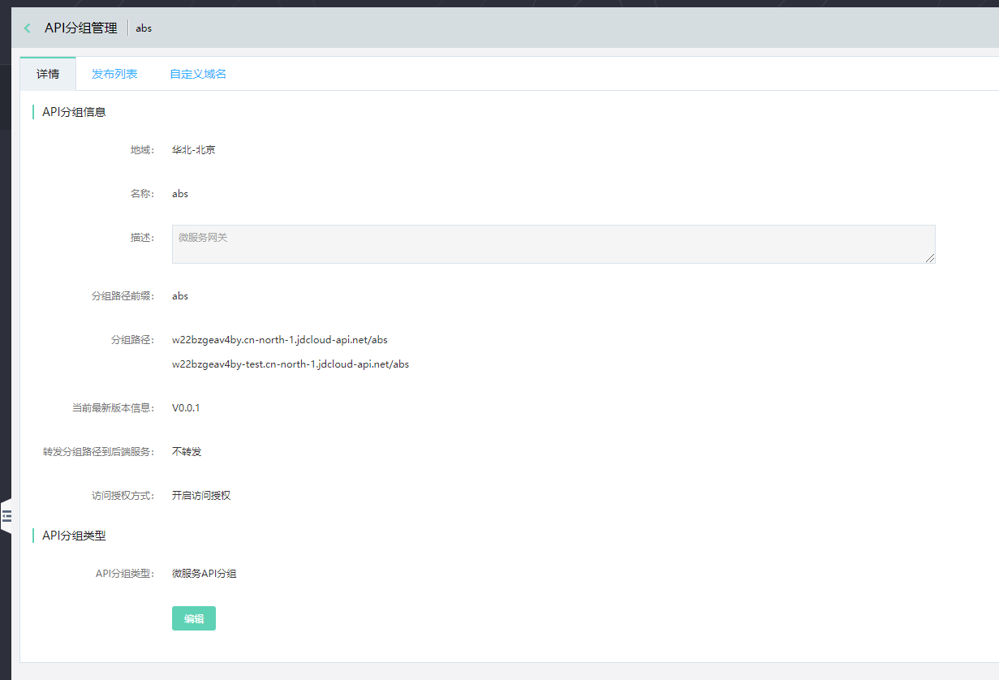
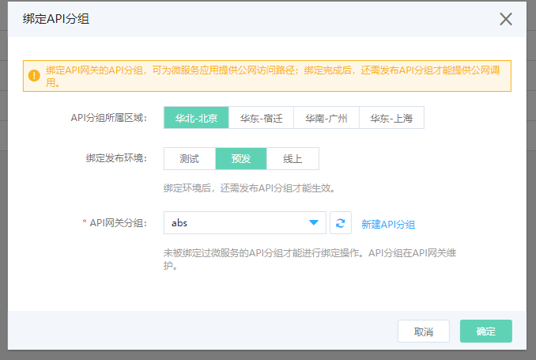
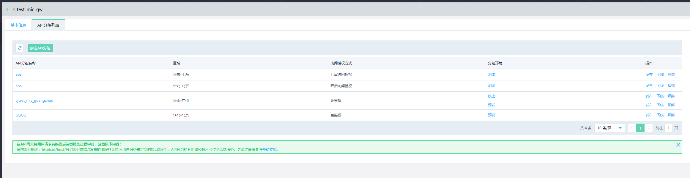
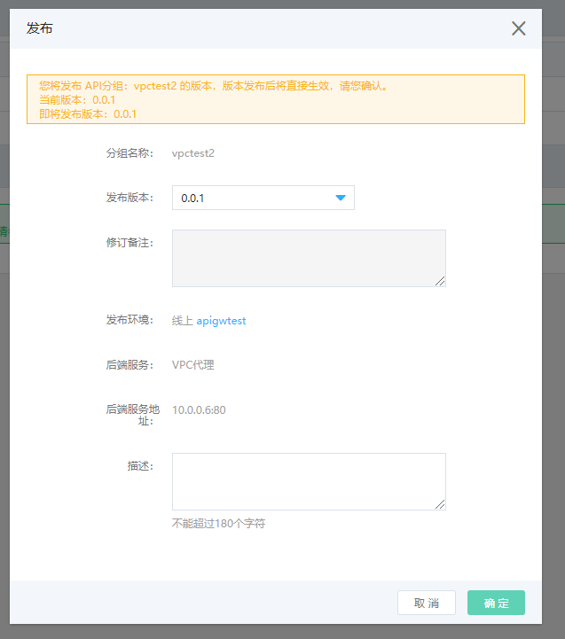
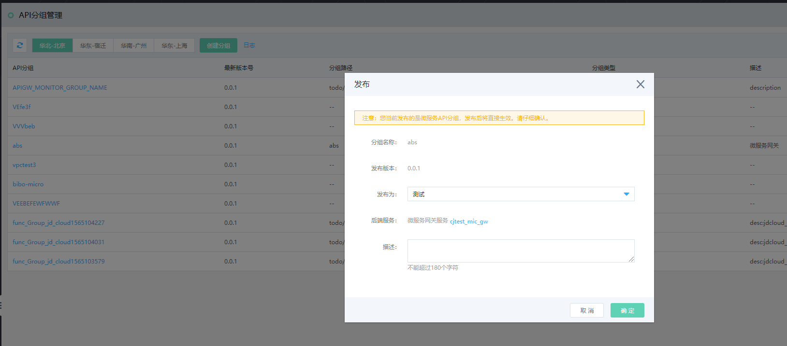
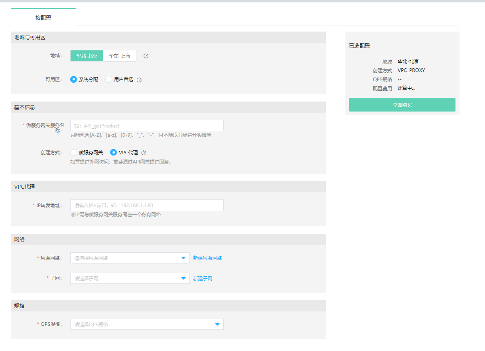
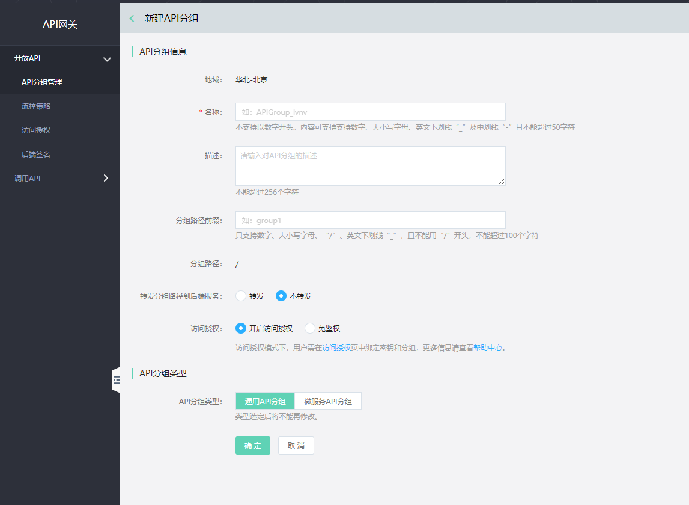
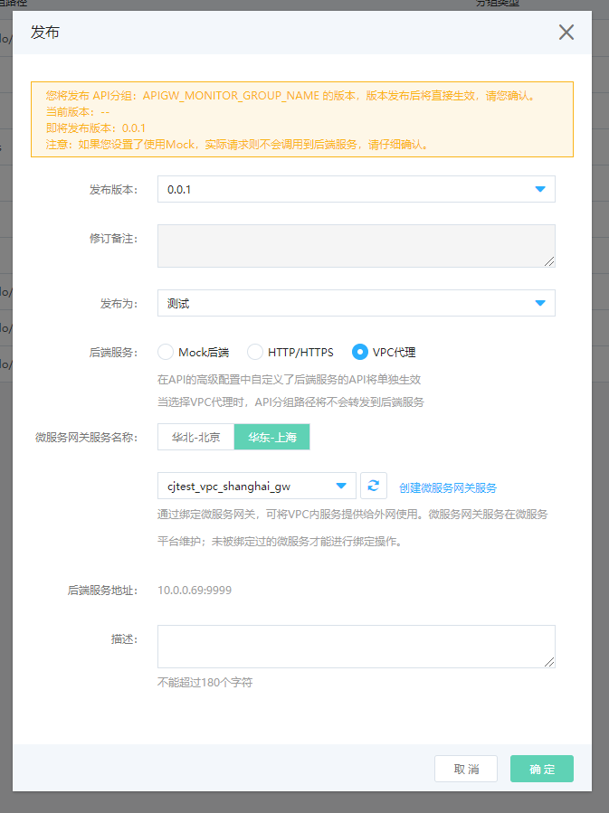

#   创建服务
目前，微服务网关服务支持两种调用方式：通过API网关进行外部调用、通过VPC代理模式进行VPC应用间的调用。本文将介绍如何基于   [京东云API网关](../../../API-Gateway/Introduction/Product-Overview.md)  和 京东云微服务平台的微服务网关， 搭建应用的微服务网关。

## 操作场景
如果用户正在实施微服务转型，并在京东云微服务平台上已经创建了一组微服务应用。那么，可以按照如下流程创建一组微服务网关服务，来提供外部请求与各个微服务之间的调用服务。

## 准备工作

假设用户已经在京东云平台上，创建了自己的VPC，开通了微服务平台产品并且创建了注册中心，同时微服务应用也已部署到了该注册中心里。

## 操作步骤

1、	登录微服务平台控制台。

2、	在左侧导航栏点击微服务网关，进入服务列表页。

3、	在服务列表上方，点击创建微服务网关服务，进入创建页。

4、	设置服务信息，单击立即购买按钮，完成创建。创建完成后，系统将创建一个微服务网关服务实例。如需提供外网访问，推荐通过API网关提供服务。

| 信息项 |说明 |
|---|---|
| 地域和可用区 | 推荐使用系统分配方式，可最大程度保障系统高可用。创建时请注意，不同地域资源内网不互通且创建后不可更改。  |
| 微服务网关服务名称 |  该服务的名称，将做为API网关和微服务网关的桥梁，且创建后不可修改。   |
| 创建方式-微服务网关通用方式 | 用于进行各个微服务的调用，为微服务网关通用方式。若选择此种方式搭配API网关使用，需要在API网关创建API分组过程中选择API分组类型时，选择“微服务API分组”。    |
| 创建方式-VPC代理 | 可以在服务不开通外网访IP和端口的情况下通过 API 网关在外网进行调用，可以进一步的保障用户对外开放服务的安全性。若选择此种方式搭配API网关使用时，需要在API网关创建API分组过程中选择API分组类型时，选择”通用API分组”。 |
| 注册中心&应用列表  | 1个微服务网关服务只能归属于1个注册中心，同时还需选择指明该注册中心下的哪些应用可以被该微服务网关服务所调用，未被勾选的应用将不能被网关服务发现。应用可在微服务网关服务创建成功后再按需增加或删除。
|  QPS规格  | 目前产品按照规格提供计费依据 。 |

## 结合API网关的操作流程

接下来将介绍结合API网关的操作流程。在介绍前，默认用户已经做好如下准备工作：

-  用户已经开通API网关产品、微服务平台产品。

-  用户已经在微服务平台上创建完注册中心、部署完应用。

-  用户已知API网关产品的常用信息和流程。

###    通过API网关发布微服务网关服务的通用步骤

#####  STEP 1：创建微服务网关服务。其中创建方式选择“微服务网关”。

-  选择该方式时，需要指定网关所属的注册中心。

-  注册中心下有哪些应用会通过微服务网关提供服务，也需要进行指定选择。在创建服务时可先不填；在创建服务成功后，可随时按照需要进行应用更新。

 

#####  STEP2:创建API分组。其中API分组类型选择“微服务API分组”。

-  第1步和第2步之间创建时无强制要求先后关系。用户可先创建API分组，也可先创建微服务网关服务。

-  微服务API分组类型，在API网关转发请求到微服务网关过程中，暂不支持转发分组路径前缀内容到微服务网关。

创建完成的API分组信息如下：

 
 

#####  STEP3：互相绑定。

-  有两处入口提供绑定：

       -  1、在API网关产品里进行绑定。可在API分组列表页中分组信息中点击“绑定“操作。

       -  2、在微服务网关产品里进行绑定。

-  绑定操作信息如下：

注意：

	-  API分组的每个发布环境里只能绑定唯一一个后端服务。比如，当在该分组的“预发“环境里尚未绑定过任何微服务时，“预发”环境下的该分组才可以被绑定到新的微服务网关服务上；
	
	-  如果API分组已经被绑定过其它微服务网关服务，将不能再进行绑定。
	
	-  这里的API分组信息，为过滤后的可绑定的API分组列表信息。该环境中已绑定过的API分组，将不会出现在列表中。

-  绑定完成后信息中，将展示所绑定的API分组信息、API分组的环境信息等内容。并提供API分组的发布、下线、解绑等操作入口。

 

#####   STEP4：发布API分组。

发布完成后，用户即可通过API网关进行公网调用。发布API分组有两个入口：

1、可在微服务网关服务的API分组列表页中，直接点击发布。这里发布时，API分组相关的环境信息、版本信息不提供修改。

2、可在API网关产品中，点击发布。

-  这里发布时，可选择将该API分组发布到不同的环境里（测试、预发、线上）。

-  每一个环境可以使用相同或者不同的微服务网关服务，做为后端服务。

####    通过API网关发布VPC代理服务步骤

#####   STEP 1：创建微服务网关服务。其中创建方式选择“VPC代理”

-  注意IP转发地址为：IP+端口方式，注意端口是必填项。

-  需要指定VPC的网络信息。在调用时需要注意同一VPC内才可相互调用。

 
 

#####   STEP2:创建API分组。API分组类型选择“通用API分组”。

-  VPC代理方式，是API网关提供的通用方式之一，因此这里做为标准功能放在了通用API分组的功能中。

-  因此，通用API分组在部署发布过程中，将可选择VPC代理方式做为其后端服务。也可选择其它方式（http/https、mock等）做为其后端服务。

#####   STEP3：发布。有两处入口：

1、在API网关产品里进行发布。

2、在微服务网关产品里进行发布。

	

DEMO范例可参考： [最佳实践](../../Getting-Started/GW_VPC.md)  

