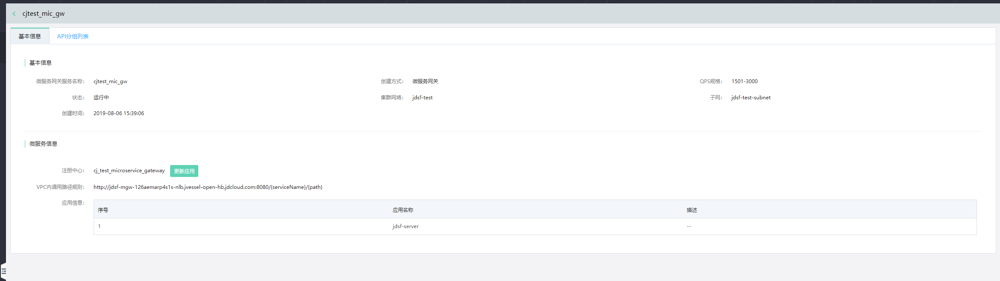
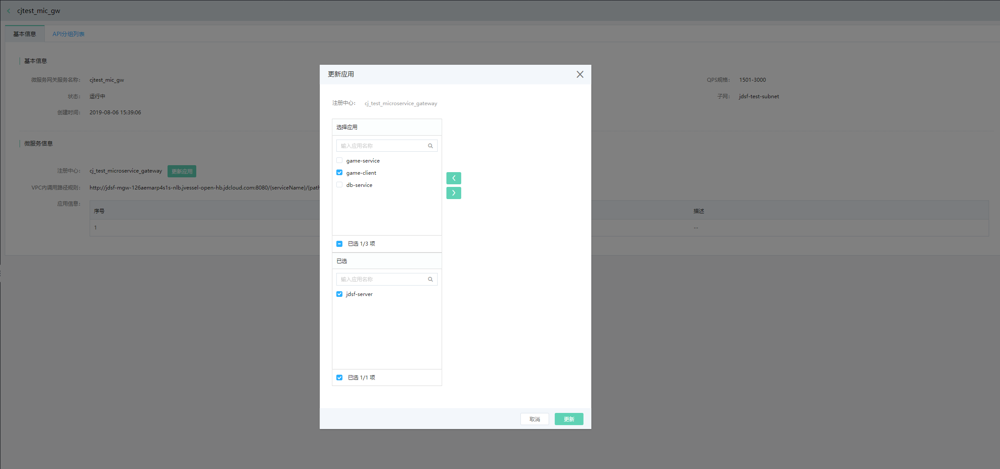
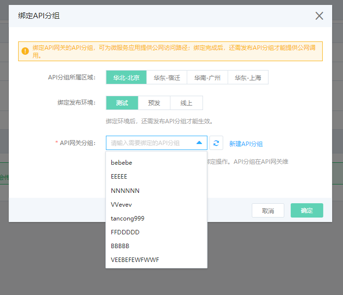
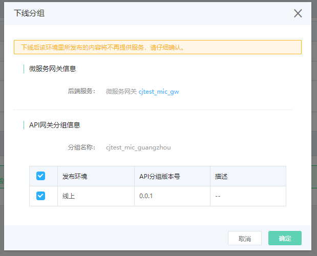
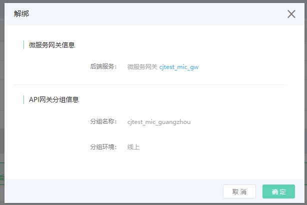
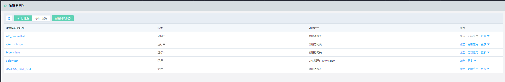
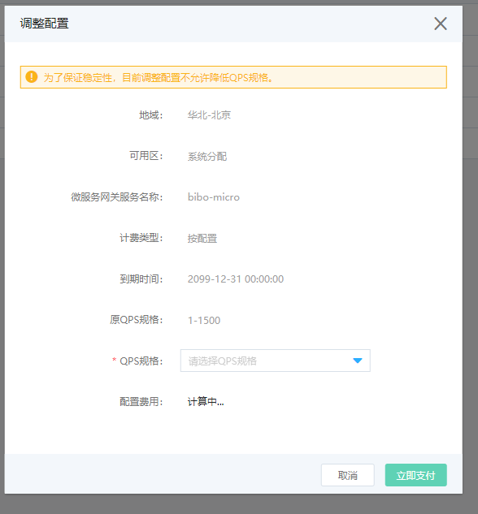
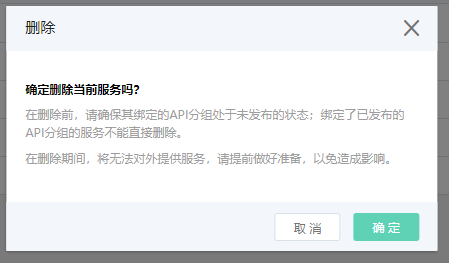

#  查看服务

## 操作场景
查看当前用户所创建的、运行中的微服务网关服务信息。

## 操作步骤

###  查看微服务网关服务详情

1、	登录微服务平台控制台

2、	在左侧导航栏点击微服务网关，进入服务列表页

3、	在服务列表中，点击要查看的服务名称，即可进入详情页查看信息。一个微服务网关服务的信息包含两部分：基本信息、API分组列表信息。

 
 

####  在基本信息tab页中，包含两部分信息：

1、	微服务网关服务自身的基本信息。

2、	微服务网关所服务的注册中心的相关信息。

-  这里用户可随时更新注册中心下的应用信息列表。并且只有被选择的应用，才可被微服务网关服务发现。

-  当用户进行应用调用时，需按照VPC内调用路径规则进行访问。

 
 
  

####   在API分组列表tab页中，展示了该微服务网关服务通过API网关方式发布后，所关联选择的API分组的信息汇总。

 
 
1、	一个微服务网关服务可以通过多个API分组提供访问。

2、	API分组可以和微服务网关不在同一区域。

3、	在客户端请求API网关，API网关将用户请求转换到后端微服务过程中注意：

-  客户端请求API网关时，请求路径规则：http(s)://host/分组路径前缀/{发布的微服务名称}/{用户服务里定义的接口路径} 。

-  API网关目前暂不支持把API分组的分组路径前缀信息传给后端微服务网关服务。

4、	绑定API分组操作：绑定微服务网关服务与API分组的过程。绑定时，需要精确到API分组的发布环境。注意：

-  只有API分组类型为“微服务API分组” 的API分组，才会出现在可选绑定的列表中。

-  API分组的每个发布环境里只能绑定唯一一个后端服务，因此绑定环境信息时，只有在该环境下未被绑定过的API分组名才会出现在可绑定列表中。且系统会自动过滤掉不能绑定的API分组信息。

例如：名为abs的API分组，在测试环境中已经选择了微服务网关服务cjtest_mic_gw做为后端服务，那么接下来只能在预发、线上环境里，可以绑定API分组abs。

下图中，因为API分组abs尚未在预发环境中绑定过任何信息，所以可以在预发环境进行绑定。

 

 

下图中，API分组abs将不再出现在测试环境下的可绑定的API分组列表中。因为该API分组的测试环境已经绑定了其它微服务网关服务。
 
 

 
5、	发布操作：API分组发布生效后才能提供微服务应用的访问。

 

 

6、	下线操作：分组在某一环境下线后（如在预发环境下线），该环境将不再提供服务访问。

 

 
 
7、	解绑操作：解除API网关分组与微服务网关服务的关系。

- 在API分组的发布环境中，若为已发布状态，则不能直接解绑，需要先下线分组再进行解绑操作。
 
 

 

###  查看微服务网关服务列表

1、	登录微服务平台控制台

2、	在左侧导航栏点击微服务网关，进入服务列表页
 
 

用户在服务列表页中可进行的操作包含：

1、 创建网关服务：创建1个新的微服务网关服务。

2、 查看详情：查看已创建的微服务网关服务的详细信息。

3、 绑定：如果当前创建的微服务网关服务，希望通过API网关方式对外提供服务，则需要进行绑定API分组来提供客户端调用。

4、 更新应用：更新可访问的应用信息。

-  当创建时选择了通用微服务网关服务，则在创建成功后，用户可根据业务情况更新注册中心下的应用，以供微服务网关进行调用；

-  对于使用VPC代理模式的微服务网关服务，没有此项功能。

5、 调整配置：升级当前规格。

-  为了保证服务稳定性，目前调整配置不允许降低QPS规格。

 

6、 删除：删除微服务网关服务。

-  可删除的前提条件是，该服务未关联绑定任何处于已发布状态的API分组。

-  若API分组在任何部署环境中（测试、预发、线上）处于已发布状态，需要先下线，再进行删除。

 

