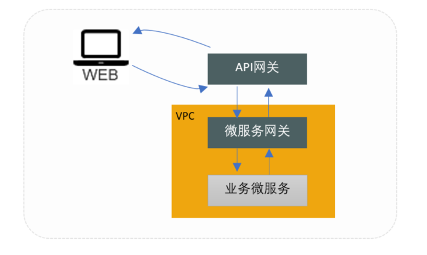
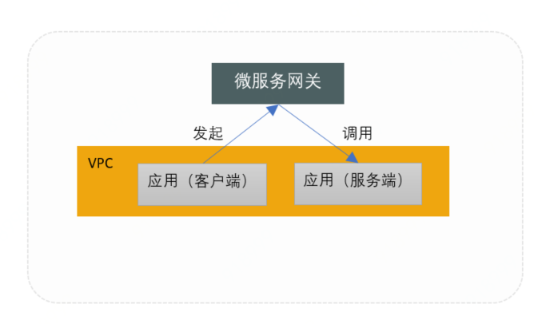
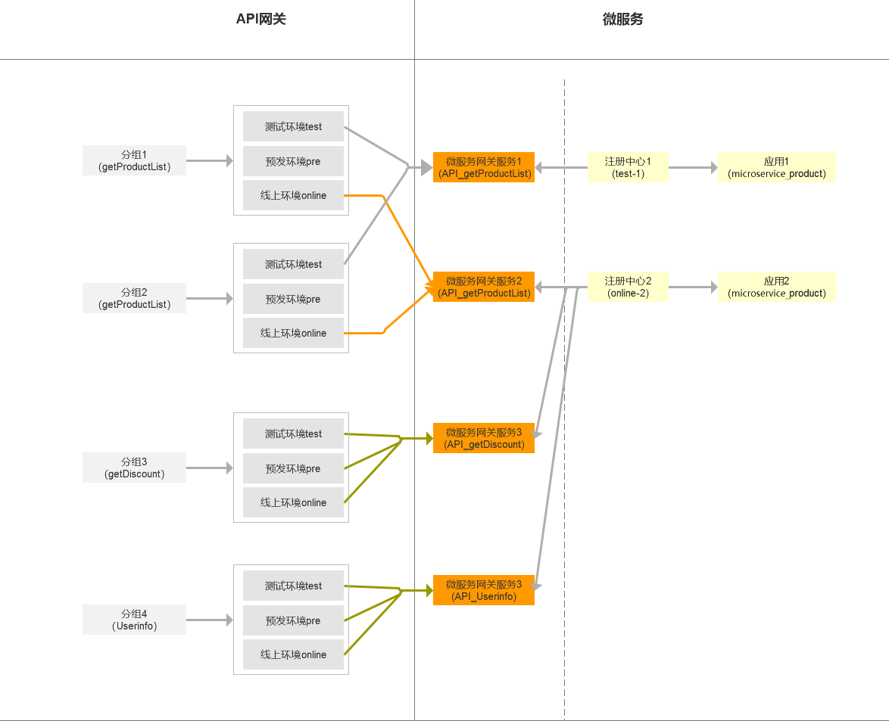

# 概述

京东云微服务网关用于服务的对外开放。使用京东云微服务网关，既可以将服务开放给内网的其他服务，也可以配合API网关开放给公网访问。如果使用了微服务平台的注册中心服务，微服务网关可以在调用时自动完成服务发现、负载均衡，无需再使用其他负载均衡或网关服务。如果服务已经通过其他方式在内网发布到了负载均衡服务上，也可以通过微服务网关实现与API网关的无缝对接，避免公网暴露，不再需要申请公网IP和产生公网流量费用。

京东云微服务网关具有如下优势：

- 微服务网关封装了微服务应用程序的内部结构，为客户端提供了统一调用的入口。当发生请求调用时，请求会经由微服务网关再转发到授权发布的微服务实例上。

- 京东云微服务网关与京东云API网关无缝整合，您可直接通过API网关将您的微服务应用发布到公网调用，避免了服务提供方直接暴露服务，不再需要申请公网IP和产生公网流量费用。

- 基于API网关可提供API的流控策略、访问授权等功能，帮助业务开发者更加专注自身业务开发。 

- 简化了客户端的开发工作量。客户端只须跟网关交互，而无须关注服务的位置和服务实例伸缩等内部细节。

## 应用场景

京东云微服务网关，帮助用户不必暴露服务，即可实现微服务应用的外部调用。目前已提供以下两种调用方式：

- 微服务网关模式：

可以将微服务网关服务，做为API网关API分组的后端服务；当API分组在部署环境中发布成功后，用户即可通过API网关调用微服务网关，进而调用VPC内微服务应用实例。微服务网关完成服务发现、负载均衡（随机模式）。

- VPC代理模式：

可将微服务网关看作为VPC代理，将部署在vpc内的任何服务通过ip+端口的方式直接通过API网关暴露给公网，无需公网IP和公网直接暴露。具体调用方式，请参考用例：使用API网关开放VPC内的接口

 
 
## 概念之间关系

API网关的API分组、微服务网关服务、注册中心、应用之间的关系如下：

|名词|说明|
|---|---|
| API分组  |  API 提供方管理 API 的单元，一个API分组包含多个API； API的发布、调用、授权、流控，均以API分组为单元。更多详情可参考： [API网关分组说明](../../../API-Gateway/Operation-Guide/Create-APIGroup/Create-APIGroup.md)   。 |
| API分组的部署环境 | API的运行环境，目前京东云API网关提供测试、预发、线上三组环境。API分组需要部署到环境（测试、预发、线上）中，才可以提供调用。更多详情可参考：[API网关发布环境说明](../../../API-Gateway/Operation-Guide/Create-APIGroup/Create-Publish.md)     。 |
| 微服务网关服务  |  微服务网关提供服务的基础单元；微服务应用在提供对外服务过程中，需要通过一个具体的微服务网关服务实例来进行通信。 |

说明：

- 当用户需要将某个API分组发布到不同部署环境中时，可以选择多个微服务网关服务做为其业务后端服务；

- 1个微服务网关服务，也可以同时做为多个API分组在不同环境下的后端服务；

- 1个微服务网关服务，只能绑定1个注册中心。

## 计费规则

- 微服务网关采用后付费模式，根据QPS规格计费，公测期间QPS在3000以下可免费使用。
  
- 当客户端通过API网关调用时，API网关将按照API调用次数收取费用。详细收费规则可参考 [API网关产品计费说明](../../../API-Gateway/Pricing/Billing-Overview.md)  。

