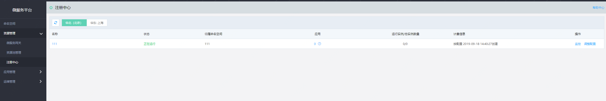
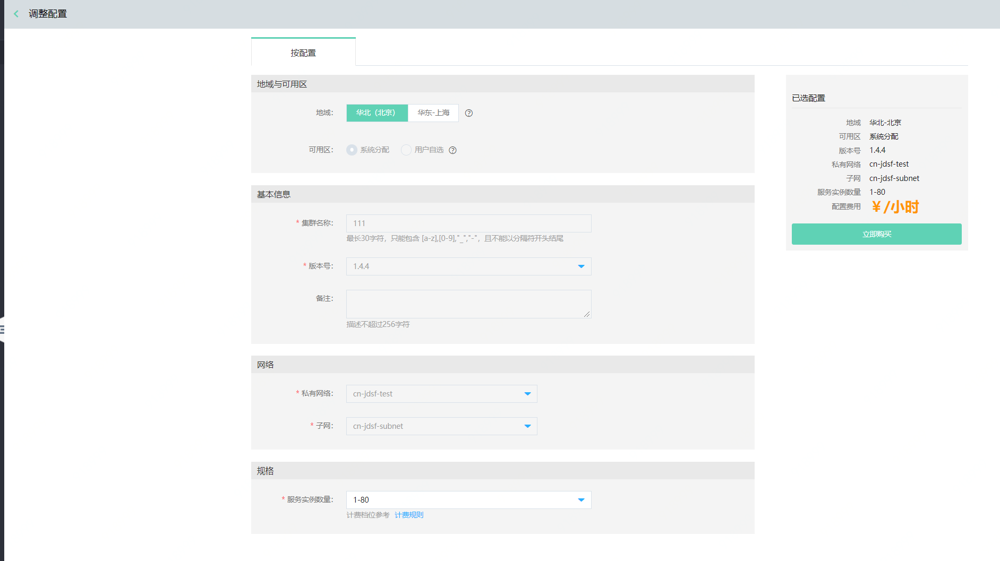

# 注册中心

注册中心，实现服务的注册与发现，是微服务的管理中心。用户在创建命名空间同时创建了注册中心；当删除命名空间时，也将同步删除注册中心信息。

注册中心提供的功能包括调整规格配置、监控信息等。

 
## 操作步骤

### 调整配置
1、登录微服务平台控制台。在左侧导航栏点击注册中心，进入注册中心列表页。
 

2、选择需要调整配置的注册中心，进入调整配置页。

3、选择所需规格，单击立即购买按钮，完成创建。

**说明：**

-  当前注册中心调整配置，只支持扩容，不支持缩容。

  

### 监控
可对当前注册中心的状态、服务实例情况、发布情况等信息进行监控，并配置报警规则。
