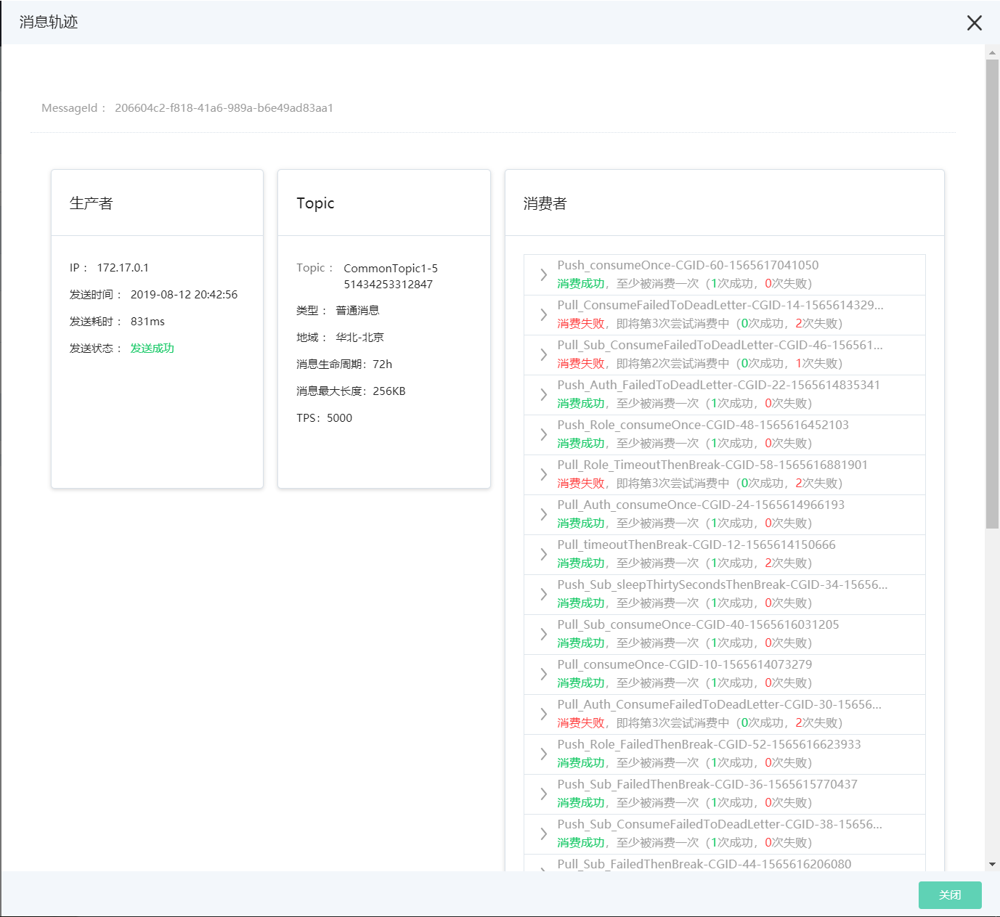

# 消息轨迹

消息轨迹是指一条消息从生产者到所有消费者完整的关键节点记录。可以帮助用户解决因为生产和消费解耦，导致生产者与消费者无法确定消息状态的问题，并且帮助用户定位问题了解消息的详细状态。


## 前提条件

暂时只有JAVA SDK收发的消息支持消息轨迹功能，使用HTTP API收发的消息不支持消息轨迹查询

- Java SDK（[版本](https://mvnrepository.com/artifact/com.jdcloud/jcq-java-sdk)）：V1.3.0及以上版本
- 确保Produc和Consumer开启消息轨迹记录，客户端默认配置为关闭


设置消息轨迹开启的方法如下：

#### 代码示例
```Java
        
        //开启生产者消息轨迹，配置属性enableMessageTrace
        ProducerConfig producerConfig = ProducerConfig.builder()
                .metaServerAddress(META_SERVER_ADDRESS)
                .enableMessageTrace(true)
                .build();
                
        //开启消费者消息轨迹，配置属性enableMessageTrace        
        ConsumerConfig consumerConfig = ConsumerConfig.builder()
                .consumerGroupId(CONSUMER_GROUP_ID)
                .metaServerAddress(META_SERVER_ADDRESS)
                .enableMessageTrace(true)
                .build();
                
```

## 操作步骤

1. 进入消息队列 JCQ控制台，在左侧菜单，选择消息查询。
2. 选择所要查询消息所在的地域，可选择任一页签，输入信息，进行消息查询。
3. 选择有问题的消息点击操作中的消息轨迹进行查看状态，来确定问题。



规则：

- 延迟消息：系统时间没有到达指定投递时间，消息查询中查询不到此消息，但是单独调用消息轨迹接口可以查询到本消息。

- 消费确认超时（ACK超时）：如果消息确认超时则消费耗时无法计算，消费状态为消费失败。

- 消息轨迹有效时间：消息轨迹记录的时间与消息的生命周期相同，为3天。

  

## 展示数据

消息的生产与消费涉及了生产者、服务端和消费者三个角色，每一次生产和消费都会产生消息轨迹，消息轨迹功能汇总展示的信息如下：

|          | 生产者                                                  | 消息队列 JCQ                                                 | 消费者                                                  |
| -------- | ------------------------------------------------------- | ------------------------------------------------------------ | ------------------------------------------------------- |
| 展示数据 | - 生产者IP<br/>- 发送时间<br/>- 发送耗时<br/>- 发送状态<br/>- 延迟时间 | - 存储Topic<br/>- Topic类型<br/>- Topic地域<br/>- 存储时长<br/>- Topic相关属性 | - 消费者IP<br/>- 消费时间<br/>- 消费状态<br/>- 消费耗时 |

名称解释：

- 发送时间：消息从客户端（生产者）发送的时间戳
- 发送耗时：消息从客户端（生产者）到服务端所消耗的时间，单位：毫秒
- 发送状态：

| 发送状态              | 状态码         | 备注                                           |
| --------------------- | -------------- | ---------------------------------------------- |
| 发送成功              | SUCCESS_NORMAL | 消息发送成功，服务端已经存储成功               |
| 发送失败              | FAILED         | 消息发送失败，服务端没有存储消息，需要重试     |
| 发送成功（延迟:？秒） | SUCCESS_DELAY  | 该消息是定时或者延时消息，可能还未投递到消费者 |


- 消费时间：客户端（消费者）开始消费消息的时间戳
- 消费耗时：客户端（消费者）开始消费消息到消息确认所消耗的时间，单位：毫秒
  - 如果消息确认超时则消费耗时无法计算
- 消费状态：

消费组状态

| 消费组消费状态                         | 状态码       | 备注                                           |
| -------------------------------------- | ------------ | ---------------------------------------------- |
| 未消费                                 | UNCONSUMED   | 该消息尚还未投递给消费组或者标签不匹配已被过滤 |
| 消费成功，至少被消费一次               | SUCCESS      | 该消息已经被消费组成功消费                     |
| 消费失败，即将第x次尝试消费中          | FAILED_RETRY | 消费组消费失败，等待重试                       |
| 消费全部失败，请去死信队列中处理此消息 | ALL_FAILED   | 该消息的所有消费尝试都失败                     |
| 未知状态                               | UNKNOWN      | 未收录状态                                     |

consumer状态：

| Consumer状态             | 状态码                | 备注                                                         |
| ------------------------ | --------------------- | ------------------------------------------------------------ |
| 消费成功                 | SUCCESS               | 本次消费成功                                                 |
| 消费失败，未返回消费结果 | FAILED_WITHOUT_RESULT | 本次消费消息的方法尚未返回结果，或者中断，导致本次消费结果未传回服务端 |
| 消费失败，消费确认失败   | FAILED_WITH_RESULT    | 本次消费失败，消费确认返回失败                               |
