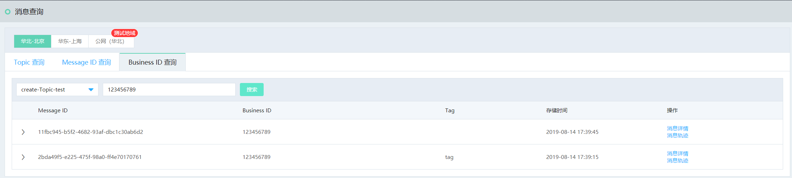
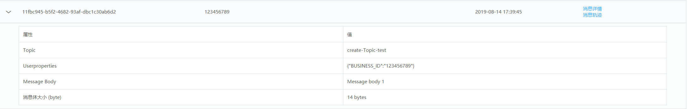

# 查询消息
消息队列 JCQ提供了三种消息查询的方式：按Topic时间范围，按Message ID，以及按Business ID查询。

## 前提条件
- 消息已经在所查询的topic中发送
- 所查询的消息在消息生命周期内（3天）

## 操作步骤
1. 进入消息队列 JCQ控制台，在左侧菜单，选择消息查询。
2. 选择所要查询消息所在的地域，可选择任一页签，输入信息，进行消息查询。

### 1. 按Topic查询

输入或选取想要查询的Topic名称和时间范围，点击搜索，得到查询结果。  
可以点击某条message的操作，查看消息详情或者消息轨迹。

### 2. 按Message ID查询

输入或选取想要查询的topic名称,输入Message ID，点击搜索。  
可以点击某条message的操作，查看消息详情或者消息轨迹。

### 3. 按Business ID查询

输入或选取想要查询的topic名称,输入用户自己定义的Business ID，点击搜索。  
可以点击某条message的操作，查看消息详情或者消息轨迹。
规则：
- 消息properties中包含Business ID的消息才能在按Business ID中查询出来。
- 按Business ID查询最多返回256条包含指定Business ID 的消息，建议消息生产者Business ID设置尽可能全局唯一，否则可能出现无法返回全集的情况。

## 查询结果
查询列表展示消息的Message ID、Business ID、Tag以及存储时间。进一步可查看消息详情和消息轨迹。
#### 消息详情
查询详情里详细展示了消息的Message Body、Userproperties以及消息体大小。

#### 消息轨迹
消息轨迹可以展示消息的完整生产和消费过程，详情参见(消息轨迹)[Message-Trace.md]。
