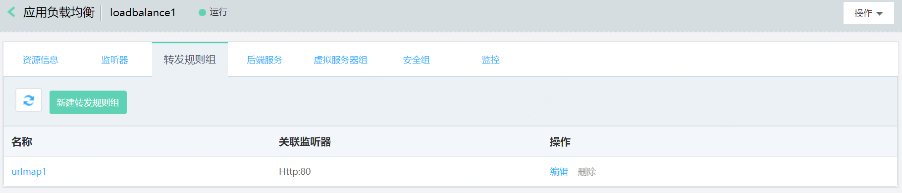

# 基于主机名和URL路径转发流量

## 准备与规划

- 网络准备

	根据业务部署需要，提前规划应用负载均衡和作为后端服务器的云主机、容器的地域、可用区、私有网络等。
	
	注意：作为后端服务器的云主机、容器需要与应用负载均衡同一地域、私有网络。

- 服务器准备

	需提前创建承载业务流量的云主机、容器，并确保打开监听所需的端口，合理配置安全组、ACL策略。

- 应用负载均衡实例

	创建一个应用负载均衡实例，设置地域、可用区、网络、安全组等配置，并为应用负载均衡创建一个HTTP（或HTTPS）监听器。

## 添加一个转发规则组

1. 通过应用负载均衡-详情-转发规则组进入转发规则组列表页。

	

2. 点击 **新建转发规则组**，打开转发规则组创建页，填写转发规则组名称和描述。
3. 点击**添加规则**，填写转发规则信息：
    - 主机：用于匹配客户端请求的主机名。支持输入IPv4地址和域名，域名支持精确匹配和通配符匹配，仅支持输入大小写字母、数字、英文中划线“-”和点“.”，最少包括一个点"."，不能以点"."和中划线"-"开头或结尾，中划线"-"前后不能为点"."，不区分大小写，且不能超过110字符。通配符匹配支持包括一个星"*"，输入格式为\*.XXX或XXX.\*。
    - URL路径：用于匹配客户端请求的URL路径。必须以/开头，仅支持输入大小写字母、数字和特殊字符：$-_.+!'()%:@&=/，区分大小写，且不能超过128字符。前缀匹配支持包括一个星"*"，输入格式为/XXX\*或/\*。
    - 后端服务：应用负载均衡将匹配规则的报文转发到的后端服务。下拉列表中仅显示后端协议为HTTP的后端服务。

## 为监听器关联一个转发规则组

1. 通过监听器列表页-操作栏，点击**更多**弹出管理转发规则组对话框。
2. 在管理转发规则组对话框中，可为监听器关联一个转发规则组。

