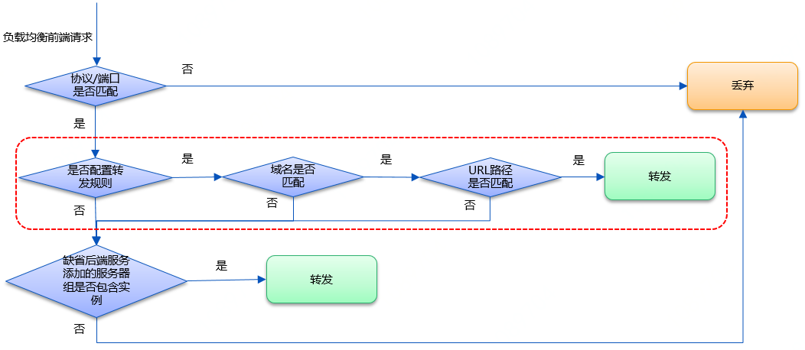

# 转发规则组管理

本页目录

[添加转发规则组](#添加转发规则组)

[管理转发规则组](#管理转发规则组)

[删除转发规则组](#删除转发规则组)

应用负载均衡支持配置基于主机和URL路径的转发规则组，可以将来自不同主机名和URL路径的请求转发给不同的后端服务处理。一个转发规则组中可配置多条转发规则。转发规则中定义匹配请求的主机、URL路径及转发到的后端服务。按照匹配优先级由高到低的顺序，访问请求依次匹配各转发规则，匹配某规则成功后，即将请求转发给该规则绑定的后端服务处理。
仅七层（HTTP/HTTPS）监听支持关联转发规则组，一个监听器只能关联一个转发规则组。监听器关联转发规则组后，应用负载均衡转发请求的流程如下：

主机支持输入IPv4地址和域名。域名支持精确匹配和通配符匹配两种。

- 精确匹配：输入格式如www.jdcloud.com
- 通配符匹配：输入格式如\*.XXX或XXX.\*

当一个客户端请求同时匹配多条转发规则的主机名时，匹配优先级为精确匹配>以\*开头的最长通配符匹配>以\*结尾的最长通配符匹配。

URL路径支持精确匹配和前缀匹配两种。

- 精确匹配：输入格式如/path/abc
- 前缀匹配：输入格式如/path1\*

当一个客户端请求同时匹配主机名相同且URL路径不同的多条规则时，匹配优先级为精确匹配>最长前缀匹配。

京东云的应用负载均衡默认根据转发规则匹配优先级为您配置的转发规则进行排序。

## 添加转发规则组

1. 通过应用负载均衡-详情-转发规则组进入转发规则组列表页。

	

2. 点击 **新建转发规则组**，打开转发规则组创建页，填写转发规则组名称和描述。
3. 点击**添加规则**，打开添加规则对话框，填写规则信息：
    - 主机：用于匹配客户端请求的主机名。支持输入IPv4地址和域名，域名支持精确匹配和通配符匹配，仅支持输入大小写字母、数字、英文中划线“-”和点“.”，最少包括一个点"."，不能以点"."和中划线"-"开头或结尾，中划线"-"前后不能为点"."，不区分大小写，且不能超过110字符。通配符匹配支持包括一个星"*"，输入格式为\*.XXX或XXX.\*。
    - URL路径：用于匹配客户端请求的URL路径。必须以/开头，仅支持输入大小写字母、数字和特殊字符：$-_.+!\'()%:@&=，区分大小写，且不能超过128字符。前缀匹配支持包括一个星"*"，输入格式为/XXX\*或/\*。
    - 后端服务：应用负载均衡将匹配规则的报文转发到的后端服务。下拉列表中仅显示后端协议为HTTP的后端服务。

4. 点击转发规则列表栏中操作列的**编辑**，可编辑已添加的规则。
5. 点击转发规则列表栏中操作列的**删除**，可删除已添加的规则。

## 管理转发规则组

1. 查看转发规则组：点击转发规则组名称进入转发规则组详情页，可查看转发规则组的详细信息。

1. 编辑转发规则组：点击转发规则组列表-操作栏下的**编辑**，可编辑转发规则组。
		
## 删除转发规则组

1. 点击转发规则组列表-操作栏下的**删除**，可删除转发规则组。删除成功后，与转发规则组绑定的后端服务将自动与其解除关联。
		
