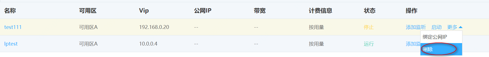

# 删除网络负载均衡实例

当您不再需要网络网络负载均衡实例提供服务时，可以选择将其删除。公网和私网类型的网络负载均衡实例删除步骤相同。

 1. 在京东云控制台菜单栏选择 **网络**>> **负载均衡**，选择**网络型** 页签，进入网络负载均衡列表页。

 3. 鼠标悬停到 **操作** 栏下的 **更多**，选择 **删除** 可删除指定网络负载均衡。
 
        注意：开启删除保护功能后，网络负载均衡不允许被删除，该功能用于预防网络负载均衡被误删除。

 
