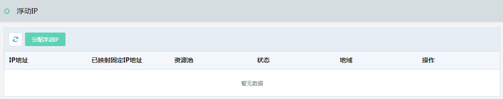
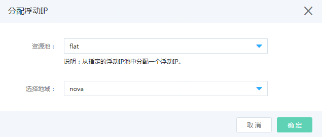

# 分配浮动IP

访问左侧导航栏，点击基础云>网络资源>浮动IP菜单，进入浮动IP列表页面，如图：浮动IP列表页面所示。

图：浮动IP列表页面

在此页面点击“分配浮动IP”按钮，弹出“分配浮动IP”页面，如图：分配浮动IP页面所示。

图：分配浮动IP页面

在此页面选择浮动IP资源池，选择地域，点击“确定”按钮，分配成功后，您可以在浮动IP列表页面中看到您分配的浮动IP，即完成浮动IP分配。如图：浮动IP列表页面所示。

图：浮动IP列表页面

## 绑定浮动IP

在图：云主机列表页，点击操作列的”更多操作”，弹出云主机操作项，点击“绑定浮动IP”，弹出绑定浮动IP页面，如图：绑定浮动IP页面所示。

图：绑定浮动IP页面

在此页面选择绑定浮动IP的端口、浮动IP，点击“确定”按钮，绑定成功后，您可以在云主机列表页面中看到您所绑定的浮动IP，如图：云主机列表页面所示。

图：云主机列表页面

绑定完成浮动IP后，您的云主机就可以被外部网络访问了。至此，您的云主机已完成创建，且可以访问及被外网访问。

