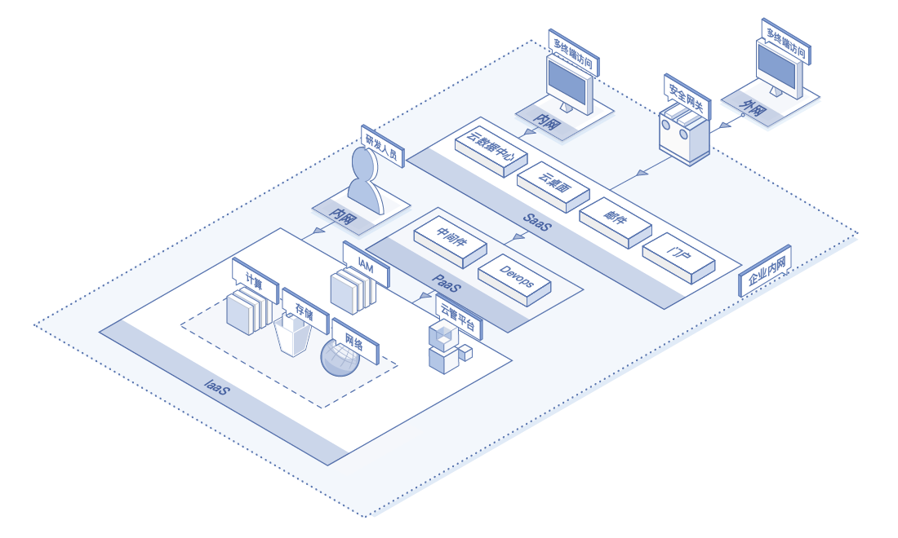

# 应用场景

**典型场景**

随着需求变化、流量增大，客户业务系统需要不断迭代更新，数据中心资源数量和规模需要不断扩大。传统数据中心已无法满足业务系统不断升级的需求，并存在诸多问题：

* 资源固化，无法动态调节和共享。
* 灵活性差，业务系统对物理设备依赖高，制约系统更新发展。
* 成本居高不下，资源过度供应，长期资源利用率偏低。
* 管理不便，多手动管理，缺乏便捷的资源监控与管理工具。

**解决方案**

* 核心数据采取安全隔离保护，数据安全性高。
* 客户可对系统物理资源完全掌控，减小运维成本。
* 实现平台上层业务系统的高可用性，具备故障恢复和容灾能力。
* 面向应用服务商提供定制化集成解决方案，将应用开发商与云簇平台全面集成一体化交付。

