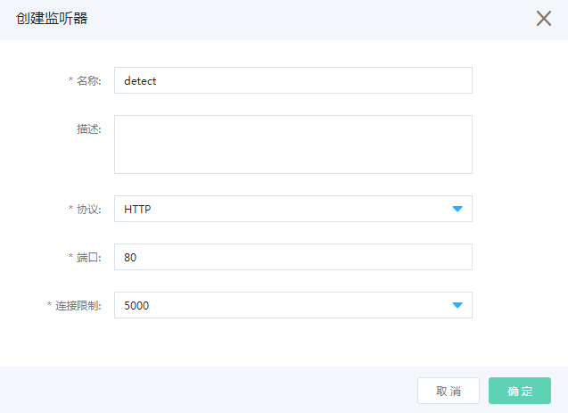
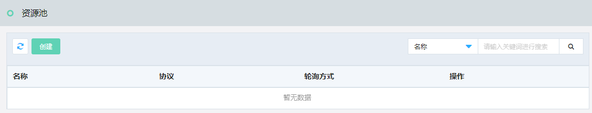
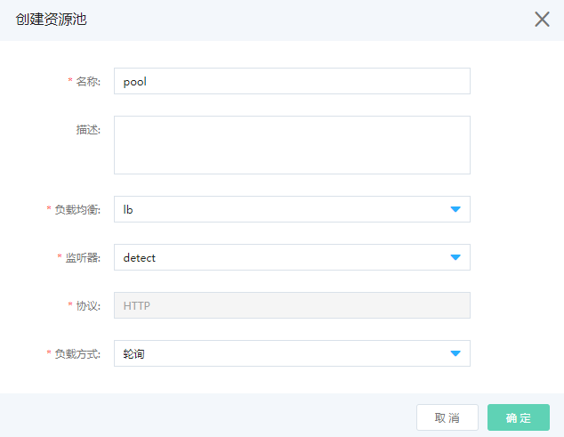
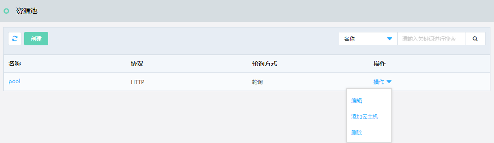
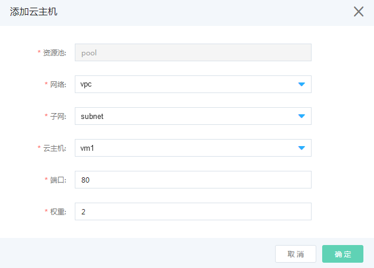
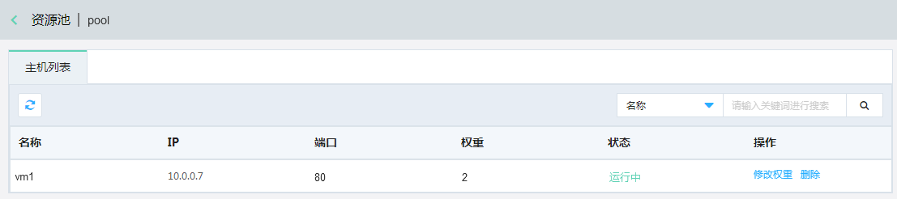
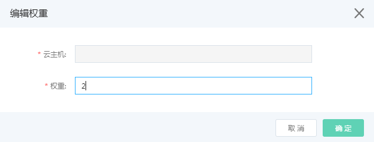

# 负载均衡

平台的普通用户，建议您通过以下方式搭建基于负载均衡的服务，快速熟悉平台的负载均衡功能。

创建一组挂载负载均衡服务的云主机，具体步骤如下：

第一步，创建负载均衡

第二步，创建监听器

第三步，创建资源池

第四步，添加云主机到资源池

第五步，编辑主机权重

## 创建负载均衡

负载均衡可将大并发流量分发到多台后端实例，调整资源利用情况，消除由于单台设备故障对系统的影响，提高系统的可用性、扩展系统服务能力。

访问左侧导航栏，点击基础云>网络资源>负载均衡菜单，进入负载均衡列表页面，如图：负载均衡列表页面所示。

图：负载均衡列表页面

在此页面，点击“创建”按钮，弹出创建负载均衡页面，如图：创建负载均衡页面所示。

图：创建负载均衡页面

在此页面输入名称、选择网络、子网、点击“确定”按钮，弹出“创建成功”提示，您可以在负载均衡列表页面中看到您创建的负载均衡信息，如图：负载均衡列表页面所示。

图：负载均衡列表页面

在此页面点击操作列的”操作”按钮，弹出下来弹框，点击相应操作执行编辑、创建监听器、删除操作。

## 创建监听器

监听规则：监听的协议类型与端口号信息，目前支持HTTPS/HTTP/TCP三种协议类型。用户在同一个应用负载均衡内可以定义多个监听器，不同监听器可以选择不同协议类型、或者选择相同协议类型但定义不同端口号。

在负载均衡列表页面，点击右侧操作列的“创建监听器”按钮，弹出创建监听器页面，如图：创建监听器页面所示。

图：创建监听器页面

在此页面输入名称、选择协议、连接限制、输入端口号，点击“确定”按钮，弹出“创建成功”提示，您可以在负载均衡详情页面中看到您创建的监听器信息，如图：负载均衡监听器详情页面所示。

图：负载均衡监听器详情页面

注意：同一负载均衡下的监听端口不可重复，监听器创建后监听协议、端口不允许修改。

## 创建资源池

访问左侧导航栏，点击基础云>网络资源>资源池菜单，进入资源池列表页面，如图：资源池列表页面所示。

图：资源池列表页面

在此页面，点击“创建”按钮，弹出创建资源池页面，如图：创建资源池页面所示。

图：创建资源池页面

在此页面输入名称、选择负载均衡、监听器、负载方式、点击“确定”按钮，弹出“创建成功”提示，您可以在资源池列表页面中看到您创建的资源池信息，如图：资源池列表页面所示。

图：资源池列表页面

## 添加云主机

在资源池列表页面，点击右侧操作列的“添加云主机”按钮，弹出添加云主机页面，如图：添加云主机页面所示。

图：添加云主机页面

在此页面输入名称、选择网络、子网、云主机、输入端口号、权重、点击“确定”按钮，弹出“添加成功”提示，您可以在资源池主机列表详情页面中看到您创建的资源池信息，如图：资源池主机列表详情页面所示。

图：资源池主机列表详情页面

参考以上添加云主机的操作方法，依次添加负载均衡服务后端需要挂载的云主机。

## 修改主机权重

在资源池主机列表详情页面中，点击操作列的“修改权重”按钮，弹出编辑权重页面，如图：编辑权重页面所示。

图：编辑权重页面

在此页面输入修改权重值、点击“确定”按钮，弹出“编辑成功”提示，您可以在资源池主机列表详情页面中看到您编辑的权重信息。
