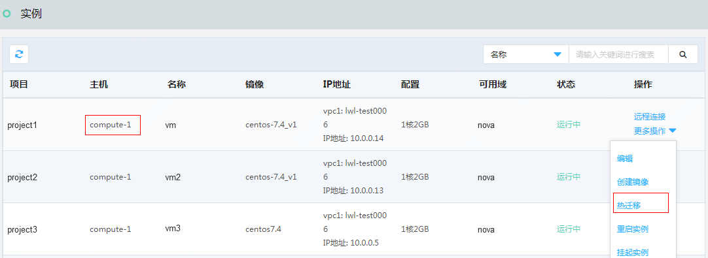
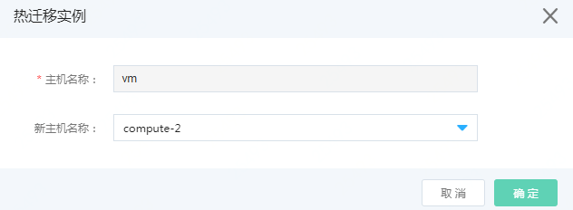
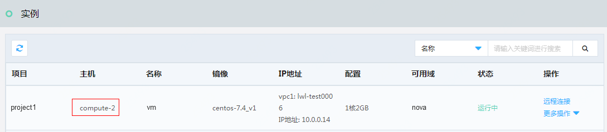
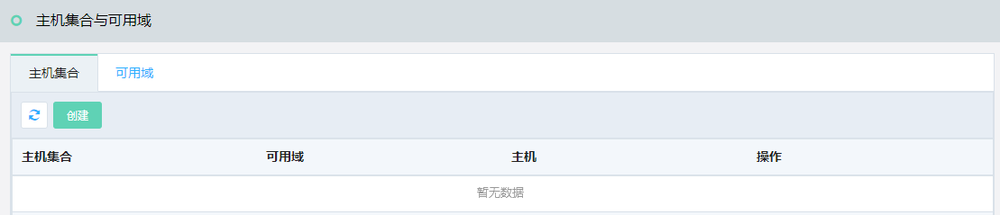
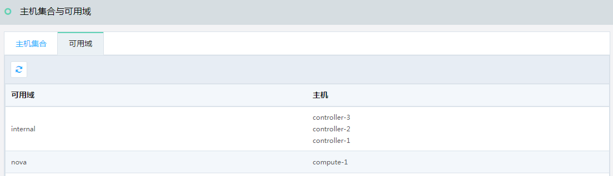

# 运维监控

运维管理员，通过系统管理员或者上级组织后台管理员创建。作为运维管理员登录平台后，具有查看资源监控信息、虚拟资产、物理资产管理权限。

常用的功能说明如下：

## 资源监控

### 监控概览

访问左侧导航栏，点击运维监控>资源监控>监控概览，进入监控概览页面，如图：监控概览页面所示。

图：监控概览页面

在此页面，可以查看全部节点在线状态、平台CPU、内存、磁盘的使用情况。

### 物理节点监控

访问左侧导航栏，点击运维监控>资源监控>物理节点监控，进入物理节点监控页面，如图：物理节点监控页面所示。

图：物理节点监控页面

### 控制服务监控

访问左侧导航栏，点击运维监控>资源监控>控制服务监控，进入控制服务监控页面，如图：控制服务监控页面所示。

图：控制服务监控页面

在此页面，可以查看每个控制服务的监控详情。

## 虚拟资产管理

### 实例管理

访问左侧导航栏，点击运维监控>虚拟资产，您可以查看云簇平台正在提供服务的虚拟资源使用情况，包括每个物理节点的云主机列表，如图：实例列表页面所示。

图：实例列表页面

在此页面，可以对虚拟资产实例进行远程连接、编辑、创建镜像、热迁移、重启实例、挂起实例、删除操作。

### 云主机热迁移

访问左侧导航栏，点击运维监控>虚拟资产>实例，进入实例页面，如图：实例列表页面所示。

图：实例列表页面

在此页面，可以看到实例vm的主机名称为computer-1，点击右侧操作列的“热迁移”按钮，弹出热迁移页面，如图：热迁移页面所示。

图：热迁移页面

在此页面，选择热迁移的目的主机，点击“确定”按钮，弹出迁移成功提示，则在实例列表页中，可以看到新主机信息，如图：实例列表页面所示。

图：实例列表页面

在此页面，可以看到实例vm，由主机computer-1热迁移到主机computer-2，即您已完成热迁移操作。

## 物理资产管理

### 主机管理

访问左侧导航栏，点击运维监控>物理资产，您可以查看云簇平台正在提供服务的物理资源情况，如图：主机列表页面所示。

图：主机列表页面

在此页面，可以对主机节点进行开启服务、关闭服务操作，如果关闭了服务，原有运行的云主机不会受到影响，新的云主机将会被调度到其他主机节点上。

### 主机集合管理

主机集合与可用域功能用于管理主机节点，您可以通过创建主机集合指定关联的可用域。在创建出来的主机集合中，您可以添加主机节点，主机节点可以同时属于多个主机集合。如图：主机集合与可用域列表页面所示。

图：主机集合与可用域列表页面

通过标签切换管理主机集合、可用域，下面介绍如何创建主机集合。

在主机集合列表页面，点击“创建”按钮，弹出创建主机集合页面，如图：创建主机集合页面所示。

图：创建主机集合页面

在此页面输入主机集合名称、可用域名称，点击“确定”按钮，弹出“创建成功”提示，您可以在主机集合列表页面中看到您所创建的主机集合和可用域，如图：主机集合列表页面所示。

图：主机集合列表页面

在此页面，点击操作列的“添加主机”操作项，弹出添加主机页面，如图：添加主机页面所示。

图：添加主机页面

在此页面，选中添加的主机信息，点击“确定”按钮，弹出添加成功提示，则在主机集合与可用域列表页中，可以看到添加的主机信息，如图：主机集合列表页面所示。

图：主机集合列表页面

在此页面，还可以对主机集合执行编辑、移除主机、删除操作。

### 可用域

访问左侧导航栏，点击运维监控>物理资产>可用域，您可以查看可用域信息，如图：可用域列表页面所示。

图：可用域列表页面

