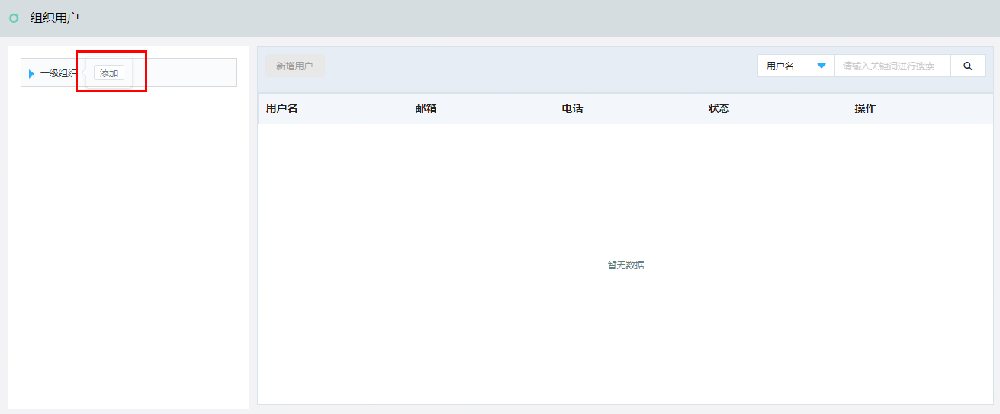
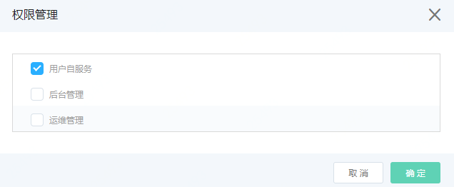
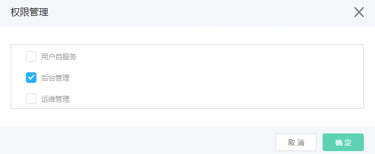
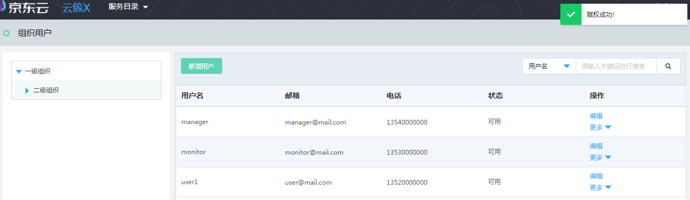
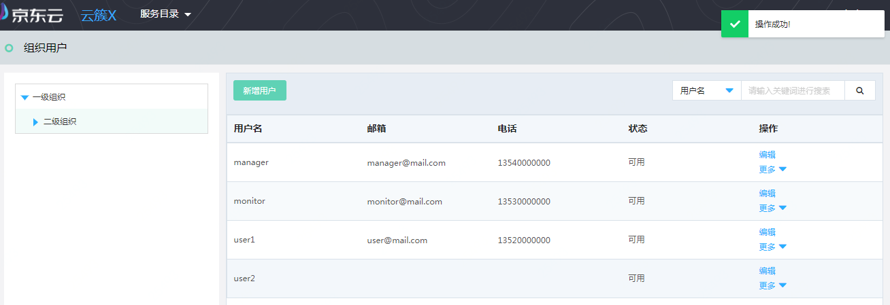
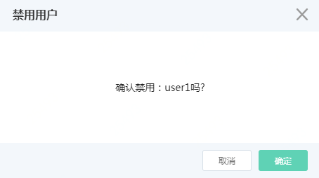

# 组织用户管理

## 创建组织

登录云簇平台后，访问左侧导航栏，点击后台管理>组织用户管理菜单，进入组织用户列表页面，如图：组织用户列表页面所示。

图：组织用户列表页面

在此页面，鼠标移到根组织名称位置，页面弹出“添加”按钮，点击“添加”按钮，弹出新增组织页面，如图：新增组织页面所示。

图：新增组织页面

在此页面，输入新增组织名称，点击“确定”按钮，新增成功后，您可以在组织用户列表页面中看到您所创建的组织，如图：组织用户列表页面所示。

图：组织用户列表页面

在此页面，您可以添加、删除组织，新增用户，编辑用户信息、分配用户权限、启用用户、禁用用户、删除用户。

## 新增用户

操作方法如下：在图：组织用户列表页面，点击左上角的“新增用户”按钮，弹出新增用户页面，如图：新增用户页面所示

图：新增用户页面

在此页面，输入用户名、密码，邮箱（可选项）、电话（可选项），点击“确定”按钮，弹出权限管理页面，如图206：权限管理页面所示。

图：权限管理页面

在此页面，勾选为此新增用户赋予的权限后，点击“确定”按钮，新增成功后，您可以在组织用户列表页面中看到您新增的用户，如图：组织用户列表页面所示。

图：组织用户列表页面

## 权限管理

操作方法如下： 在图：组织用户列表页面，点击指定用户操作列的“权限管理”按钮，弹出权限管理页面，如图：权限管理页面所示

图：权限管理页面

在此页面可以查看和编辑用户权限，点击“确定”按钮，页面弹出“赋权成功”提示，如图：用户权限赋权成功提示。

图：用户权限赋权成功提示

在此页面弹出的“赋权成功”提示，表示您编辑的用户权限已生效。

## 重置密码

操作方法如下： 在图：组织用户列表页面，点击指定用户操作列的“重置密码”按钮，弹出重置密码页面，如图：重置密码页面所示

图：重置密码页面

在此页面点击“确定”按钮，当页面弹出“操作成功”提示，如图：用户重置密码操作成功提示。

图：用户重置密码操作成功提示

在此页面弹出的“操作成功”提示，表示您重置密码已生效。

## 禁用/激活

操作方法如下： 在图：组织用户列表页面，点击指定用户操作列的“禁用”按钮，弹出禁用用户页面，如图：禁用用户页面所示

图：禁用用户页面

在此页面点击“确定”按钮，则用户的平台访问权限被禁用，禁用后，该用户将不能登录平台。操作列显示“启用”按钮，如图：组织用户列表页面

图：组织用户列表页面

点击“启用”按钮，弹出启用用户页面，如图：启用用户页面所示

图：启用用户页面

在此页面点击“确定”按钮，则用户的平台访问权限被启用，启用后，该用户登录平台的权限被恢复，即可以登录平台。
