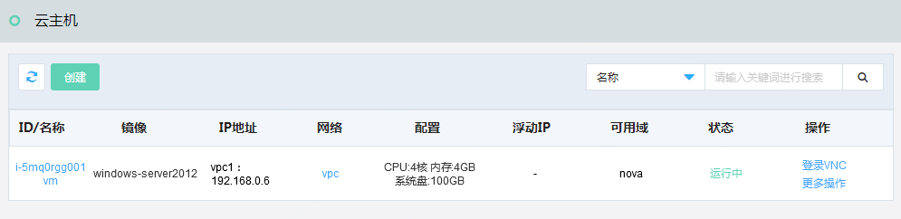

# 创建云主机

访问左侧导航栏，点击基础云>计算资源>云主机菜单，进入云主机列表页面，如图：云主机列表页面所示。

图：云主机列表页面

在此页面，点击“创建”按钮，页面跳转到“创建云主机”页面，如图：创建云主机页面所示。

图：创建云主机页面

在此页面，选择可用域、镜像、配置、网络、安全组，填写云主机名称、选择数量，点击“立即创建”按钮，创建成功后，您可以在云主机列表页面中看到您所创建的云主机，如图：云主机列表页面所示。

图：云主机列表页面

