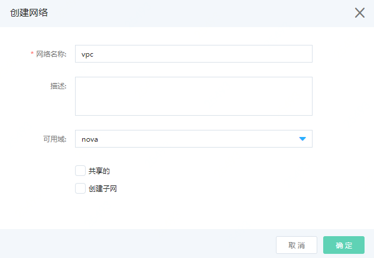
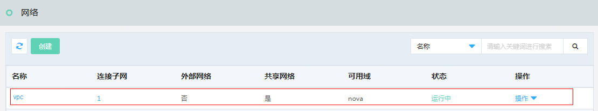
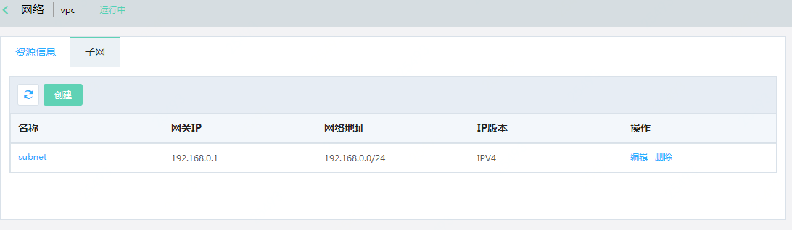

# 创建网络

访问左侧导航栏，点击基础云>网络资源>网络菜单，进入网络列表页面，如图：网络列表页面所示。

图：网络列表页面

在此页面，点击“创建”按钮，弹出创建网络页面，如图：创建网络页面所示。

图：创建网络页面

在此页面输入您创建网络的名称，勾选“创建子网”（亦可不勾选，创建网络后，通过网络列表页面，该网络对应操作项“创建子网”），页面创建子网信息，如图：创建网络页面所示。

图：创建网络页面（勾选创建子网）

在此页面继续填写子网名称、网络地址、指定网关IP（如默认网关），点击“确定”按钮，创建成功后，您可以在网络列表页面中看到您所创建的网络、子网，如图：网络列表页面所示。

图：网络列表页面

在此页面点击网络名称，即可查看网络的详情页内容，点击连接子网的数量，即可查看该网络下创建的子网列表，如图：网络详情页页面所示。

图：网络详情页页面

