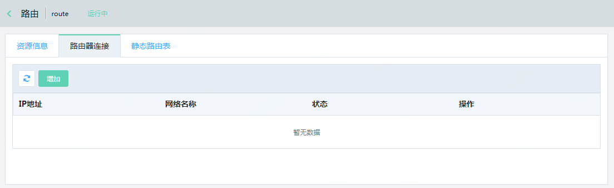
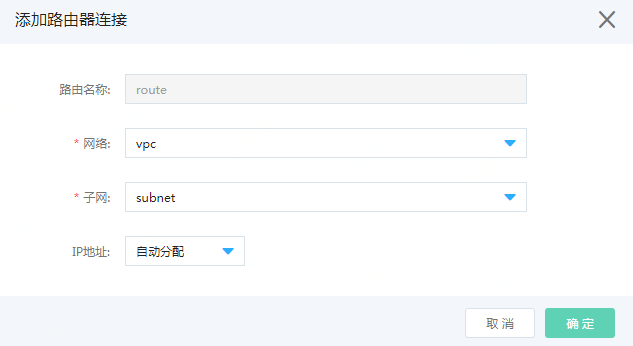
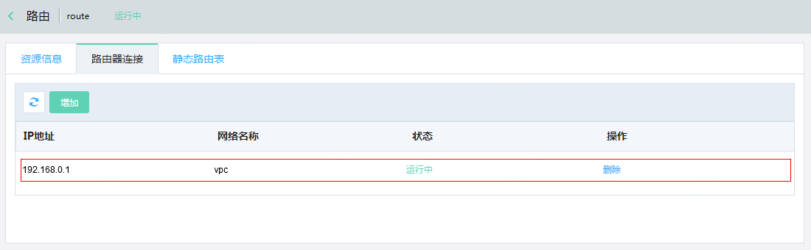
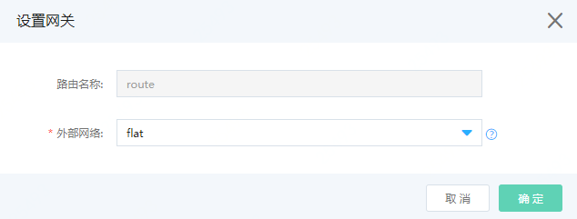

# 创建路由

访问左侧导航栏，点击基础云>网络资源>路由管理菜单，进入路由列表页面，如图：路由列表页面所示。

图：路由列表页面

在此页面，点击“创建”按钮，弹出创建路由页面，如图：创建路由页面所示。

图：创建路由页面

在此页面输入路由名称，点击“确定”按钮，创建成功后，您可以在路由列表页面中看到您所创建的路由，如图：路由列表页面所示。

图：路由列表页面

## 路由连接子网

子网通过连接路由器来访问Internet。

在图：路由列表页面，点击新创建的路由名称，进入路由详情页，切换到“路由器连接”详情页，如图：路由器里连接详情页所示。

图：路由器连接详情页

在此页面点击“增加”按钮，弹出“添加路由器连接”页面，如图：添加路由器连接页面。

图：添加路由器连接页面

在此页面选择创建的网络vpc、子网subnet，点击“确定”按钮，连接成功后，您可以在路由器连接列表页面中看到您所连接的子网，如图：路由器连接详情页面所示。

图：路由器连接详情页页面

## 路由设置网关

在图：路由列表页面，点击操作列的“设置网关”按钮，弹出“设置网关”页面，如图：设置网关页面所示。

图：设置网关页面

在此页面，选择外部网络，点击“确定”按钮，设置成功后，您可以在路由列表页面中看到您设置的外部网络，即完成设置网关。如图：路由列表页面所示。

图：路由器列表页面

子网与路由器建立了连接，路由器上设置了子网的网关地址，此时，配了外部IP的路由器连接这外部网络，子网内的云主机能够访问Internet网络。

