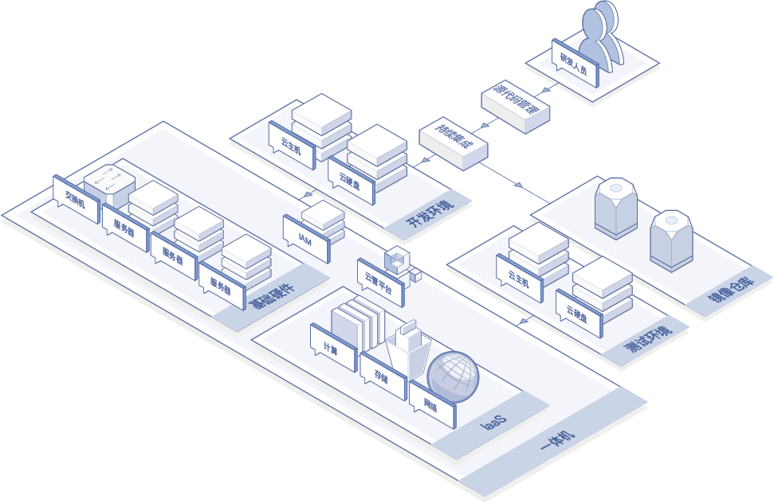
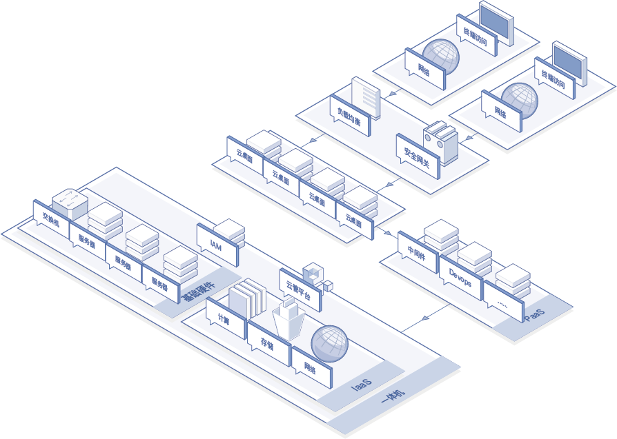
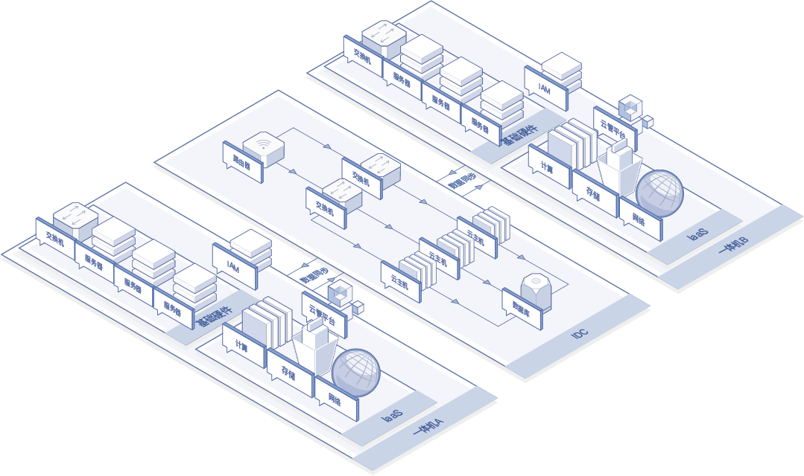
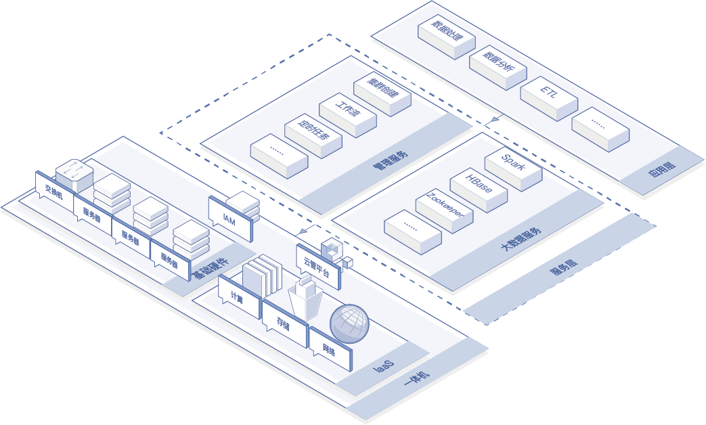
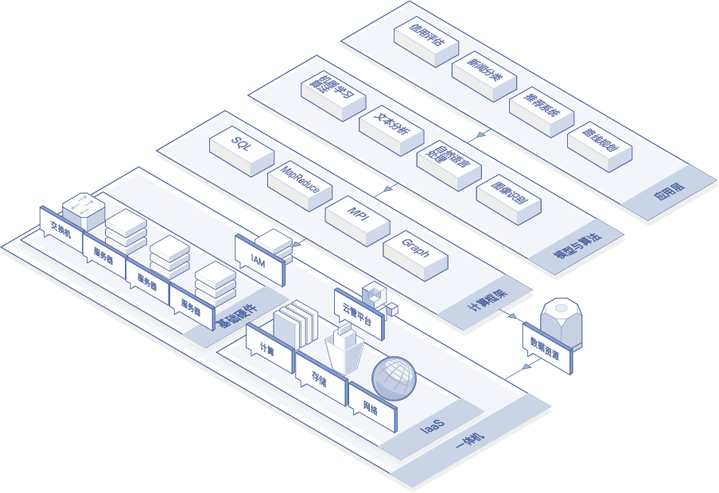

# 应用场景

### 开发测试环境支持

传统应用的开发及测试场景中，存在资源配置不灵活、利用率低下、开发测试周期离散、环境部署效率低、成本高等问题。云簇超融合产品基于超融合架构，构建共享虚拟资源池，对研发测试人员，提供弹性、按需调度的云资源。产品轻量灵活，最小3节点部署，支持24U机柜封装，可支持在企业办公区放置，方便研发人员就近调试，快速迭代，敏捷开发，节约网络配置、环境部署与机房维护成本。3节点支持创建200台以上的云主机，可满足中型开发团队的需求，同时支持单个物理节点或整机的横向扩展，可实现开发环境向正式生产环境的平滑转化，降低企业研发成本，提升研发效率。

### 分支机构云桌面办公

当企业或政府分支机构较多时，存在管理架构分散、无统一门户、无法快速扩展等问题。云簇超融合产品基于软硬件深度融合的架构，可为云桌面应用提供承载平台，通过打造云桌面一体机，搭建媲美PC桌面体验的云桌面架构，满足分支机构中人员远程访问办公、随时随地接入办公环境的需求。3节点可支持200个以上的云桌面，3000以下成本即可获得一个稳定可靠可热迁的办公电脑。同时，通过对访问权限的管控与网络隔离，加强分支机构数据安全，帮助用户建设安全、便捷、高性能、低成本的IT办公体系。

### 廉价灾备

传统数据中心基础设施部署速度无法适应高速的业务增长，为此需要一种轻便快捷的解决方案，对数据中心的关键应用与业务数据进行备份容灾。借助超融合架构，京东云面向用户关键应用提供跨数据中心的容灾及应用级高可用解决方案。超融合架构以更经济的方式实现数据的安全存储和管理，基于平台虚拟化软件层的高可用机制，解决单数据中心故障带来的业务风险，大大降低灾备成本。

### 大数据应用场景

中小企业每日会产生大量业务数据，需要对这些数据做分解、统计、汇总。云簇超融合产品基于超融合架构，依托云计算的分布式处理、分布式数据库、云存储和虚拟化技术提供弹性可扩展的虚拟化资源，支持在云平台上集成大数据平台，作为PaaS层对外提供服务，帮助用户实现对企业数据的统一采集、存储、计算。同时为大数据的运算提供资源层的灵活性，利用最少物理资源提供最大化的数据管理、开发与计算能力，可支撑企业级数据仓库、用户画像、知识图谱、深度学习、文本分析及更多企业级应用的构建。

### AI应用场景

随着AI在全球的增长态势，各行业企业的AI应用需求也越发强烈。基于超融合架构，支持上层集成AI应用服务，打造AI软硬件一体化解决方案。满足企业海量数据治理、大规模训练样本和高维机器学习的高效率需求，赋予企业开箱即用的AI能力。同时超融合AI一体机可作为应用的开发平台，免去AI底层基础的配置、调试步骤，降低企业AI应用的开发门槛。

