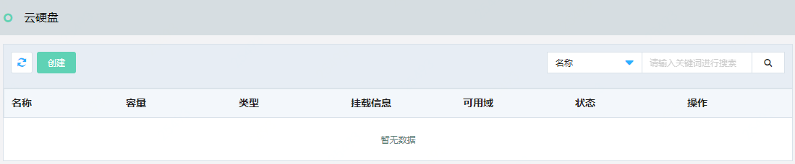
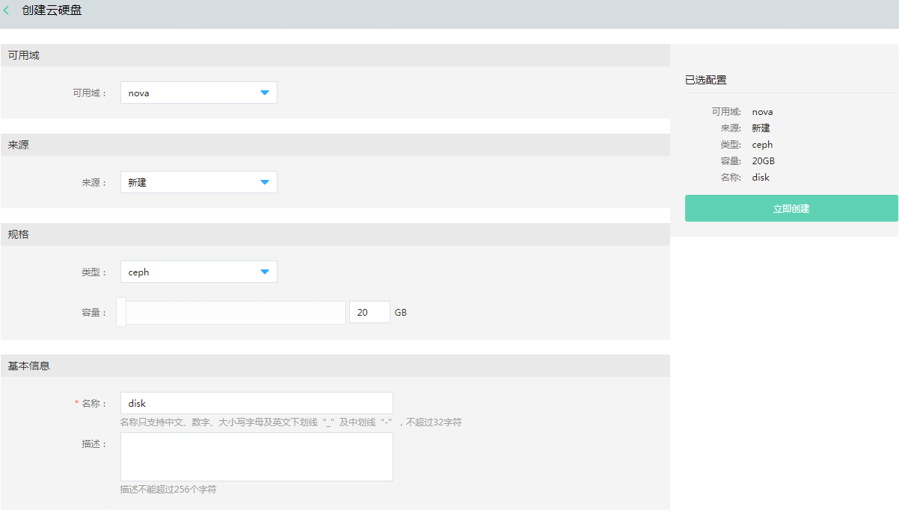
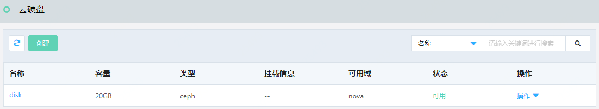
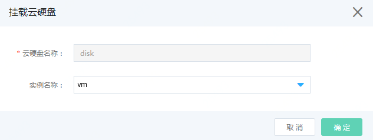
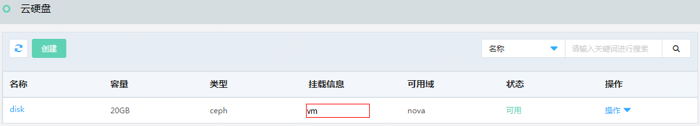
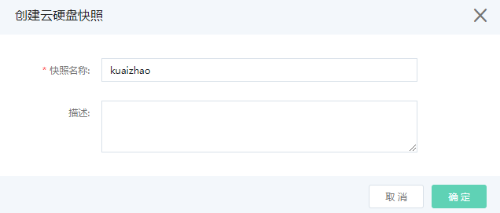
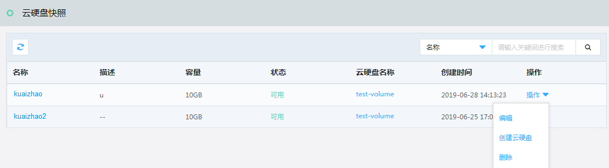

# 云硬盘相关

## 创建云硬盘

访问左侧导航栏，点击基础云>存储资源>云硬盘菜单，进入云硬盘列表页面，如图：云硬盘列表页面所示。

图：云硬盘列表页面

在此页面，点击“创建”按钮，弹出创建云硬盘页面，如图：创建云硬盘页面所示。

图：创建云硬盘页面

在此页面选择可用域、选择硬盘类型、选择硬盘容量，输入名称，点击“立即创建”按钮，弹出创建成功提示后，您可以在云硬盘列表页面中看到您所创建的云硬盘，如图：云硬盘列表页面所示。

图：云硬盘列表页面

## 挂载云硬盘

在云硬盘列表页，点击操作列的“挂载”按钮，弹出“挂载云硬盘”页面，如图：挂载云硬盘页面所示。

图：挂载云硬盘页面

在此页面选择挂载的实例名称，点击“确定”按钮，弹出挂载成功提示，则在云硬盘列表页中，可以看到挂载信息，如图：云硬盘列表页面所示。

图：云硬盘列表页面

## 创建云硬盘快照

快照是云簇X提供的数据备份方式，快照保留了某个指定时间点之前云硬盘上的所有数据。在执行创建快照之前，需对云硬盘进行卸载操作，创建快照后再重新挂载到云主机上。

访问左侧导航栏，点击基础云>存储资源>云硬盘菜单，进入云硬盘列表页面，如图：云硬盘列表页面所示。

图：云硬盘列表页面

在此页面，点击操作列的“创建快照”按钮，弹出“创建快照”页面，如图：创建快照页面所示。

图：创建快照页面

在此页面，输入快照名称，点击“确定”按钮，弹出创建成功提示，则在云硬盘快照列表页中，可以看到新建快照信息。

访问左侧导航栏，点击基础云>存储资源>云硬盘快照菜单，进入云硬盘快照列表页面，如图：云硬盘快照列表页面所示。

图：云硬盘快照列表页面

在此页面，点击操作列的”操作”按钮，弹出下来弹框，点击相应操作执行编辑、创建云硬盘、删除操作。
