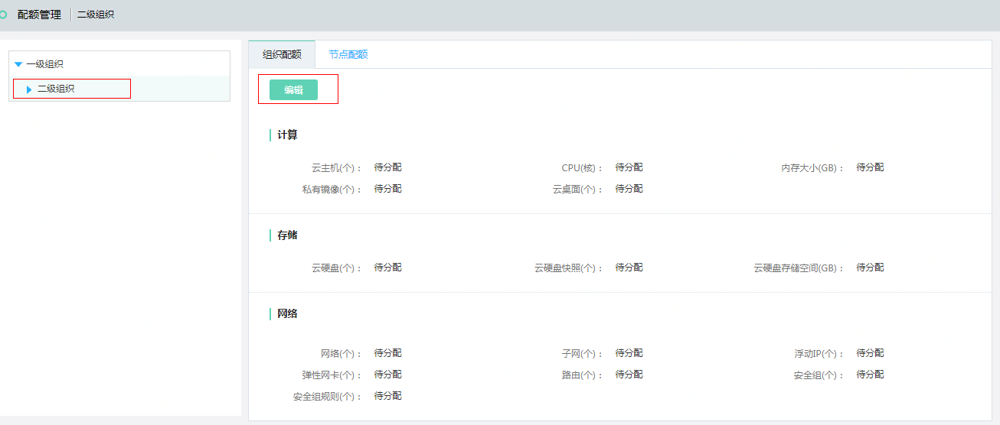
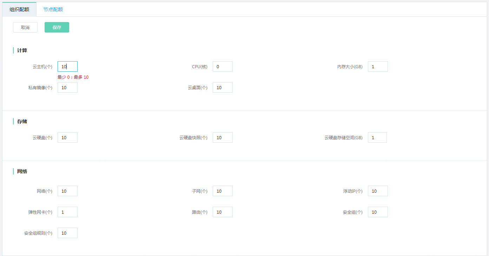
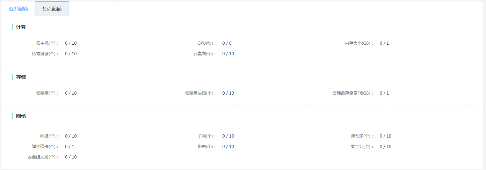

# 配额管理

第二步，组织创建完成后，需要为组织分配配额

## 编辑配额

访问左侧导航栏，点击后台管理>配额管理菜单，进入配额管理页面，点击左侧组织树，选择新建的组织，显示该组织的配额管理页面，如图：配额管理页面所示。

图：配额管理页面

在此页面，点击“编辑”按钮，显示该组织的配额编辑页面，如图：配额编辑页面所示。

图：配额编辑页面

在此页面，系统会默认显示推荐配额，您可以编辑当前组织的配额，系统会提示剩余可分配配额量，点击“保存”按钮，页面提示设置成功，则表示您设置的配额已生效。

## 节点配额

在如图：配额管理页面，点击节点配额，显示当前组织节点使用量/配额量，如图：节点配额页面所示。

图：节点配额页面

