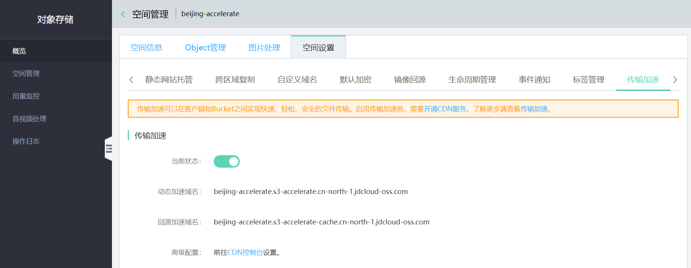

# 传输加速

传输加速通过京东云CDN分布式边缘站点提供加速服务，可以在客户端和Bucket之间实现快速、轻松、安全的远距离文件传输。当指定某一Bucket开启传输加速后，系统将为您分配加速域名，您可以使用该域名进行上传下载。

如需使用传输加速，请提前[开通CDN服务](https://docs.jdcloud.com/cn/cdn/open-cdn-service)。

## 规则说明

**传输加速支持以下加速模式：**

- 动态加速：通过路由优化、传输优化等动态加速技术解决跨运营商、网络不稳定等因素导致的响应慢、丢包、服务不稳定等问题，适用于较差网络环境下上传下载的场景。

- 回源加速：通过CDN边缘节点缓存源站内容来实现文件加速分发，提供低成本、高性能、可扩展的互联网内容分发服务，适用于相同内容反复下载的使用场景。

**当您开启传输加速后，OSS将为您分配以下加速域名：**

- 动态加速域名：\<BUCKET\>.s3-accelerate.\<REGION\>.jdcloud-oss.com

- 回源加速域名：\<BUCKET\>.s3-accelerate-cache.\<REGION\>.jdcloud-oss.com

**注意事项：**

- 使用传输加速功能所产生的计费请查看[CDN计费概述](https://docs.jdcloud.com/cn/cdn/billing-overview)。

- 开启加速后，OSS将异步为您开启加速，该加速域名将在24小时内生效，在开启过程中，不支持修改加速状态；如需关闭传输加速，请在生效后关闭。

- 如您需要使用自定义域名开启CDN加速，需前往CDN控制台配置，请参考[创建域名](https://docs.jdcloud.com/cn/cdn/create-domain)。

## 配置加速

对象存储支持通过控制台配置设置管理传输加速，设置步骤请参考如下内容。如需使用API设置传输加速，请参考[Put Bucket accelerate](../../API-Reference-S3-Compatible/Compatibility-API/Operations-On-Bucket/PUT-Bucket-accelerate.md)。

1.登入控制台->对象存储->空间管理->进入某个Bucket->空间设置->传输加速，在该页面下可以查看当前Bucket的传输加速设置。



2.点击开启后，您可以查看该Bucket的加速域名。

3.如需设置特殊加速规则，请前往CDN控制台设置，请参考[CDN控制台概览](https://docs.jdcloud.com/cn/cdn/console-introduction)。

## 使用加速域名

使用Curl命令模拟使用加速域名上传文件，示例命令如下：

```
curl -X PUT -T local_file  https://examplebucket.s3-accelerate.cn-north-1.jdcloud-oss.com/test
```

